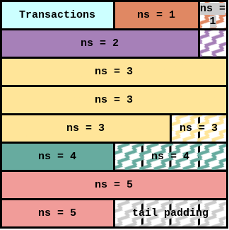

# ADR 003: Non-interactive Defaults, Wrapped Transactions, and Subtree Root Message Inclusion Checks

## Intro

pls see the [original specs](https://github.com/celestiaorg/celestia-specs/blob/master/src/rationale/message_block_layout.md), from which this ADR paraphrases heavily.

Currently, when checking for message inclusion, validators recreate the share commitment from the messages in the block and compare those with what are signed over in the `MsgPayForData` transactions also in that block. If any commitment is not found in one of the PFD transactions, or if there is a commitment that doesn't have a corresponding message, then they reject that block.

While this functions as a message inclusion check, the light client has to assume that 2/3's of the voting power is honest in order to be assured that both the messages they are interested in and the rest of the messages paid for in that block are actually included. In order to have this property, we need a block (or tx? pls halp reviewers) validity rule where:

> **All share commitments included in `MsgPayForData` must consist only of subtree roots of the data square.**

The main issue with that requirement is that it requires the users to know the relevant subtree roots before they sign, which is problematic considering that is the block is not orginized perfectly, the subtree roots will include data unknown to the user at the time of signing.

To fix this, the spec outlines the “non-interactive default rules”. These involve a few additional message layout rules that allow for commitments to messages to consist entirely of sub tree roots of the data root, and for those sub tree roots to be generated only from the message itself (so that the user can sign something “non-interactively”). NOTE: MODIFIED FROM THE SPEC

> **Messages must begin at a location aligned with the largest power of 2 that is not larger than the message length or k.**


> **If the messages are larger than k, then they must start on a new row.**


If we can follow these rules, we can always create a commitment to the data that is a subtree root of the data root while only knowing the data in that message. Below illustrates how we can break a message up into two different subtree roots, the first for first four shares, the second consisting of the last two shares.

In practice this usually means that we end up adding padding between messages (zig-zag hatched share) to ensure that each message is starting at an "aligned power of two". Padding consists of a the namespace of the message before it, with all zeros for data.


Below is an example block that has been filled using the non-interactive default rules to ensure that all commitments consist only of subtree roots.


Not only does doing this allow for easy trust minimized message inclusion checks for specific messages by light clients, but also allows for the creation of message inclusion fraud proofs for all messages in the block.

## Alternative Designs

While all commitments signed over must only consist of subtree roots, its worth noting that non-interactive defaults are just that, defaults! It's entirely possible that block producers use some mechanism to notify the signer of the commitments that they must sign over, or even that the block producers are signing paying for the inclusion of the message on behalf of the users. This would render the non-interactive default rules, and the padding accompanied by them, to not be necessary. Other solutions are not mutually exclusive to non-interactive defaults, and do not even have to be built by the core team, so covering those solutions in a more in depth way is outside the scope of this ADR. However, whatever design we pick needs to support not using the non-interactive defaults. Meaning we should be able to encode block data into a square even if the messages are not arranged according to the non-interactive defaults, and we still need to be able to check for message inclusion using subtree roots.

## Decision

TBD

## Detailed Design

To recap the default constraints of arranging a square:

- All messages must be ordered lexigraphically by namespace.
- The commitments signed over in each `MsgPayForData` must consist only of subtree roots of the data square.
- If a `MsgPayForData` is added to the square, then its corresponding message must also be included.
- There must not be a message with a `MsgPayForData` (does this need to be a rule? cc @adlerjohn).
- Transactions with higher fees should be prioritized by default.
- Ideally, the square should be filled as optimally as possible.

For squares that are smaller than the max squaresize, the exact approach is much less important. This is because if we can't fit all of the transactions in a square, then by default we shouldn't be using that square size in the first place (reviewers: is this true? halp).

Arranging the messages in the block to maximize for fees and optimize square space is an NP-hard problem. While the actual compuation of the number of shares could be cached to an extent, each change to the square potentially affects the rest of the messages in the square. The only way to know for certain is to calculate the number of shares used. Caclulating the exact number of bytes used due to our rampant use of varints, both in our encoding scheme and protobuf's. The example below shows how removing a single share (from the transactions in this case) could change the rest of the square and allow for a message that otherwise would not fit.




To meet the above constraints, there are multiple refactors required.

- Add metadata to wrapped transactions, connecting that transaction with message that it pays for.
- Refactor share splitting and merging to use the above metadata when decoding and encoding the square.
- Implement the non-interactive default logic.
- Implement the ability to traverse nmt tree to find subtree roots.
- Refactor square estimation to account for padding introduced by non-interactive defaults.
- Refactor `PrepareProposal` to arrange the shares such that each message has the appropriate subtree roots, and so that the metadata connection transactions and messages is correct.
- Refactor `ProcessProposal` to check for message inclusion using only subtree roots to row roots.

### Add metadata to wrapped transactions [#819](https://github.com/celestiaorg/celestia-core/pull/819)

In order to check for message inclusion, create message inclusion fraud proofs, split the block data into squares, and not force non-interactive defaults for every square, we have to connect a `MsgPayForData` transaction to its corresponding messasge. Since users cannot know this ahead of time, block producers have to add this information as metadata before the transaction gets included in the block.

We are already wrapping/unwrapping malleated transactions, so including the `share_index` as metadata using the current code is essentially as simple as adding the `share_index` to the struct. Transactions are unwrapped selectively by using a [`MalleatedTxDecoder`](https://github.com/celestiaorg/celestia-app/blob/5ac236fb1dab6628e98a505269f295c18e150b27/app/encoding/malleated_tx_decoder.go#L8-L15) or by using the [`UnwrapMalleatedTx`](https://github.com/celestiaorg/celestia-core/blob/212901fcfc0f5a095683b1836ea9e890cc952dc7/types/tx.go#L214-L237) function.

```proto
message MalleatedTx {
  bytes original_tx_hash = 1;
  bytes tx               = 2;
  uint32 share_index     = 3;
}
```

### Refactor Share Splitting and Merging

Our encoding scheme now has to actually use the meta data added to wrapped transaction.

Note: In order to properly test the new encoding scheme, we have perform identical if not very similar application logic to that in `PrepareProposal` for this reason, we wanted initially wanted to move the share encoding/decoding logic to the app instead of core. There were some other quality of life improvements that were also added during this refactor that are technically unrelated to these changes.

We currently utilize a struct to store the state needed for lazily writing message shares (todo: possibly change this name). Here we add a method to it that allows for us to write namepsaced padded shares.

```go
// MessageShareSplitter lazily splits messages into shares that will eventually be
// included in a data square. It also has methods to help progressively count
// how many shares the messages written take up.
type MessageShareSplitter struct {
    shares [][]NamespacedShare
    count  int
}
...
// WriteNamespacedPaddedShares adds empty shares using the namespace of the last written share.
// This is useful to follow the message layout rules. It assumes that at least
// one share has already been written, if not it panics.
func (msw *MessageShareSplitter) WriteNamespacedPaddedShares(count int) {
    if len(msw.shares) == 0 {
        panic("Cannot write empty namespaced shares on an empty MessageShareSplitter")
    }
    if count == 0 {
        return
    }
    lastMessage := msw.shares[len(msw.shares)-1]
    msw.shares = append(msw.shares, namespacedPaddedShares(lastMessage[0].ID, count))
    msw.count += count
}
```

Now we simply combine this new functionality with the `share_index`s described above, and we can properly split and pad messages when needed. Note, the below implementation allows for `nil` to be passed as indexes. This is important, as it allows the same implmenetation to be used in the cases where we don't want to split messages using wrapped transactions, such as supporting older networks or when users create commitments to sign over for `MsgWirePayForData`

```go
func SplitMessages(cursor int, indexes []uint32, msgs []coretypes.Message) ([][]byte, error) {
    if indexes != nil && len(indexes) != len(msgs) {
        return nil, ErrIncorrectNumberOfIndexes
    }
    writer := NewMessageShareSplitter()
    for i, msg := range msgs {
        writer.Write(msg)
        if indexes != nil && len(indexes) > i+1 {
            paddedShareCount := int(indexes[i+1]) - (writer.Count() + cursor)
            writer.WriteNamespacedPaddedShares(paddedShareCount)
        }
    }
    return writer.Export().RawShares(), nil
}
```

When parsing the message shares, we can simply ignore these added namespaced padded shares.

### Implement the non-interactive default logic

recall our non-interactive default rule:

> **Messages must begin at a location aligned with the largest power of 2 that is not larger than the message length or k.**

The key to arranging the square into non-interactive defaults is calculating then next "aligned power of 2". We do that here statelessly with two simple functions.

```go
// NextAlignedPowerOfTwo calculates the next index in a row that is an aligned
// power of two and returns false if the entire the msg cannot fit on the given
// row at the next aligned power of two. An aligned power of two means that the
// largest power of two that fits entirely in the msg or the square size. pls
// see specs for further details. Assumes that cursor < k, all args are non
// negative, and that k is a power of two.
// https://github.com/celestiaorg/celestia-specs/blob/master/src/rationale/message_block_layout.md#non-interactive-default-rules
func NextAlignedPowerOfTwo(cursor, msgLen, k int) (int, bool) {
    // if we're starting at the beginning of the row, then return as there are
    // no cases where we don't start at 0.
    if cursor == 0 || cursor%k == 0 {
        return cursor, true
    }

    nextLowest := nextLowestPowerOfTwo(msgLen)
    endOfCurrentRow := ((cursor / k) + 1) * k
    cursor = roundUpBy(cursor, nextLowest)
    switch {
    // the entire message fits in this row
    case cursor+msgLen <= endOfCurrentRow:
        return cursor, true
    // only a portion of the message fits in this row
    case cursor+nextLowest <= endOfCurrentRow:
        return cursor, false
    // none of the message fits on this row, so return the start of the next row
    default:
        return endOfCurrentRow, false
    }
}

// roundUpBy rounds cursor up to the next interval of v. If cursor is divisible
// by v, then it returns cursor
func roundUpBy(cursor, v int) int {
    switch {
    case cursor == 0:
        return cursor
    case cursor%v == 0:
        return cursor
    default:
        return ((cursor / v) + 1) * v
    }
}
```

We can now use this function in many places, such as when we estimate the square size, calculate the number of messages used, calculate which subtree roots are needed to verify a share commitment, and calculate when to start the first message after the reserved namespaces are filled.

### Implement the ability to traverse an nmt tree to find subtree roots

todo: to after implementing feedback

### Refactor `PrepareProposal`

From a very high level perspective `PrepareProposal` stays mostly the same. We need to estimate the square size accurately enough to malleate the transactions that are given to us by tendermint, then arrange messages in a square. However, recall the constraints and issues described at the top of this section.

- All messages must be ordered lexigraphically by namespace.
- The commitments signed over in each `MsgPayForData` must consist only of subtree roots of the data square.
- If a `MsgPayForData` is added to the square, then its corresponding message must also be included.
- There must not be a message with a `MsgPayForData` (does this need to be a rule? cc @adlerjohn).
- Transactions with higher fees should be prioritized by default.
- Ideally, the square should be filled as optimally as possible.

These constraints make processing block data into a square much more complicated. 

#### Square Estimation

Using some of the non-interactive defaults code above, we can quickly calculate the size of each reserved namespace shares, along with

```go
// FitsInSquare uses the non interactive default rules to see if messages of
// some lengths will fit in a square of size origSquareSize starting at share
// index cursor. See non-interactive default rules
// https://github.com/celestiaorg/celestia-specs/blob/master/src/rationale/message_block_layout.md#non-interactive-default-rules
func FitsInSquare(cursor, origSquareSize int, msgShareLens ...int) (bool, int) {
    // if there are 0 messages and the cursor already fits inside the square,
    // then we already know that everything fits in the square.
    if len(msgShareLens) == 0 && cursor/origSquareSize <= origSquareSize {
        return true, 0
    }
    firstMsgLen := 1
    if len(msgShareLens) > 0 {
        firstMsgLen = msgShareLens[0]
    }
    // here we account for padding between the contiguous and message shares
    cursor, _ = NextAlignedPowerOfTwo(cursor, firstMsgLen, origSquareSize)
    sharesUsed, _ := MsgSharesUsedNIDefaults(cursor, origSquareSize, msgShareLens...)
    return cursor+sharesUsed <= origSquareSize*origSquareSize, sharesUsed
}

// estimateSquareSize uses the provided block data to estimate the square size
// assuming that all malleated txs follow the non interactive default rules.
// todo: get rid of the second shares used int as its not used atm
func estimateSquareSize(txs []*parsedTx, evd core.EvidenceList) (uint64, int) {
    // get the raw count of shares taken by each type of block data
    txShares, evdShares, msgLens := rawShareCount(txs, evd)
    ...

    var fits bool
    for {
        // assume that all the msgs in the square use the non-interactive
        // default rules and see if we can fit them in the smallest starting
        // square size. We start the cusor (share index) at the begginning of
        // the message shares (txShares+evdShares), because shares that do not
        // follow the non-interactive defaults are simple to estimate.
        fits, msgShares = shares.FitsInSquare(txShares+evdShares, squareSize, msgLens...)
        switch {
        // stop estimating if we know we can reach the max square size
        case squareSize >= consts.MaxSquareSize:
            return consts.MaxSquareSize, txShares + evdShares + msgShares
        // return if we've found a square size that fits all of the txs
        case fits:
            return uint64(squareSize), txShares + evdShares + msgShares
        // try the next largest square size if we can't fit all the txs
        case !fits:
            // increment the square size
            squareSize = int(nextPowerOfTwo(squareSize + 1))
        }
    }
}
```

## Status

{Deprecated|Proposed|Accepted|Declined}

## Consequences

### Positive

- Trust minimized message inclusion checks
- Ability to create message inclusion fraud proofs

### Negative

- Potentially there will be a lot of wasted square space

### Neutral

## References
