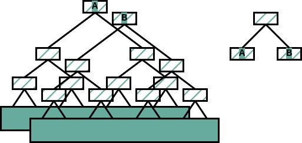
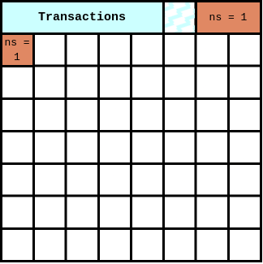
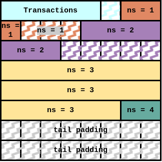

# ADR 006: Non-interactive Defaults, Wrapped Transactions, and Subtree Root Message Inclusion Checks

## Status

Implemented. Parts of this ADR were superseded by [ADR-020](./adr-020-deterministic-square-construction.md).

> **Note**
> Unlike normal tendermint/cosmos ADRs, this ADR isn't for deciding whether or not we will implement non-interactive defaults. The goal of this document is to help reviewers and future readers understand what non-interactive defaults are, the considerations that went into the initial implementation, and how it differs from the original specs.

The exact approach taken by the initial implementation, however, is certainly up for scrutiny.

## Intro

please see the [original specs](https://github.com/celestiaorg/celestia-specs/blob/e59efd63a2165866584833e91e1cb8a6ed8c8203/src/rationale/message_block_layout.md), from which this ADR paraphrases heavily.

Currently, when checking for message inclusion, validators recreate the share commitment from the messages in the block and compare those with what are signed over in the `MsgPayForBlob` transactions also in that block. If any commitment is not found in one of the PFB transactions, or if there is a commitment that doesn't have a corresponding message, then they reject that block.

While this functions as a message inclusion check, the light client has to assume that 2/3's of the voting power is honest in order to be assured that both the messages they are interested in and the rest of the messages paid for in that block are actually included. In order to have this property, we need a block validity rule where:

> **All share commitments included in `MsgPayForBlob` must consist only of subtree roots of the data square.**

The main issue with that requirement is that users must know the relevant subtree roots before they sign, which is problematic considering that if the block is not organized perfectly, the subtree roots will include data unknown to the user at the time of signing.

To fix this, the spec outlines the “non-interactive default rules”. These involve a few additional **default but optional** message layout rules that enables the user to follow the above block validity rule, while also not interacting with a block producer. Commitments to messages can consist entirely of sub-tree roots of the data hash, and those sub-tree roots are to be generated only from the message itself (so that the user can sign something “non-interactively”).

> **Messages must begin at a location aligned with the largest power of 2 that is not larger than the message length or k.**

Below illustrates how we can break a message up into two different subtree roots, following a [Merkle Mountain Range](https://docs.grin.mw/wiki/chain-state/merkle-mountain-range/) structure, i.e. root `A` for first four shares, and root `B` consisting of the last two shares. We can then create a commitment out of any number of subtree roots by creating a merkle root of those commitments.


> **If the messages are larger than k, then they must start on a new row.**



If we follow this rule, we can always create a commitment to subtree roots of the data root, that commit to the data.

In practice, this usually means that we end up adding padding between messages (zig-zag hatched shares in the figure below) to ensure that each message is starting at an "aligned power of two". Padding consists of shares with the namespace of the message before it, with all zeros for data.




Below is an example block that has been filled using the non-interactive default rules to ensure that all commitments consist only of subtree roots.



- `ns = 1`: The first namespace is put at the beginning of the messages space.
- `ns = 2`: Starting at the largest power of 2 that is not larger than the message length or `k`.
- `ns = 3`: Message spanning multiple rows. So, it will be at the beginning of a new row.
- `ns  = 4`: Starting at the largest power of 2 that is not larger than the message length or `k`.

Not only does doing this allow for easy trust minimized message inclusion checks for specific messages by light clients, but also allows for the creation of message inclusion fraud proofs for all messages in the block. This is important to reduce the trust assumptions made by light clients.

## Decision

TBD

While there certainly can be some decisions here, whether or not we begin following the non-interactive defaults isn't really the goal of this ADR. Please see the note at the top of this document.

## Alternative Designs

While all commitments signed over must only consist of subtree roots, it's worth noting that non-interactive defaults are just that, defaults! It's entirely possible that block producers use some mechanism to notify the signer of the commitments that they must sign over, or even that the block producers are signing the transactions paying for the inclusion of the message on behalf of the users. This would render the non-interactive defaults, and the padding accompanied by them, to not be necessary. Other solutions are not mutually exclusive to non-interactive defaults and do not even have to be built by the core team, so covering those solutions in a more in-depth way is outside the scope of this ADR.

However, the default implementation of non-interactive defaults is within the scope of this ADR. Whatever design we use ultimately needs to support not using the non-interactive defaults. Meaning we should be able to encode block data into a square even if the messages are not arranged according to the non-interactive defaults. Again, this does not change the requirement that all share commitments signed over in PFBs consist only of subtree roots.

## Detailed Design

To recap the default constraints of arranging a square:

- All messages must be ordered lexicographically by namespace.
- The commitments signed over in each `MsgPayForBlob` must consist only of subtree roots of the data square.
- If a `MsgPayForBlob` is added to the square, then its corresponding message must also be included.
- There must not be a message without a `MsgPayForBlob` (does this need to be a rule? cc @adlerjohn).
- Transactions with higher fees should be prioritized by default.
- The square should be filled as optimally as possible.

For squares that are smaller than the max square size, the exact approach is much less important. This is because if we can't fit all of the transactions in a square, then by default we shouldn't be using that square size in the first place.

Arranging the messages in the block to maximize fees and optimize square space is a difficult problem that is similar to the ["Bin packing problem"](https://en.wikipedia.org/wiki/Bin_packing_problem). While the actual computation of the number of shares could be cached to an extent, each change to the square potentially affects the rest of the messages in the square. The only way to know for certain is to calculate the number of shares used. Calculating the exact number of bytes used is further complicated by the order of the steps due and our rampant use of varints, both in our encoding scheme and protobuf's. The example below shows how removing a single share (from the transactions in this case) could change the rest of the square and allow for a message that otherwise would not fit.


To meet the above constraints, there are multiple refactors required.

- Add metadata to wrapped transactions, connecting that transaction with a message that it pays for.
- Refactor share splitting and merging to use the above metadata when decoding and encoding the square. [#462](https://github.com/celestiaorg/celestia-core/issues/462) [#819](https://github.com/celestiaorg/celestia-core/pull/819) [#637](https://github.com/celestiaorg/celestia-app/pull/637)
- Implement the non-interactive default logic. [#680](https://github.com/celestiaorg/celestia-app/pull/680)
- Implement the ability to traverse nmt tree to find subtree roots. [#621](https://github.com/celestiaorg/celestia-app/pull/621) [#545](https://github.com/celestiaorg/celestia-app/pull/549) [#681](https://github.com/celestiaorg/celestia-app/pull/681)
- Refactor `PrepareProposal` to arrange the shares such that each message has the appropriate subtree roots, and so that the metadata connection between transactions and messages is correct. [#692](https://github.com/celestiaorg/celestia-app/pull/692)
- Refactor `ProcessProposal` to check for message inclusion using only subtree roots to row roots. [#747](https://github.com/celestiaorg/celestia-app/pull/747)

### Add metadata to wrapped transactions [#819](https://github.com/celestiaorg/celestia-core/pull/819)

In order to check for message inclusion, create message inclusion fraud proofs, split the block data into squares, and not force non-interactive defaults for every square, we have to connect a `MsgPayForBlob` transaction to its corresponding message by adding the index of the share that the message starts on as metadata. Since users cannot know this ahead of time, block producers have to add this metadata before the transaction gets included in the block.

We are already wrapping/unwrapping malleated transactions, so including the `share_index` as metadata using the current code is essentially as simple as adding the `share_index` to the struct. Transactions are unwrapped selectively by using a [`MalleatedTxDecoder(...)`](https://github.com/celestiaorg/celestia-app/blob/5ac236fb1dab6628e98a505269f295c18e150b27/app/encoding/malleated_tx_decoder.go#L8-L15) or by using the [`UnwrapMalleatedTx(...)`](https://github.com/celestiaorg/celestia-core/blob/212901fcfc0f5a095683b1836ea9e890cc952dc7/types/tx.go#L214-L237) function.

```proto
message MalleatedTx {
bytes original_tx_hash = 1;
bytes tx               = 2;
uint32 share_index     = 3;
}
```

### Refactor Share Splitting and Merging

Our encoding scheme now has to actually use the metadata added to wrapped transactions.

Note: In order to properly test the new encoding scheme, we have to perform identical if not very similar application logic to that in `PrepareProposal`, for this reason, we initially wanted to move the share encoding/decoding logic to the app instead of core. There were some other quality of life improvements that were also added during this refactor that are technically unrelated to these changes.

We currently utilize a struct to store the state needed for lazily writing message shares. Here we add a method to it that allows for us to write namespaced padded shares.

```go
// SparseShareSplitter lazily splits messages into shares that will eventually be
// included in a data square. It also has methods to help progressively count
// how many shares the messages written take up.
type SparseShareSplitter struct {
	shares []Share
	count  int
}
...
// WriteNamespacedPaddedShares adds empty shares using the namespace of the last written share.
// This is useful to follow the message layout rules. It assumes that at least
// one share has already been written, if not it panics.
func (sss *SparseShareSplitter) WriteNamespacedPaddedShares(count int) {
	if len(sss.shares) == 0 {
		panic("cannot write empty namespaced shares on an empty SparseShareSplitter")
	}
	if count == 0 {
		return
	}
	lastMessage := sss.shares[len(sss.shares)-1]
	sss.shares = append(sss.shares, namespacedPaddedShares(lastMessage.NamespaceID(), count)...)
	sss.count += count
}
```

Now we simply combine this new functionality with the `share_index`s described above, and we can properly split and pad messages when needed. Note, the below implementation allows indexes to not be used. This is important, as it allows the same implementation to be used in the cases where we don't want to split messages using wrapped transactions, such as supporting older networks or when users create commitments to sign over for `MsgWirePayForBlob`

```go
func SplitMessages(cursor int, indexes []uint32, msgs []coretypes.Message, useShareIndexes bool) ([]Share, error) {
	if useShareIndexes && len(indexes) != len(msgs) {
		return nil, ErrIncorrectNumberOfIndexes
	}
	writer := NewSparseShareSplitter()
	for i, msg := range msgs {
		writer.Write(msg)
		if useShareIndexes && len(indexes) > i+1 {
			paddedShareCount := int(indexes[i+1]) - (writer.Count() + cursor)
			writer.WriteNamespacedPaddedShares(paddedShareCount)
		}
	}
	return writer.Export(), nil
}
```

When parsing the message shares, we can simply ignore these added namespaced padded shares.

### Implement the non-interactive default logic

recall our non-interactive default message layout rule:

> **Messages must begin at a location aligned with the largest power of 2 that is not larger than the message length or k.**

The key to arranging the square into non-interactive defaults is calculating the next "aligned power of 2". We do that here statelessly with two simple functions.

```go
// NextAlignedPowerOfTwo calculates the next index in a row that is an aligned
// power of two and returns false if the entire blob cannot fit on the given
// row at the next aligned power of two. An aligned power of two means that the
// largest power of two that fits entirely in the blob or the square size. See
// specs for further details. Assumes that cursor < squareSize, all args are non
// negative, and that squareSize is a power of two.
// https://github.com/celestiaorg/celestia-specs/blob/master/src/rationale/message_block_layout.md#non-interactive-default-rules
func NextAlignedPowerOfTwo(cursor, blobLen, squareSize int) (int, bool) {
	// if we're starting at the beginning of the row, then return as there are
	// no cases where we don't start at 0.
	if cursor == 0 || cursor%squareSize == 0 {
		return cursor, true
	}

	// nextLowestPowerOfTwo is the largest power of two that fits entirely in
	// the blob
	nextLowestPowerOfTwo := RoundDownPowerOfTwo(blobLen)
	startOfNextRow := ((cursor / squareSize) + 1) * squareSize
	cursor = roundUpBy(cursor, nextLowestPowerOfTwo)
	switch {
	// the entire blob fits in this row
	case cursor+blobLen <= startOfNextRow:
		return cursor, true
	// only a portion of the blob fits in this row
	case cursor+nextLowestPowerOfTwo <= startOfNextRow:
		return cursor, false
	// none of the blob fits on this row, so return the start of the next row
	default:
		return startOfNextRow, false
	}
}

// roundUpBy rounds cursor up to the next multiple of v. If the cursor is divisible
// by v, then it returns cursor
func roundUpBy(cursor, v int) int {
	switch {
	case cursor == 0:
		return cursor
	case cursor%v == 0:
		return cursor
	default:
		return ((cursor / v) + 1) * v
	}
}

```

We can now use this function in many places, such as when we estimate the square size, calculate the number of messages used, calculate which subtree roots are needed to verify a share commitment, and calculate when to start the first message after the reserved namespaces are filled.

### Refactor `PrepareProposal`

From a very high-level perspective `PrepareProposal` stays mostly the same. We need to estimate the square size accurately enough to pick a square size so that we can malleate the transactions that are given to us by tendermint and arrange those messages in a square. However, recall the constraints and issues described at the top of this section. Technically, the addition or removal of a single byte can change the entire arrangement of the square. Knowing, or at least being able to estimate, how many shares/bytes are used is critical to finding an optimal solution to arranging the square. Yet the constraints themselves along with our frequent use of variable length encoding techniques make estimating much more complicated.

While messages must be ordered lexicographically, we also have to order transactions by their fees and ensure that each message is added atomically with its corresponding `MsgPayForBlob` transaction. Also, malleated transactions exist alongside normal transactions, the former of which we have to add **variable sized** metadata to only _after_ we know the starting location of each message. All while following the non-interactive defaults.

Below is the lightly summarized code for `PrepareProposal` that we can use as a high-level map of how we're going to arrange the block data into a square.

```go
// PrepareProposal fulfills the celestia-core version of the ABCI interface by
// preparing the proposal block data. The square size is determined by first
// estimating it via the size of the passed block data. Then the included
// MsgWirePayForBlob messages are malleated into MsgPayForBlob messages by
// separating the message and transaction that pays for that message. Lastly,
// this method generates the data root for the proposal block and passes it back
// to tendermint via the blockdata.
func (app *App) PrepareProposal(req abci.RequestPrepareProposal) abci.ResponsePrepareProposal {
   // parse the txs, extracting any MsgWirePayForBlob and performing basic
   // validation for each transaction. Invalid txs are ignored. Original order
   // of the txs is maintained.
   parsedTxs := parseTxs(app.txConfig, req.BlockData.Txs)

   // estimate the square size. This estimation errors on the side of larger
   // squares but can only return values within the min and max square size.
   squareSize, totalSharesUsed := estimateSquareSize(parsedTxs, req.BlockData.Evidence)

   // the totalSharesUsed can be larger than the max number of shares if we
   // reach the max square size. In this case, we must prune the deprioritized
   // txs (and their messages if they're pfb txs).
   if totalSharesUsed > int(squareSize*squareSize) {
       parsedTxs = prune(app.txConfig, parsedTxs, totalSharesUsed, int(squareSize))
   }

   // in this step we are processing any MsgWirePayForBlob transactions into
   // MsgPayForBlob and their respective messages. The malleatedTxs contain the
   // the new sdk.Msg with the original tx's metadata (sequence number, gas
   // price etc).
   processedTxs, messages, err := malleateTxs(app.txConfig, squareSize, parsedTxs, req.BlockData.Evidence)
   if err != nil {
       panic(err)
   }

   blockData := core.Data{
       Txs:                processedTxs,
       Evidence:           req.BlockData.Evidence,
       Messages:           core.Messages{MessagesList: messages},
       OriginalSquareSize: squareSize,
   }

   ...

   // create the new data root by creating the data availability header (merkle
   // roots of each row and col of the erasure data).
   dah := da.NewDataAvailabilityHeader(eds)

   // We use the block data struct to pass the square size and calculated data
   // root to tendermint.
   blockData.Hash = dah.Hash()
   blockData.OriginalSquareSize = squareSize

   // tendermint doesn't need to use any of the erasure data, as only the
   // protobuf encoded version of the block data has gossiped.
   return abci.ResponsePrepareProposal{
       BlockData: &blockData,
   }
}
```

#### ParsedTxs

The first major change is that we are making use of an intermediate data structure. It contains fields that are progressively and optionally used during the malleation process. This makes it easier to keep track of malleated transactions and their messages, prune transactions in the case that we go over the max square size, cache the decoded transactions avoiding excessive deserialization, and add metadata to malleated transactions after we malleate them. All while preserving the original ordering (from the prioritized mempool) of the transactions.

```go
// parsedTx is an internal struct that keeps track of potentially valid txs and
// their wire messages if they have any.
type parsedTx struct {
   // the original raw bytes of the tx
   rawTx []byte
   // tx is the parsed sdk tx. this is nil for all txs that do not contain a
   // MsgWirePayForBlob, as we do not need to parse other types of of transactions
   tx signing.Tx
   // msg is the wire msg if it exists in the tx. This field is nil for all txs
   // that do not contain one.
   msg *types.MsgWirePayForBlob
   // malleatedTx is the transaction after the malleation process is performed. This is nil until that process has been completed for viable transactions.
   malleatedTx coretypes.Tx
}
```

```go
func (app *App) PrepareProposal(req abci.RequestPrepareProposal) abci.ResponsePrepareProposal {
   // parse the txs, extracting any MsgWirePayForBlob and performing basic
   // validation for each transaction. Invalid txs are ignored. Original order
   // of the txs is maintained.
   parsedTxs := parseTxs(app.txConfig, req.BlockData.Txs)
   ...
}
```

#### Square Estimation

Using some of the non-interactive defaults code above, we can quickly calculate the number of shares required by each type of block data. As discussed in the docs of this function, the goal here is not necessarily to get a perfect count of the shares that are being used, but we do need to know roughly what square size is needed. When estimating, we should round up in square size.

```go
// FitsInSquare uses the non interactive default rules to see if messages of
// some lengths will fit in a square of size origSquareSize starting at share
// index cursor.
func FitsInSquare(cursor, origSquareSize int, msgShareLens ...int) (bool, int) {
   // if there are 0 messages and the cursor already fits inside the square,
   // then we already know that everything fits in the square.
   if len(msgShareLens) == 0 && cursor/origSquareSize <= origSquareSize {
       return true, 0
   }
   firstMsgLen := 1
   if len(msgShareLens) > 0 {
       firstMsgLen = msgShareLens[0]
   }
   // here we account for padding between the contiguous and message shares
   cursor, _ = NextAlignedPowerOfTwo(cursor, firstMsgLen, origSquareSize)
   sharesUsed, _ := MsgSharesUsedNIDefaults(cursor, origSquareSize, msgShareLens...)
   return cursor+sharesUsed <= origSquareSize*origSquareSize, sharesUsed
}

// estimateSquareSize uses the provided block data to estimate the square size
// assuming that all malleated txs follow the non interactive default rules.
// The total shares used is returned to allow for pruning if necessary.
func estimateSquareSize(txs []*parsedTx, evd core.EvidenceList) (uint64, int) {
   // get the raw count of shares taken by each type of block data
   txShares, evdShares, msgLens := rawShareCount(txs, evd)
   ...

   var fits bool
   for {
       // assume that all the msgs in the square use the non-interactive
       // default rules and see if we can fit them in the smallest starting
       // square size. We start the cursor (share index) at the beginning of
       // the message shares (txShares+evdShares), because shares that do not
       // follow the non-interactive defaults are simple to estimate.
       fits, msgShares = shares.FitsInSquare(txShares+evdShares, squareSize, msgLens...)
       switch {
       // stop estimating if we know we can reach the max square size
       case squareSize >= consts.MaxSquareSize:
           return consts.MaxSquareSize, txShares + evdShares + msgShares
       // return if we've found a square size that fits all of the txs
       case fits:
           return uint64(squareSize), txShares + evdShares + msgShares
       // try the next largest square size if we can't fit all the txs
       case !fits:
           // increment the square size
           squareSize = int(nextPowerOfTwo(squareSize + 1))
       }
   }
}
```

#### Pruning excess transactions

If there are too many transactions and messages in the square to fit in the max square size, then we have to remove them from the block. This can be complicated, as by default we want to prioritize transactions that have higher fees, but removing a low-fee transaction doesn't always result in using fewer shares.

The simplest approach, and the one taken in the initial implementation, works by prematurely pruning the txs if we estimate that too many shares are being used. While this does work and fulfills the constraints discussed earlier to create valid blocks, it is suboptimal. Ideally, we would be able to identify the most optimal message and transactions to remove and then simply remove only those. As mentioned earlier, technically, a single-byte difference could change the entire arrangement of the square. This makes arranging the square with complete confidence difficult not only because we have to follow all of the constraints, but also because of our frequent reliance on variable length length delimiters, and protobuf changing the amount of bytes used depending on the size of ints/uints.

```go
func (app *App) PrepareProposal(req abci.RequestPrepareProposal) abci.ResponsePrepareProposal {
   ...
   // the totalSharesUsed can be larger that the max number of shares if we
   // reach the max square size. In this case, we must prune the deprioritized
   // txs (and their messages if they're pfb txs).
   if totalSharesUsed > int(squareSize*squareSize) {
       parsedTxs = prune(app.txConfig, parsedTxs, totalSharesUsed, int(squareSize))
   }
   ...
```

#### Malleation

Due to the use of the `parsedTxs` data structure, we can now abstract the malleation process entirely, whereas before it was hard coded into the block proposal logic.

```go
func (p *parsedTx) malleate(txConf client.TxConfig, squareSize uint64) error {
   if p.msg == nil || p.tx == nil {
       return errors.New("can only malleate a tx with a MsgWirePayForBlob")
   }

   // parse wire message and create a single message
   _, unsignedPFB, sig, err := types.ProcessWirePayForBlob(p.msg, squareSize)
   if err != nil {
       return err
   }

   // create the signed PayForBlob using the fees, gas limit, and sequence from
   // the original transaction, along with the appropriate signature.
   signedTx, err := types.BuildPayForBlobTxFromWireTx(p.tx, txConf.NewTxBuilder(), sig, unsignedPFB)
   if err != nil {
       return err
   }

   rawProcessedTx, err := txConf.TxEncoder()(signedTx)
   if err != nil {
       return err
   }

   p.malleatedTx = rawProcessedTx
   return nil
}
```

When doing this process over all of the transactions, we also need to add the share index as metadata to the malleated transaction when we wrap it. This is completed in the malleateTxs step.

```go

func (app *App) PrepareProposal(req abci.RequestPrepareProposal) abci.ResponsePrepareProposal {
   ...
   // in this step we are processing any MsgWirePayForBlob transactions into
   // MsgPayForBlob and their respective messages. The malleatedTxs contain the
   // the new sdk.Msg with the original tx's metadata (sequence number, gas
   // price etc).
   processedTxs, messages, err := malleateTxs(app.txConfig, squareSize, parsedTxs, req.BlockData.Evidence)
   if err != nil {
       panic(err)
   }
   ...
```

#### Encoding the square

As briefly discussed earlier, one major change in how we are producing blocks is that we are using the normal mechanism for splitting shares.

```go
func (app *App) PrepareProposal(req abci.RequestPrepareProposal) abci.ResponsePrepareProposal {
   ...
   blockData := core.Data{
       Txs:                processedTxs,
       Evidence:           req.BlockData.Evidence,
       Messages:           core.Messages{MessagesList: messages},
       OriginalSquareSize: squareSize,
   }

   dataSquare, err := shares.Split(coreData)
   if err != nil {
       panic(err)
   }
   ...
}
```

### ProcessProposal

Fortunately, most of the work necessary for non-interactive defaults is encapsulated by `PrepareProposal`. Our goal in `ProcessProposal` is to enforce the constraints that we set during `PrepareProposal`. Note that we cannot actually check the last two constraints, so we don't.

- All messages must be ordered lexicographically by namespace.
- The commitments signed over in each `MsgPayForBlob` must consist only of subtree roots of the data square.
- If a `MsgPayForBlob` is added to the square, then its corresponding message must also be included.
- There must not be a message without a `MsgPayForBlob`.

We are already checking the first constraint simply be calculating the data root. The only changes we need to make here are to cache the nmt trees generated when comparing the data root, and then use those cached trees to find the subtree roots necessary to create the data commitments.

#### Implement the ability to traverse an nmt tree to find subtree roots

We need to be able to check for message inclusion using only subtree roots, and in order to do that we have to first know which subtree roots are needed. Given a message's starting position and length, we should be able to calculate that.

```go
// coord identifies a tree node using the depth and position
// Depth       Position
// 0              0
//               / \
//              /   \
// 1           0     1
//            /\     /\
// 2         0  1   2  3
//          /\  /\ /\  /\
// 3       0 1 2 3 4 5 6 7
type coord struct {
   // depth is the typical depth of a tree, 0 being the root
   depth uint64
   // position is the index of a node of a given depth, 0 being the left most
   // node
   position uint64
}

// calculateSubTreeRootCoordinates generates the subtree root coordinates of a
// set of shares for a balanced binary tree of a given depth. It assumes that
// end does not exceed the range of a tree of the provided depth, and that end
// >= start. This function works by starting at the first index of the msg and
// working our way right.
func calculateSubTreeRootCoordinates(maxDepth, start, end uint64) []coord {
   ...
}
```

This is effectively calculating the positions of subtree root A and subtree root B in the diagram below.


While we could regenerate the commitments using the data square, since we already have to calculate the data root during `ProcessProposal`, we cache them instead.

```go
// subTreeRootCacher keep track of all the inner nodes of an nmt using a simple
// map. Note: this cacher does not cache individual leaves or their hashes, only
// inner nodes.
type subTreeRootCacher struct {
   cache map[string][2]string
}

func newSubTreeRootCacher() *subTreeRootCacher {
   return &subTreeRootCacher{cache: make(map[string][2]string)}
}

// Visit fulfills the nmt.NodeVisitorFn function definition. It stores each inner
// node in a simple map, which can later be used to walk the tree. This function
// is called by the nmt when calculating the root.
func (strc *subTreeRootCacher) Visit(hash []byte, children ...[]byte) {
   switch len(children) {
   case 2:
       strc.cache[string(hash)] = [2]string{string(children[0]), string(children[1])}
   case 1:
       return
   default:
       panic("unexpected visit")
   }
}

// EDSSubTreeRootCacher caches the inner nodes for each row so that we can
// traverse it later to check for message inclusion. NOTE: Currently this has to
// use a leaky abstraction (see docs on the counter field below), and is not
// threadsafe, but with a future refactor, we could simply read from rsmt2d and
// not use the tree constructor which would fix both of these issues.
type EDSSubTreeRootCacher struct {
   caches     []*subTreeRootCacher
   squareSize uint64
   // counter is used to ignore columns. NOTE: This is a leaky abstraction that
   // we make it because rsmt2d is used to generate the roots for us, so we have
   // to assume that it will generate a row root for every other tree constructed.
   // This is also one of the reasons this implementation is not thread-safe.
   // Please see the note above on a better refactor.
   counter int
}

func NewCachedSubtreeCacher(squareSize uint64) *EDSSubTreeRootCacher {
   return &EDSSubTreeRootCacher{
       caches:     []*subTreeRootCacher{},
       squareSize: squareSize,
   }
}

// Constructor fulfills the rsmt2d.TreeCreatorFn by keeping a pointer to the
// cache and embed it as a nmt.NodeVisitor into a newly wrapped nmt.
func (stc *EDSSubTreeRootCacher) Constructor() rsmt2d.Tree {

}

func (app *App) ProcessProposal(req abci.RequestProcessProposal) abci.ResponseProcessProposal {
   ...
   cacher := inclusion.NewSubtreeCacher(data.OriginalSquareSize)
   eds, err := rsmt2d.ComputeExtendedDataSquare(dataSquare, consts.DefaultCodec(), cacher.Constructor)
   if err != nil {
       ...
       return abci.ResponseProcessProposal{
           Result: abci.ResponseProcessProposal_REJECT,
       }
   }
}
```

The end API should only require the cached trees, the row roots, the message start index, and the length of the message.

```go
func GetCommit(cacher *EDSSubTreeRootCacher, dah da.DataAvailabilityHeader, start, msgShareLen int) ([]byte, error) {
   ...
   paths := calculateCommitPaths(originalSquareSize, start, msgShareLen)
   commits := make([][]byte, len(paths))
   for i, path := range paths {
       ...
   }
   return merkle.HashFromByteSlices(commits), nil
}
```

Now we can fulfill the second constraint:

- The commitments signed over in each `MsgPayForBlob` must consist only of subtree roots of the data square.

```go
func (app *App) ProcessProposal(req abci.RequestProcessProposal) abci.ResponseProcessProposal {
   ...
   // iterate over all of the MsgPayForBlob transactions and ensure that their
   // commitments are subtree roots of the data root.
   for _, rawTx := range req.BlockData.Txs {
       // iterate through the transactions and check if they are malleated
       ...
       for _, msg := range tx.GetMsgs() {
           if sdk.MsgTypeURL(msg) != types.URLMsgPayForBlobs {
               continue
           }

           pfb, ok := msg.(*types.MsgPayForBlob)
           if !ok {
               app.Logger().Error("Msg type does not match MsgPayForBlob URL")
               continue
           }

           if err = pfb.ValidateBasic(); err != nil {
               ...
               return abci.ResponseProcessProposal{
                   Result: abci.ResponseProcessProposal_REJECT,
               }
           }

           commitment, err := inclusion.GetCommit(cacher, dah, int(malleatedTx.ShareIndex), shares.MsgSharesUsed(int(pfb.BlobSize)))
           if err != nil {
               ...
               return abci.ResponseProcessProposal{
                   Result: abci.ResponseProcessProposal_REJECT,
               }
           }

           if !bytes.Equal(pfb.ShareCommitment, commitment) {
               ...
               return abci.ResponseProcessProposal{
                   Result: abci.ResponseProcessProposal_REJECT,
               }
           }
       }
   }
   ...
   return abci.ResponseProcessProposal{
       Result: abci.ResponseProcessProposal_ACCEPT,
   }
}
```

Lastly, we also need to check that each valid `MsgPayForBlob` has a corresponding message, and that there are no unexpected messages.

- If a `MsgPayForBlob` is added to the square, then its corresponding message must also be included.
- There must not be a message without a `MsgPayForBlob`.

```go
func (app *App) ProcessProposal(req abci.RequestProcessProposal) abci.ResponseProcessProposal {
   ...
   // iterate over all of the MsgPayForBlob transactions and ensure that they
   // commitments are subtree roots of the data root.
   commitmentCounter := 0
   for _, rawTx := range req.BlockData.Txs {
       // iterate through the transactions and check if they are malleated
       ...
       for _, msg := range tx.GetMsgs() {
           ...
           commitmentCounter++
       }
   }

   // compare the number of PFBs and messages, if they aren't
   // identical, then  we already know this block is invalid
   if commitmentCounter != len(req.BlockData.Messages.MessagesList) {
       ...
       return abci.ResponseProcessProposal{
           Result: abci.ResponseProcessProposal_REJECT,
       }
   }
   ...
}
```

## Future Improvements

The current implementation performs many different estimation and calculation steps. It might be possible to amortize these calculations to each transaction, which would make it a lot easier to confidently arrange an optimal block.

## Consequences

### Positive

- Trust minimized message inclusion checks
- Ability to create message inclusion fraud proofs

### Negative

- There will be more wasted square space
- Adds significant complexity to block creation

### Neutral

## References
