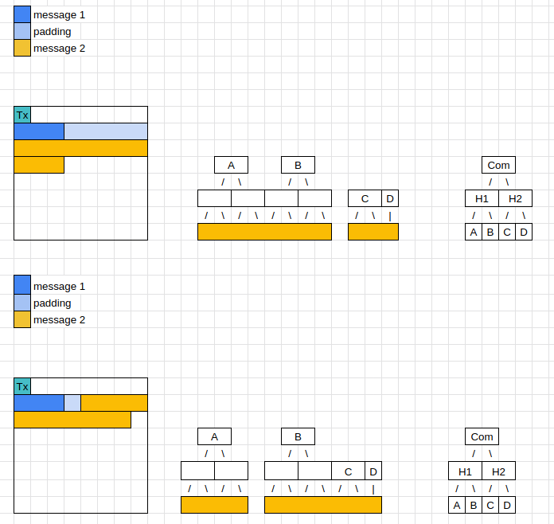
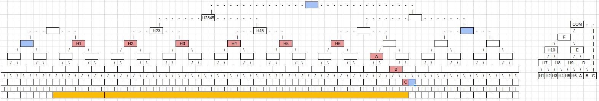
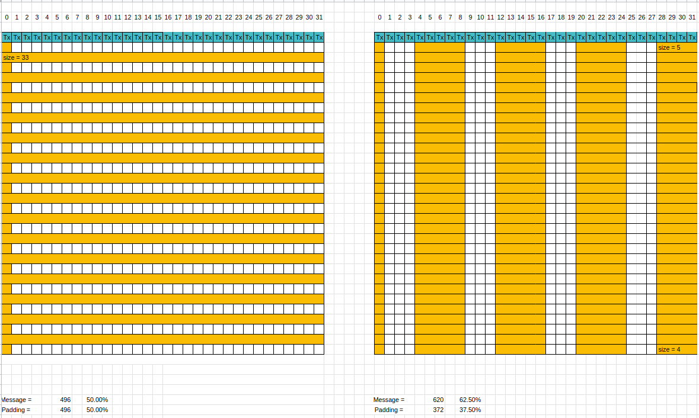
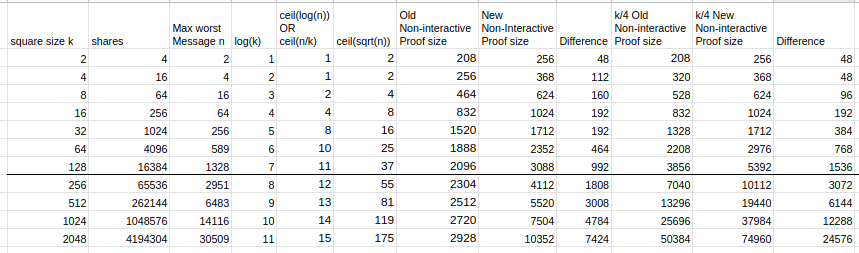
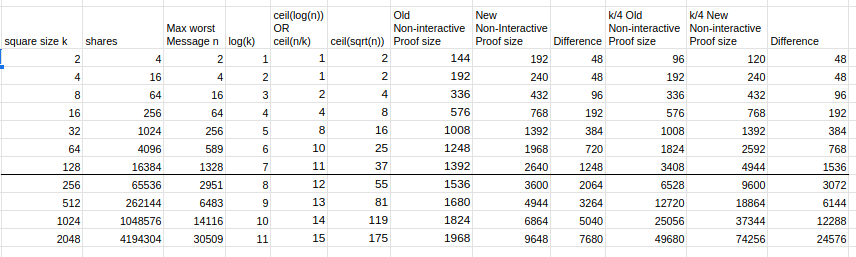

# ADR 009: Non-Interactive Default Rules for Reduced Padding

## Status

Implemented. Superseded by [ADR-013](./adr-013-non-interactive-default-rules-for-zero-padding.md).

## Changelog

- 14.11.2022: Initial Draft

## Context

[ADR 008](./adr-008-square-size-independent-message-commitments.md) makes it possible for the current non-interactive default rules to be modified slightly:

Current

> - Messages must begin at a location aligned with the largest power of 2 that is not larger than the message length or k. If the messages are larger than k, then they must start on a new row.

Proposed

> - Messages start at an index that is a multiple of its `msgMinSquareSize`.

The upside of this proposal is that it reduces the inter-message padding. The downside is that a message inclusion proof will not be as efficient for large square sizes so the proof will be larger.

> **Note**
> This analysis assumes the implementation of [celestia-app#1004](https://github.com/celestiaorg/celestia-app/issues/1004). If the tree over the subtree roots is not a Namespace Merkle Tree then both methods have the same proof size.

As an example, take the diagram below. Message 1 is 3 shares long and message 2 is 11 shares long.

With the current non-interactive default rules, message 2 must start at a location aligned with the largest power of 2 that is not larger than 11 (message length) or 8 (square size). Therefore, message 2 must start at a location aligned with 8 which is index 16 in the example below. This arrangement results in 5 shares of padding.

With the proposed non-interactive default rules, message 2 must start at an index that is a multiple of `msgMinSquareSize`. A message of 11 shares can fit in a square size of 4 (since 4 * 4 = 16 available shares which are > 11) so `msgMinSquareSize` is 4. Therefore, message 2 can start at index 12. This arrangement results in 1 share of padding.

### Defining variables for this analysis

- n := Message length in number of shares
- k := Square size
- r := Number of rows a message fills in the original square

### The following questions will be answered

- Given square size independent commitments, why does a message in a larger square size result in an O(log(n)) message inclusion proof size?
- Assuming message inclusion proof sizes change from O(log(n)) to O(sqrt(n)), what is the worst-case constructible message?
- Why can we not use the same trick that we used in Question 1 in a single row for more efficient proofs over the row roots?
- How big is the proof size for this message?
- What is the worst constructible block with the most amount of padding with old and new non-interactive defaults?
- What is the quantified padding and proof size cost?

## 1. Given square size independent commitments, why does a message in a larger square size result in an O(log(n)) message inclusion proof size

If you use the current non-interactive default rules then the message begins at a location aligned with the largest power of 2 that is not larger than the message length or k. Because the subtree roots are aligned you can skip some subtree roots and calculate their parents.
In the example below instead of proving H1, H2, H3, and H4 to the DataRoot you can prove H10. **H10 is part of the commitment generation and part of the Merkle tree to the DataRoot.** That is why you can use it for more efficient proofs. In smaller square sizes, you cannot do this, because H10 does not exist. The nodes in **red** are the subtree nodes that you need to provide for the message inclusion proof. The nodes in **blue** are the additional nodes for the Merkle proof.

So why can you not do it with the proposed non-interactive default rules? This is because H10 is not generated. In the diagram below the first 8 shares are in the row before and therefore the tree structure changes. The previous subtree root H10 is now H23 and cannot be used for the efficiency boost.
The commitment is still the same but we need to use the bottom subtree roots for the message inclusion proof.

## 2. Assuming message inclusion proof sizes change from O(log(n)) to O(sqrt(n)), what is the worst-case constructible message

Given a square size k, the biggest message that you can construct that is affected by the proposed non-interactive default rules has a size (k/2)². If you construct a message that is bigger than (k/2)² the `minSquareSize` will be k. If the minSquareSize is k in a square of size k then the current non-interactive default rules are equivalent to the proposed non-interactive default rules, because the message starts always at the beginning of a row. In other words, if you have k² shares in a message the worst constructible message is a quarter of that k²/4, because that is the size of the next smaller square.

If you choose k²/4 as the worst constructible message it would still have O(sqrt(n)) subtree roots. This is because the size of the message is k²/4 with a width of k and a length of k/4. This means the number of rows the message fills approaches O(sqrt(n)). Therefore, we need to find a message where the number of rows is log(n) of the size of the message.

With k being the square size and n being the number of shares and r being the number of rows, we want to find a message so that:
k * r = n & log(n) = r => k = n/log(n)

By substituting in k we can calculate n. To get r we calculate n/k, rounding up to the next highest integer in the processes.

|   k  |   n   |  r |
|:----:|:-----:|:--:|
|    2 |     4 |  2 |
|    4 |    16 |  4 |
|    8 |    43 |  6 |
|   16 |   108 |  7 |
|   32 |   256 |  8 |
|   64 |   589 | 10 |
|  128 |  1328 | 11 |
|  256 |  2951 | 12 |
|  512 |  6483 | 13 |
| 1024 | 14116 | 14 |
| 2048 | 30509 | 15 |

The worst case constructible message in a square to have the biggest impact from switching from O(log(n)) to O(sqrt(n)) with n being the size of the message, has r rows in a square size of k. If r is larger than k/4 we need to take k/4 as the number of rows instead because of the first point in this message. With adopting this rule the messages look as follows:

|   k  |   n   |  r |
|:----:|:-----:|:--:|
|    2 |     **2** |  **1** |
|    4 |     **4** |  **1** |
|    8 |    **16** |  **2** |
|   16 |    **64** |  **4** |
|   32 |   256 |  8 |
|   64 |   589 | 10 |
|  128 |  1328 | 11 |
|  256 |  2951 | 12 |
|  512 |  6483 | 13 |
| 1024 | 14116 | 14 |
| 2048 | 30509 | 15 |

 Reminder: We did this calculation because we need O(log(n)) rows.

## 3. Why can we not use the same trick that we used in Question 1 in a single row for more efficient proofs over the row roots

The node needs to be part of the commitment generation **and** part of the Merkle tree to the DataRoot for the trick to work. The diagram shows a Celestia square that is erasure coded and those parity shares are marked in green.
H12 is part of the commitment generation and part of the Merkle tree to the DataRoot.
It is only generated in the bigger square and not in the smaller square because in the smaller square you have to take into account the nodes over the parity shares.
As H12 only exists in the bigger square the more efficient proofs only work in those squares.

## 4. How big is the proof size for this message

We differentiate the size of the proof between the current non-interactive default rules and the proposed non-interactive default rules.
For completion, we also included the scenario of k/4 to compare the proof size before and after even though the % gain is not that high.

### Current Non-Interactive Default Rules

Each row consists of one subtree root, which means if you have log(n) rows you will have in total log(n) subtree roots. The last row has log(k) subtree roots. To get the row roots we will need log(n) blue nodes from the parity shares. Blue nodes are additional nodes that you need for the Merkle proof, which have been used in the previous diagrams. After having now r row roots we need to a Merkle proof of them to the `DataRoot`. In the worst case, the message lies in the middle of the block. Therefore we will need 2* log(k) blue nodes for the proof.

NMT-Node size := 32 bytes + 2\*8 bytes = 48 bytes
MT-Node size := 32 bytes

Proof size = subtree roots (rows) + subtree roots (last row) + blue nodes (parity shares) + 2 \* blue nodes (`DataRoot`)
Proof size = (log(n) + log(k) + log(n)) \* NMT-Node size  + 2\*log(k) \* MT-Node size
Proof size = 48 \* (2\*log(n) + log(k)) + 64 \*log(k)

### Current Non-Interactive Default Rules for k/4

Proof size = subtree roots (rows) + subtree roots (last row) + blue nodes (parity shares) + 2 \* blue nodes (`DataRoot`)
Proof size = (k/4 + log(k) + k/4) \* NMT-Node size  + 2\*log(k) \* MT-Node size
Proof size = 48 \* (k/2 + log(k)) + 64 \*log(k)

### Proposed Non-Interactive Default Rules

Each row consists of sqrt(n)/log(n) subtree roots. Which makes in total sqrt(n) subtree roots. The rest is here the same as before.

Proof size = subtree roots (all rows) + subtree roots (last row) + blue nodes (parity shares) + 2 \* blue nodes (`DataRoot`)
Proof size = (sqrt(n) + log(k) + log(n)) \* NMT-Node size  + 2\*log(k) \* MT-Node size
Proof size = 48 \* (sqrt(n) + log(k) + log(n)) + 64 \*log(k)

### Proposed Non-Interactive Default Rules for k/4

Proof size = subtree roots (rows) + subtree roots (last row) + blue nodes (parity shares) + 2 \* blue nodes (`DataRoot`)
Proof size = (**k/2** + log(k) + k/4) \* NMT-Node size  + 2\*log(k) \* MT-Node size
Proof size = 48 \* (3k/4 + log(k)) + 64 \*log(k)

## 5. What is the worst constructible block with the most amount of padding with old and new non-interactive default rules

For the current non-interactive default rules, when you have a square size of k the worst padding is to fill the square with messages of size k+1
Padding = (k/2) \* (k -1)

To have the most amount of padding for the proposed non-interactive default rules you use repeated messages of size 5 which will result in a padding of 3 in between.

Padding = 3 \* (k-1) \* k/8

## What are the quantified padding and proof size costs

### Proof Size for Super-Light-Nodes

Proof size increases from 2928 bytes to 10352 bytes in 2 GB blocks. In the current `MaxSquareSize` it's from 2096 to 3088 bytes. For bigger messages, the number of row roots will approach sqrt(n). Before that, we will get to k/4+1 roots which will make the message act the same before and after the proposed non-interactive default rules.

### Proof Size for Light-Nodes

Light Nodes have additional access to row and column roots from the Data Availability header. Therefore we can discard any blue nodes to the `DataRoot` from the analysis.

### Total Proof Size for Partial Nodes

Partial nodes in this context are light clients that may download all the data in the reserved namespace. They check that the data behind the PFB was included in the `DataRoot`, via blob inclusion proofs.

For this analysis, we take the result from the light nodes and scale them up to fill the whole square. We ignore for now the reserved namespace and what space it might occupy.
For the proposed non-interactive default rules we are also creating 1 more message that could practically fit into a square. This is because the current non-interactive default rules fit one more message if we construct it this way and don't adjust the first and last messages.

### Padding

The worst-case padding decreases from 1.1 GB to 0.8 GB in 2 GB Blocks. In the current `MaxSquareSize` it's from 4 MB to 3 MB. In general, the worst-case padding size approaches in current non-interactive default rules 50% and the proposed non-interactive default rules 37.5%. That is a maximum reduction of padding to 25%.

## Additional Optimizations

You can further optimize the proof size by using the fact the Namespace is known and the same for all the subtree roots. You can do the same trick for parity shares as the namespace is fixed for them too. Both of these optimizations are not included in the analysis and would save the bytes that are used to store the namespace.

## Consequences

### Positive

The padding decreases a lot.

### Negative

The proof size increases a bit.

## References

[Related Question](https://github.com/celestiaorg/celestia-app/blob/main/docs/architecture/adr-008-square-size-independent-message-commitments.md#positive-celestia-app-changes)
