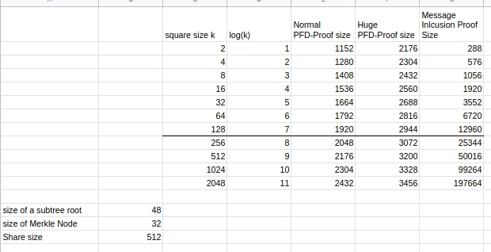

# ADR 010: Optimistic Message Size Independent Inclusion Proofs and PFD Fraud Proofs

## Changelog

- 18.11.2022: Initial Draft

## Context

The verification game is between the verifier and a prover. The verifier has the message or its commitment and access to the block header of Celestia. The prover wants to prove the inclusion of the message in the DA Layer.

Validators check if the PFD commitment matches the commitment that is referenced in [ProcessProposal](https://github.com/celestiaorg/celestia-app/blob/3473000a9ff04fccfbba83929711fe11643b782c/app/process_proposal.go#L113). If validators misbehave and coerce together to break this consensus rule, we need a fraud-proof to enforce this rule. If we assume that we have this fraud-proof then we can use the check in `ProcessProposal` to our advantage for an optimistic message size independent inclusion proof.

## Message size independent inclusion proof - PFD inclusion proof

Instead of proving the Merkle proof over all subtree roots over the message we create a Merkle proof over the PFD transaction as it includes the commitment already. Therefore this proof will include the shares where the PFD transaction lies in the Celestia block plus the inclusion proof of those shares to the `DataRoot`.
The verifier could do the following steps:

- Unserialize the PFD-Transaction
- verify the signatures matches the sequencer
- verify that the nid is 0
- verify that the message length is as long as the rollup block is
- verify the commitment matches the commitment in the header

## PFD Fraud Proof

## Quantitative size comparison

### PFD Inclusion Proof

We are comparing the size of a PFD inclusion proof to a worst-case message inclusion proof.

The size of a normal pfd-transaction is about 330 bytes. This pfd-transaction can span over 2 shares because the start of a transaction can happen in the middle of a share. The worst case is if the transaction starts in the middle of the share of the last block in a row and continues to the first share of the row after. The picture below shows this scenario and what you need to prove the inclusion of those shares. It is a Merkle Proof of the shares to ROW1 and ROW2 and then a Merkle proof of ROW1 and ROW2 to the DataRoot. The blue nodes are additional nodes that are needed for the Merkle proof.

Let's assume a square size of k. The amount of blue nodes from the shares to ROW1 is O(log(k). The amount of blue nodes from ROW1 to the `DataRoot` is also O(log(k). You will have to include the shares themselves in the proof.
Share size := 512 bytes
NMT-Node size := 32 bytes + 2\*8 bytes = 48 bytes
MT-Node size := 32 bytes

Normal PFD proof size in bytes = 2 \* Share size + 2 \* log(k) \* NMT-Node size + log(k) \* MT-Node size  
                               = 2 \* 512 + 2 \* log(k) \* 48 + log(k) \* 32  
                               = 1024 + 128 \* log(k)  

As the size of a PFD-Transaction is unbounded you can encompass even more shares. To put a bound on this we assume that most PFD-Transactions will be able to be captured by 4 Shares.

Huge PFD proof size in bytes = 4 \* Share size + 2 \* log(k) \* NMT-Node size + log(k) \* MT-Node size  
                             = 2048 + 128 \* log(k)

### Message Inclusion Proof

The worst-case message inclusion proof size will result from the biggest possible message with the most amount of subtree roots. This message is constructed as filling up the whole block and having the last row missing one share.

With a message of size n and a square size of k, this means that we have O(sqrt(n)) subtree row roots and O(log(sqrt(n))) subtree row roots in the last row. As the whole block is filled up, sqrt(n) tends towards k. The last row will require log(k) blue nodes. We will also require additional k blue parity nodes to prove the row roots.

Worst case message inclusion proof size = (sqrt(n) + log(sqrt(n)) + log(k) + k) \* NMT-Node size     | sqrt(n) = k  
                                        = ( 2 \* k + 2 \* log(k) ) \* 48  

## Alternative Approaches

The other way to prove message inclusion depends on the message size. An analysis of this was done at ADR009  A message inclusion proof includes all the subtree roots of the message and the Merkle proof of those subtree roots to the Data Root of Celestia.

## Decision

> This section records the decision that was made.
> It is best to record as much info as possible from the discussion that happened. This aids in not having to go back to the Pull Request to get the needed information.

## Detailed Design

TODO

## Status

Proposed

## Consequences

> This section describes the consequences, after applying the decision. All consequences should be summarized here, not just the "positive" ones.

### Positive

### Negative

### Neutral

## References

> Are there any relevant PR comments, issues that led up to this, or articles referenced for why we made the given design choice? If so link them here!

- {reference link}
