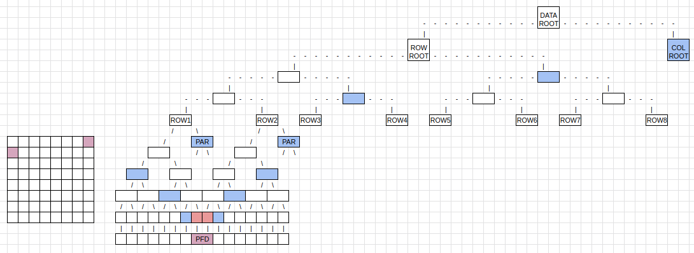
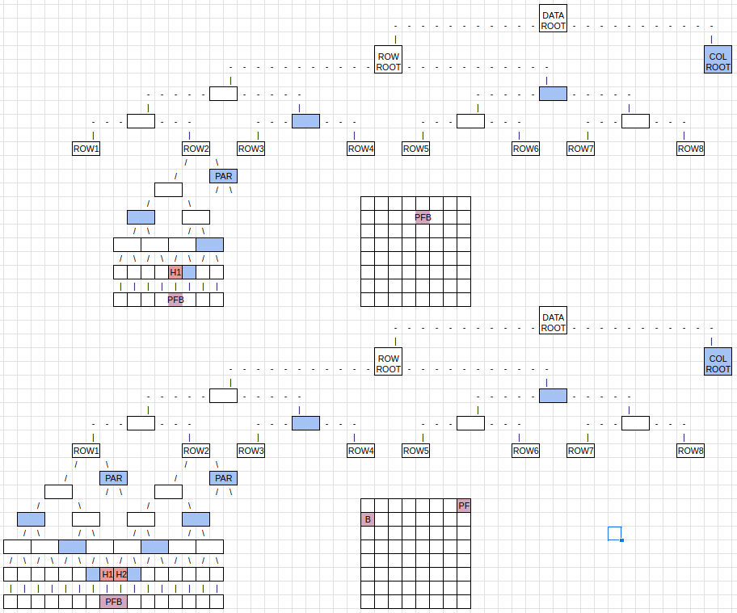
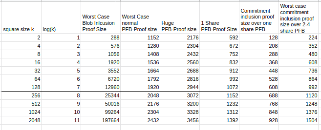

# ADR 011: Optimistic Blob Size Independent Inclusion Proofs and PFB Fraud Proofs

## Status

Accepted -> Does not affect the Celestia Core Specification

Optimization 1 & 2 **Declined** as it is currently not worth it to introduce extra complexity for reducing the PFB proof size by 512-1024 bytes.

## Changelog

- 18.11.2022: Initial Draft

## Context

The blob inclusion verification game is between the verifier and a prover. The verifier has the blob or its commitment and access to the Celestia block header. The prover wants to prove the inclusion of the blob in this block.

Validators check if the commitment in the PFB transaction matches the commitment that is referenced in [ProcessProposal](https://github.com/celestiaorg/celestia-app/blob/3473000a9ff04fccfbba83929711fe11643b782c/app/process_proposal.go#L113). Given that 2/3 of validators can collude and break this consensus rule, we want a fraud-proof to inform light clients of violations of this rule. If we assume that we have this fraud-proof then we can use the check in `ProcessProposal` to our advantage for an optimistic blob size independent inclusion proof.

## Blob size independent inclusion proof - PFB inclusion proof

A PFB transaction inclusion proof proves that a PFB transaction was included in a block. A PFB transaction inclusion proof contains the shares that have the PFB transaction and two distinct inclusion proofs:

1. An NMT proof that proves the shares exist in a Merkle tree with root `RowRoot`.
2. A Merkle proof that proves the `RowRoot` exists in a Merkle tree with root `DataRoot`.

Note the second proof may not be necessary because light clients download the `DataAvailabilityHeader` which contains all `RowRoot`s of the block's extended data square (EDS).

Note that a PFB transaction inclusion proof does not scale with the size of the blob it pays for because the blob was separated from the PFB transaction before being written to the data square. In other words, a PFB transaction inclusion proof is blob size independent.

The verifier could do the following steps:

1. Verify that the namespaceID is the transaction namespaceID (i.e. `namespace.ID{0, 0, 0, 0, 0, 0, 0, 1}`). A verifier must do this to avoid accidentally interpreting a blob share as a transaction share.
2. Deserialize all shares that contain the relevant PFB transaction
3. Verify that the PFB transaction signatures are valid
4. Verify the commitment in the PFB transaction matches the commitment that the verifier has

Optional if you have the whole blob:

- Verify that the blob length in the PFB is as long as the size of the blob

Optional if you have the rollup header:

- Verify if the signatures match the sequencer

## PFB Fraud Proof

First, we need to ask the question of what the PFB Fraud Proof tries to prove. A PFB Fraud Proof tries to prove that a sound PFB in the square exists but the corresponding blob does not exist where it should be.

A PFB Fraud Proof = PFB Inclusion Proof + Blob Inclusion Proof

After you verify the PFB Inclusion Proof you will get the:

- index where the blob is located
- how long the blob is
- the commitment of the blob

With the information that you now confirmed you can confirm the blob inclusion proof of the shares that start at the index for the given length.

This means that you will verify the Merkle proof over the subtree roots over the blob that was specified in the PFB transaction. The final step would be to calculate the commitment over the subtree roots for the final commitment.

If the calculated commitment equals the commitment in the PFB transaction then the fraud proof is invalid. One may block the full node that provided this fraud proof to mitigate DoS attacks.

If the calculated commitment doesn't equal the commitment in the PFB transaction, then the fraud proof is valid. Halt the chain as 2/3 of the validators signed an invalid block.

## Quantitative size comparison

### PFB Inclusion Proof

We are comparing the size of a PFB inclusion proof to a worst-case blob inclusion proof.

The size of a normal PFB transaction is about 330 bytes. This PFB transaction can span over 2 shares because the start of a transaction can occur in the middle of a share. In the worst case scenario, a transaction starts in the middle of the last share in a row and continues to the first share of the next row. This worst case scenario is depicted by the pink squares in the diagram below. In order to prove the inclusion of the pink shares, one needs:

1. A NMT proof of the first share to ROW1's `RowRoot`.
1. A NMT proof of the second share to ROW2's `RowRoot`.
1. A Merkle proof of the `RowRoot`s from ROW1 and ROW2 to the `DataRoot`.

Note: the blue nodes are additional nodes that are needed for the Merkle proofs.

Let's assume a square size of k. The amount of blue nodes from the shares to ROW1 is O(log(k)). The amount of blue nodes from ROW1 to the `DataRoot` is also O(log(k)). You will have to include the shares themselves in the proof.
Share size := 512 bytes
NMT-Node size := 32 bytes + 2\*8 bytes = 48 bytes
MT-Node size := 32 bytes

Worst Case Normal PFB proof size in bytes
= 2 PFB Shares + blue nodes to row roots + blue nodes to (`DataRoot`)
= 2 \* Share size + 2 \* log(k) \* NMT-Node size + log(k) \* MT-Node size
= 2 \* 512 + 2 \* log(k) \* 48 + log(k) \* 32
= 1024 + 128 \* log(k)

As the size of a PFB transaction is unbounded you can encompass even more shares. To put a bound on this we assume that most PFB transactions will be able to be captured by 4 shares.

Huge PFB proof size in bytes
= 4 PFB Shares + blue nodes to row roots + blue nodes to (`DataRoot`)
= 4 \* Share size + 2 \* log(k) \* NMT-Node size + log(k) \* MT-Node size
= 2048 + 128 \* log(k)

### Blob Inclusion Proof

The worst-case blob inclusion proof size will result from the biggest possible blob with the most amount of subtree roots. This blob is constructed as filling up the whole block and having the last row missing one share.

With a blob of size n and a square size of k, this means that we have O(sqrt(n)) subtree row roots and O(log(k)) subtree row roots in the last row. As the whole block is filled up, sqrt(n) tends towards k. We will also require additional k blue parity nodes to prove the row roots.

Worst case blob inclusion proof size
= subtree roots (all rows) + subtree roots (last row) + blue nodes (parity shares)
= (sqrt(n) + log(k) + k) \* NMT-Node size | sqrt(n) => k
= ( 2 \* k + log(k) ) \* 48

## Optimizations

### Optimization 1

If a PFB would be guaranteed to be in one share then we could decrease the PFB proof size significantly. You would not only get rid of one share resulting in a 512 bytes save but also log(k) fewer blue nodes in the worst case. The maximum size PFB that fits into one share is 501 bytes long:
= Share size - nid - special byte - reserved bytes - transaction length
= 512 - 8 - 1 - 1 - 1 = 501
Therefore a normal-sized PFB of 330 bytes fits easily into a share with additional spare bytes to be used for more complex PFBs.
A requirement for this is an option for the transaction to be the only one in a share or at the start of a share if it fits in the share. This would extend to bigger PFB shares as well so you can potentially reduce the size of overlapping PFB proofs by 1 share (512 bytes).

One share PFB proof size
= Share + blue nodes to row root + blue nodes (`DataRoot`)
= Share size + log(k) \* NMT-Node size + log(k) \* MT-Node size
= 512 + log(k) \* 48 + log(k) \* 32
= 512 + 80 \* log(k)

### Optimization 2

The second optimization that could be possible is to only prove the commitment over the PFB transaction and not the PFB transaction itself. This requires the next block header in the rollup chain to include the commitment of the PFB transaction shares as well.
This would require the PFB transaction to be deterministic and therefore predictable so you can calculate the commitment over PFB transaction beforehand. How the PFB transaction is created like gas used and signatures, is something the roll-up has to agree upon before. It only needs to be predictable, if we want to keep the option of asynchronous blocktimes and multiple Rollmint blocks per Celestia block.
Another requirement is that the content of the PFB shares is predictable. You could enforce this by only having the PFB transaction in the share.

The commitment over the PFB transaction is created by using the same principle of creating the commitment over a blob. Therefore the size of the inclusion proof is the same as the size of a blob inclusion proof of the size of how many shares the PFB transaction spans.

Commitment inclusion proof size over one share PFB
= subtree root + blue nodes to share + blue nodes to (`DataRoot`)
= NMT-Node size + log(k) \* NMT-Node size + log(k) \* MT-Node size
= 48 + log(k) \* 48 + log(k) \* 32
= 48 + 80 \* log(k)

For two shares the best case is the same as for one share but the worst case includes twice the blue nodes to the row root. For 3 and 4 shares for a PFB transaction, the worst case proof size does not change significantly.

Worst case commitment inclusion proof size over 2-4 share PFB
= subtree roots + blue nodes to share + blue nodes to (`DataRoot`)
= 2 \* NMT-Node size + 2 \* log(k) \* NMT-Node size + log(k) \* MT-Node size
= 96 + log(k) \* 96 + log(k) \* 32
= 96 + 128 \* log(k)

<!--- This does not need a fraud proof as it could be a validation rule that even light clients can check. This would require the light clients to know the sequencer set and whose turn it was. (not sure about this)
--->

The fraud proof for this would be to prove that the commitment of the PFB transaction does not equal the predicted commitment in the header. Therefore this is equivalent to a PFB transaction inclusion proof. This fraud proof would be optimistic as we would assume that the PFB commitment is correct. But realistically if the commitment over the PFB transaction is wrong then the PFB commitment is most likely wrong as well. Therefore the fraud proof would be a PFB Fraud Proof as described at the top.
If we do not have a PFB transaction that can be predicted, we also need to slash double signing of 2 valid PFB transactions in Celestia. This is required so we don't create a valid fraud proof over a valid commitment over the PFB transaction.

The third optimization could be to SNARK the PFB Inclusion Proof to reduce the size even more.?

## Result

For normal-sized PFBs the Proof size will be worth it from blob size x to y depending on how many shares the PFB occupies.
If the PFB is guaranteed to be in one share then it is always worth from blob size x.
For huge PFBs that span over 4 shares the PFB Proof will be worth it from blob size z.
Detailed analysis of x, y and z will follow if the general concept makes sense.

## Alternative Approaches

The other way to prove blob inclusion is dependent on the blob size. A blob inclusion proof includes all the subtree roots of the blob and the Merkle proof of those subtree roots to the `DataRoot` of Celestia.

## Detailed Design

TODO

## Consequences

### Positive

By implementing PFB inclusion proofs you create PFB fraud proofs at the same time.

### Negative

Optimization 1 will most likely introduce intra-transaction padding. Optimization 2 will definitely introduce intra-transaction padding so only the PFB transaction occupies the shares.

### Neutral

TODO
