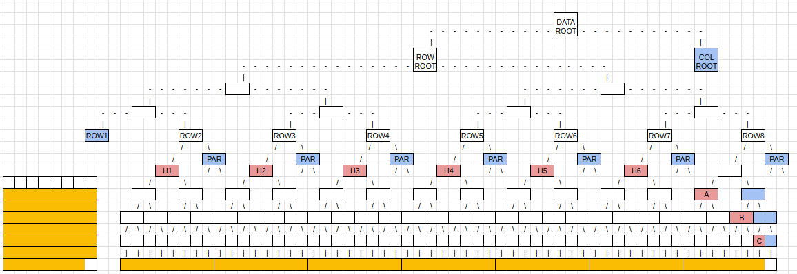
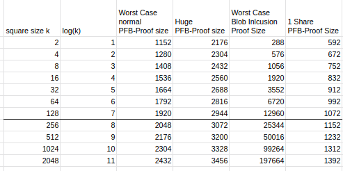

# ADR 011: Optimistic Blob Size Independent Inclusion Proofs and PFB Fraud Proofs

## Changelog

- 18.11.2022: Initial Draft

## Context

The blob inclusion verification game is between the verifier and a prover. The verifier has the blob or its commitment and access to the block header of Celestia. The prover wants to prove the inclusion of the blob in the DA Layer.

Validators check if the PFB commitment matches the commitment that is referenced in [ProcessProposal](https://github.com/celestiaorg/celestia-app/blob/3473000a9ff04fccfbba83929711fe11643b782c/app/process_proposal.go#L113). If validators misbehave and coerce together to break this consensus rule, we need a fraud-proof to enforce this rule. If we assume that we have this fraud-proof then we can use the check in `ProcessProposal` to our advantage for an optimistic blob size independent inclusion proof.

## Blob size independent inclusion proof - PFB inclusion proof

Instead of proving the Merkle proof over all subtree roots over the blob we create a Merkle proof over the PFB transaction as it includes the commitment already. Therefore this proof will include the shares where the PFB transaction lies in the Celestia square plus the inclusion proof of those shares to the `DataRoot`.

The verifier could do the following steps:

- Verify that the nid is 0. We have to do this so we don't accidentally verify a blob share that looks like a PFB-Transaction
- Unserialize the PFB-Transaction
- Verify the signatures
- Verify the given commitment matches the commitment in the header

Optional if you have the whole blob:

- Verify that the blob length in the PFB is as long as the size of the blob

Optional if you have the rollup header:

- Verify if the signatures match the sequencer

## PFB Fraud Proof

First, we need to ask the question of what the PFB Fraud Proof tries to proof. A PFB Fraud Proof tries to prove that a sound PFB in the square exists but the corresponding blob does not exist where it should be.

A PFB Fraud Proof = PFB Inclusion Proof + Blob Inclusion Proof

After you verify the PFB Inclusion Proof you will get the:

- index where the blob is located
- how long the bob is
- the commitment of the blob

With the information that you now confirmed you can confirm the blob inclusion proof of the shares that start at the index for the given length.

This means that you will verify the Merkle proof over the subtree roots over the blob that was specified in the PFB-Transaction. The final step would be to calculate the commitment over the subtree roots for the final commitment.

If the calculated commitment equals the commitment in the PFB-Transaction then reject the Fraud-Proof and block the full node, otherwise halt the chain as 2/3 of the validators signed an invalid block.

(TODO: We might need to verify the share after the blob to see if the blob ended if we want to prevent nested blob attacks. Forum post coming soon)

## Quantitative size comparison

### PFB Inclusion Proof

We are comparing the size of a PFB inclusion proof to a worst-case blob inclusion proof.

The size of a normal PFB-Transaction is about 330 bytes. This PFB-Transaction can span over 2 shares because the start of a transaction can happen in the middle of a share. The worst case is if the transaction starts in the middle of the share of the last block in a row and continues to the first share of the row after. The picture below shows this scenario and what you need to prove the inclusion of those shares. It is a Merkle Proof of the shares to ROW1 and ROW2 and then a Merkle proof of ROW1 and ROW2 to the DataRoot. The blue nodes are additional nodes that are needed for the Merkle proof.

Let's assume a square size of k. The amount of blue nodes from the shares to ROW1 is O(log(k). The amount of blue nodes from ROW1 to the `DataRoot` is also O(log(k). You will have to include the shares themselves in the proof.
Share size := 512 bytes
NMT-Node size := 32 bytes + 2\*8 bytes = 48 bytes
MT-Node size := 32 bytes

Worst Case Normal PFB proof size in bytes  
= 2 \* Share size + 2 \* log(k) \* NMT-Node size + log(k) \* MT-Node size  
= 2 \* 512 + 2 \* log(k) \* 48 + log(k) \* 32  
= 1024 + 128 \* log(k)  

As the size of a PFB-Transaction is unbounded you can encompass even more shares. To put a bound on this we assume that most PFB-Transactions will be able to be captured by 4 Shares.

Huge PFB proof size in bytes  
= 4 \* Share size + 2 \* log(k) \* NMT-Node size + log(k) \* MT-Node size  
= 2048 + 128 \* log(k)

### Blob Inclusion Proof

The worst-case blob inclusion proof size will result from the biggest possible blob with the most amount of subtree roots. This blob is constructed as filling up the whole block and having the last row missing one share.

With a blob of size n and a square size of k, this means that we have O(sqrt(n)) subtree row roots and O(log(k)) subtree row roots in the last row. As the whole block is filled up, sqrt(n) tends towards k. We will also require additional k blue parity nodes to prove the row roots.

Worst case blob inclusion proof size  
= (sqrt(n) + log(k) + k) \* NMT-Node size     | sqrt(n) => k  
= ( 2 \* k + log(k) ) \* 48

### Optimizations

If a PFB would be guaranteed to be in one share then we could decrease the PFB proof size significantly. You would not only get rid of one share resulting in a 512 bytes save but also log(k) fewer blue nodes. The maximum size PFB that fits into one share is 501 bytes long:  
= Share size - nid - special byte - reserved bytes - transaction length  
= 512 - 8 - 1 - 1 - 1 = 501  
Therefore a normal-sized PFB of 330 fits easily into a share with additional spare bytes to be used for more complex PFBs.

One share PFB proof size  
= Share + blue nodes to shares + blue nodes (`DataRoot`)  
= Share size + log(k) \* NMT-Node size + log(k) \* MT-Node size  
= 512 + log(k) \* 48 + log(k) \* 32  
= 512 + 80 \* log(k)

The second optimization could be to SNARK the PFB Inclusion Proof to reduce the size even more.?

### Result

For normal-sized PFBs the Proof size will be worth it from blob size x to y depending on how many shares the PFB occupies.
If the PFB is guaranteed to be in one share then it is always worth from blob size x.
For Huge PFBs that span over 4 shares the PFB Proof will be worth it from blob size z.
Detailed analysis of x,y and z will follow if the general concept makes sense.

## Alternative Approaches

The other way to prove blob inclusion depends on the blob size. A blob inclusion proof includes all the subtree roots of the blob and the Merkle proof of those subtree roots to the `DataRoot` of Celestia.

## Detailed Design

TODO

## Status

Proposed

## Consequences

### Positive

By creating PFB inclusion proofs you create PFB fraud proofs at the same time.

### Negative

TODO

### Neutral

TODO
