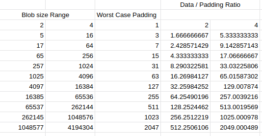

# ADR 013: Non-Interactive Default Rules for Zero Padding

## Status

Implemented in <https://github.com/celestiaorg/celestia-app/pull/1604>. `SubtreeRootThreshold` decreased from 128 to 64 in <https://github.com/celestiaorg/celestia-app/pull/1766>.

## Changelog

- 2023/03/01: Initial draft
- 2023/05/30: Update status
- 2023/06/17: Add a section for "Picking a `SubtreeRootThreshold`". Rephrased some sections.

## Context

When laying out blobs in the square, the block proposer adds namespace padding shares between blobs to conform to the non-interactive default rules. [ADR-009](./adr-009-non-interactive-default-rules-for-reduced-padding.md) reduced padding by placing blobs at an index that is a multiple of the `MinSquareSize(blob)`[^1]. This is a good improvement but we can reduce padding further.

If we analyze the worst case padding for different blob sizes, we can see that the ratio of blob size to padding is not constant. Insight: **the ratio of blob size to padding is small for small blobs and large for large blobs.**

This means small blobs are inefficient because they generate more potential padding for the data they provide. This is not ideal as we want to minimize padding. Since users do not pay for namespace padding shares, they may not be sufficiently incentivized to submit large blobs.

In the naive approach if the block proposer aligned blobs one after another then there would be zero padding between blobs. Although this approach minimizes padding, it comes at the cost of large blob inclusion proofs because the hash of each share would be a subtree root of the proof. Put another way, the blob inclusion proof for a blob of size N shares would include N subtree roots. Large blob inclusion proofs may be difficult to download for resource constrained light nodes.

Small blob sizes have the lowest ratio of data to padding but also have small blob inclusion proofs. Since the size of blob inclusion proofs is an important constraint, we can establish a threshold to bound the number of subtree roots in a blob inclusion proof. From now on this threshold is called the `SubtreeRootThreshold` and it sets an upper bound for the number of subtree roots in a blob inclusion proof.

We can increase the `SubtreeRootThreshold` (and correspondingly the blob inclusion proof size) as long we are confident light nodes can process such a proof size. By increasing the subtree root threshold, we can place blobs closer together and therefore decrease the padding in the square. This is especially useful for small blobs since they have the lowest ratio of data to padding.

## Proposal

The proposed non-interactive default rules: A blob must start at an index that is a multiple of the subtree root width for the given blob. The subtree root width for a blob is the minimum of:

- `math.Ceil(blob / SubtreeRootThreshold)` rounded up to the next power of two
- `MinSquareSize(blob)`[^1]

where `blob` is the length of the blob in shares and `SubtreeRootThreshold` is some constant.

Note, `MinSquareSize(blob)` is retained in this iteration of the non-interactive default rules to prevent some blobs from having more padding with this proposal than they had with the old non-interactive default rules.

## Visualization

The diagram below shows the difference between the old and new non-interactive default rules in a square of size 8 with `SubtreeRootThreshold` of 8.

## Picking a `SubtreeRootThreshold`

To recap, the `SubtreeRootThreshold` determines the index of where a blob must start in the square. A low `SubtreeRootThreshold` results in small blob inclusion proofs at the cost of more padding in the square.

For example, assume `SubtreeRootThreshold = 64`. This would mean that the blobs smaller than the `64` can start at an index that is a multiple of one and therefore introduce zero padding. Blobs that are larger than `64` but smaller than `64 * 2 = 128` can use an index that is a multiple of 2 to get a maximum of 1 padding share. Blobs that are larger than `64 * 2 = 128` but smaller than `64 * 4 = 256` can use an index that is a multiple of 4 to get a maximum of 3 padding shares and so on.

| Blob size (in number of shares) | Subtree root width[^2] | Index in square | Worst case padding |
|---------------------------------|------------------------|-----------------|--------------------|
| blob <= 64                      | 1                      | multiple of 1   | 0                  |
| 64 < blob <= 128                | 2                      | multiple of 2   | 1                  |
| 128 < blob <= 256               | 4                      | multiple of 4   | 3                  |
| 256 < blob <= 512               | 8                      | multiple of 8   | 7                  |

Note: the threshold doesn't need to be `64` and the implementation versions this constant so that it is possible to modify over time.

## Analysis

### Light nodes

The proof size is determined by the number of subtree roots in the blob inclusion proof which is bounded by the threshold. If the new threshold is the `SubtreeRootThreshold` then the worst case for the number of subtree roots in a blob inclusion proof will be bounded by `SubtreeRootThreshold`.

If light nodes can process this proof size without a problem then we can use this bound. If not, we can use a smaller bound. The smaller the bound the more padding we will have.

In addition, we could use PFB inclusion proofs ([ADR 11](./adr-011-optimistic-blob-size-independent-inclusion-proofs-and-pfb-fraud-proofs.md)) to reduce the proof size of the blob inclusion proof for light nodes. This would make this change not noticeable to them as they are blob size independent until we need a fraud-proof for a malicious PFB inclusion.

This fraud-proof would still be magnitudes smaller than a bad encoding fraud-proof. Both cases require 2/3 of the Celestia validators to be malicious. In both cases, the chain would halt and fall back to social consensus. If a light node can process the bad encoding fraud-proof then it can also process the PFB fraud-proof easily.

### Partial nodes

In this context, partial nodes are celestia-node light nodes that may download all of the data in the reserved namespaces. They check that the data behind the PFB was included in the `DataRoot`, via blob inclusion proofs.

The sum of the size of all blob inclusion proofs will be larger than the sum with the previous non-interactive default rules.

In the current worst case a Celestia block is full of blobs of size 1, making the total amount of subtree roots that need to be downloaded O(n) where n is the number of shares in a block. With the new non-interactive default rules, the worst case stays the same, but the average case goes up. If the block is filled with blobs that are smaller than the threshold then the partial node will still need to download O(n) subtree roots.

### Worst Case Padding

If we choose the threshold to be the `MaxSquareSize` then the worst-case padding will be approaching 2 rows of padding. This means that this scales very well as no matter how large the blob is, the worst-case padding will be at most 2 rows of padding if we adjust the threshold to a new `MaxSquareSize`.

Here is a diagram of the worst-case padding for a threshold of 16 for the square size of 16. The left side is before and the right side is after this change. The bigger the square the more noticeable the change will be.

## Consequences

### Positive

Most blocks will have close to zero padding.

### Negative

The number of subtree roots to download for partial nodes will increase in the average case.

### Neutral

The number of subtree roots to download for light nodes will increase in the average case, but it is still small enough as the threshold will be chosen wisely. Furthermore, this effect can be mitigated by using PFB inclusion proofs.

[^1]: `MinSquareSize(blob)` is a function that returns the minimum square size that can contain a blob of size `blob` shares. For example, a blob that spans 5 shares can be contained in a square of size 4 x 4 but it cannot be contained in a square of size 2 x 2. Note that square sizes must be powers of two. As a result `MinSquareSize(5) = 4`.

[^2]: Subtree root width is the maximum number of leaves per subtree root.
