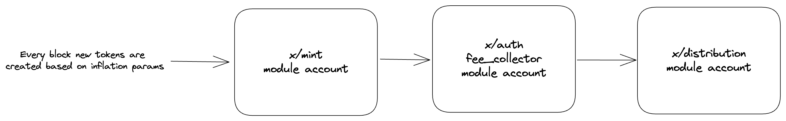

# ADR 019: Strict Inflation Schedule

## Status

Implemented in <https://github.com/celestiaorg/celestia-app/pull/1578>

## Changelog

- 2023/3/31: Initial draft
- 2023/4/27: Height-based vs time-based
- 2023/5/12: Clarify annual provisions based on year start

## Context

Cosmos SDK chains that use the [x/mint](https://github.com/cosmos/cosmos-sdk/blob/v0.46.15/x/mint/spec/README.md) module have a flexible inflation rate that increases/decreases so that the total % of tokens bonded target some value.

In contrast to a flexible inflation rate, Celestia intends on having a predictable inflation rate with the following constants:

| Constant                   | Value (%) |
|----------------------------|-----------|
| Initial inflation          | 8.00      |
| Disinflation rate per year | 10.00     |
| Target inflation           | 1.50      |

When the target inflation is reached, it remains at that rate.
The table below depicts the inflation rate for the foreseeable future:

| Year | Inflation (%)     |
|------|-------------------|
| 0    | 8.00              |
| 1    | 7.20              |
| 2    | 6.48              |
| 3    | 5.832             |
| 4    | 5.2488            |
| 5    | 4.72392           |
| 6    | 4.251528          |
| 7    | 3.8263752         |
| 8    | 3.44373768        |
| 9    | 3.099363912       |
| 10   | 2.7894275208      |
| 11   | 2.51048476872     |
| 12   | 2.259436291848    |
| 13   | 2.0334926626632   |
| 14   | 1.83014339639688  |
| 15   | 1.647129056757192 |
| 16   | 1.50              |
| 17   | 1.50              |
| 18   | 1.50              |
| 19   | 1.50              |
| 20   | 1.50              |

Additionally, the annual provisions should be based on the total supply at the beginning of each year. In other words, tokens that are minted throughout the course of a year should not be considered when calculating the annual provisions for that year. For example:

| Year | Inflation (%) | Total supply at year start | Annual provisions |
|------|---------------|----------------------------|-------------------|
| 0    | 8.00          | 100                        | 8.00              |
| 1    | 7.20          | 108                        | 7.776             |
| 2    | 6.48          | 115.776                    | 7.5022848         |

## Design

In order to implement the inflation rate specified above, we want to make one significant modification to the existing `x/mint` module. Instead of relying on a block height (i.e. `header.height`) based inflation schedule, we are considering a time-based (i.e. `header.time`) inflation schedule. Using a time-based schedule has one key advantage: since the block interval isn't fixed, individual validators are able to produce blocks at a rate (i.e. one block every 10 seconds) that differs from the network target (i.e. one block every 15 seconds).

An inflation schedule based on block height needs to make an assumption on the number of blocks created per year so a large discrepancy between the expected and actual block interval will result in a discrepancy between target and actual inflation rate.

A time-based inflation schedule depends on block timestamps and "the timestamp is equal to the weighted median of validators present in the last commit." [cometbft/specs](https://github.com/cometbft/cometbft/blob/c58597d656d5c816334aff9ea8e600bdbc534817/spec/core/data_structures.md?plain=1#L127). In other the weighted median timestamp has the same 1/3+ security model as the rest of Tendermint and it takes 1/3+ to arbitrarily modify the time (monotonically increasing).

Note: a time-based inflation schedule implemented isn't as battle-tested as the Cosmos SDK `x/mint` module and may expose additional attack vectors.

## Detailed Design

1. Remove all governance modifiable parameters from the module. The inflation schedule is fixed and can only be modified by a major upgrade.
1. Every year
    1. Calculate inflation rate based on the number of years since genesis
    1. Calculate annual provisions for that year based on the new inflation rate
1. Every block
    1. Calculate block provision based on the annual provisions and the number of seconds elapsed between the current and previous block

Note: all time-based calculations use nanosecond precision. Additionally time-based calculations assume 365.2425 [`DaysPerYear`](https://github.com/celestiaorg/celestia-app/blob/ddaa261b9b0dec5f5ea10dbfab4c8a03c95d7e72/x/mint/types/constants.go#LL13C23-L13C31) to account for leap years.

### FAQ

Q: What is the flow of funds for newly created tokens in the existing `x/mint` module?

The `x/mint` BeginBlock:

1. Recalculates the inflation rate based on the bonded ratio and target bonded ratio.
1. Calculates the total amount of tokens that should be minted in the year due to inflation: `AnnualProvisions`
1. Updates the `x/mint` Minter field with these two newly calculated values
1. Calculates the amount of tokens that should be minted in the previous block due to inflation. This method makes an assumption on the number of blocks per year by depending on the param: `BlocksPerYear`
1. Mints the tokens
    1. Calls `x/bank` BankKeeper `MintCoins` which creates new coins and adds them to the `x/mint` module account
    1. Moves coins from `x/mint` module account to `x/auth` fee_collector module account

The `x/distribution` BeginBlock

1. Moves the fees from the `x/auth` fee_collector module account to the `x/distribution` distribution module account
1. The block proposer receives a fraction of the fees from the block based on the params `BaseProposerReward` and `BonusProposerReward`. Celestia has set `BaseProposerReward=0` and `BonusProposerReward=0` [here](https://github.com/celestiaorg/cosmos-sdk/commit/d931c27bdf9a6958618c541458ca2272a79de787) so this step does not apply.
1. A community pool receives a fraction of the fees based on the params `CommunityTax`. Celestia has set `CommunityTax=.02`
1. Validators receive the remainder of the fees from the block based on their voting power. Tokens don't actually leave the distribution module account at this step. At some point in the future when a validator or delegator trigger a withdrawal, tokens are withdrawn from the distribution module account.

Q: If we use a time-based inflation schedule, how can we avoid a hard-coded assumption for the `BlocksPerYear`?

A: Likely calculate an estimate for the # of `BlocksPerYear` in BeginBlock by looking at the # of blocks in the year so far or the # of seconds between the last block and the current block.

Q: Do any other Cosmos chains use a time-based inflation schedule?

Osmosis creates new tokens due to inflation once per day. Their inflation rate decreases by 1/3 every year. They use a time-based inflation schedule. See [`osmosis/x/epochs`](https://github.com/osmosis-labs/osmosis/tree/main/x/epochs) and [`osmosis/x/mint`](https://github.com/osmosis-labs/osmosis/tree/main/x/mint). Note: Some of the Osmosis inflation goes to a developer vesting pool, a community pool, and liquidity pool incentives.

Osmosis doesn't specify a `BlocksPerYear` because their inflation mechanism uses epochs.

Osmosis decreases inflation rate by a third every 365 days. See <https://github.com/rootulp/osmosis/blob/94e0042d6cbd91ffab05cc71ab214a55e441f89f/x/mint/keeper/hooks.go#L39-L49>

Note: we should use DecCoin to avoid rounding errors. See <https://github.com/osmosis-labs/osmosis/issues/1917>.

Q: What is the skew between `BlocksPerYear` on popular Cosmos SDK chains and the actual number of blocks per year?

Cosmos Hub (a.k.a Gaia) sets `BlocksPerYear` to 4,360,000 [here](https://github.com/cosmos/gaia/blob/8a522e98a2863205cf02fb97f8ad27d091670b9d/docs/governance/current-parameters.json#L86). Cosmos Hub has a block time 6.353 ms. Numia data doesn't have complete data for 2021 so we'll examine 2022:

| Year | BlocksPerYear | Actual # of Blocks | Skew  |
|------|---------------|--------------------|-------|
| 2022 | 4,360,000     | 4,580,463          | 5.05% |

Source: [Numia query](https://console.cloud.google.com/bigquery?sq=611612269782:f0c42f9584c448c78a4ec5f118c2091c)
