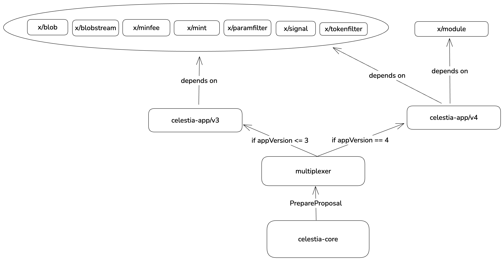
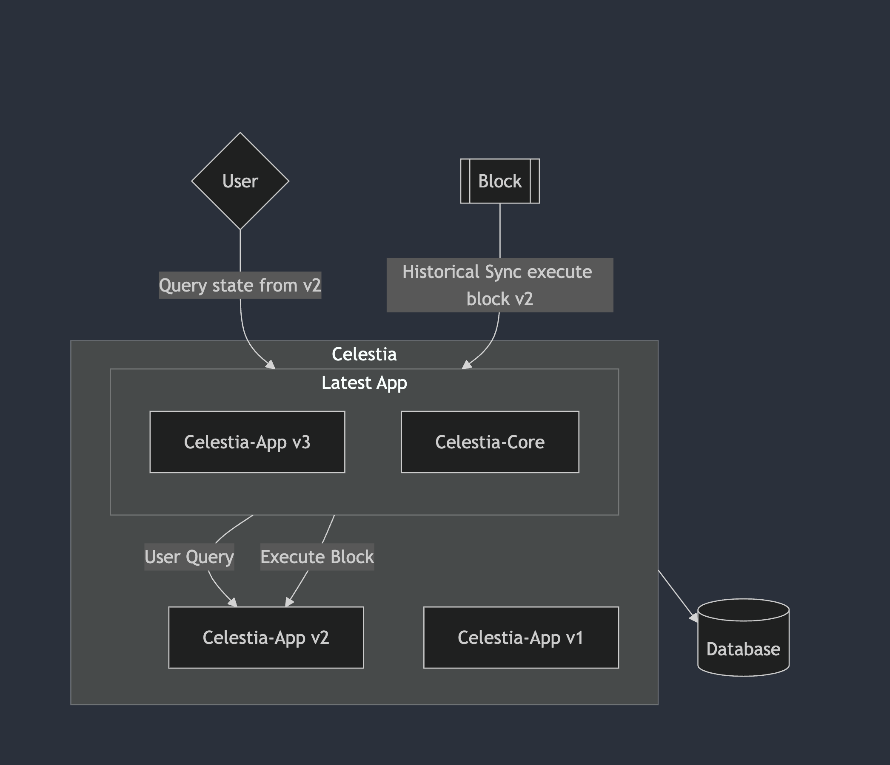
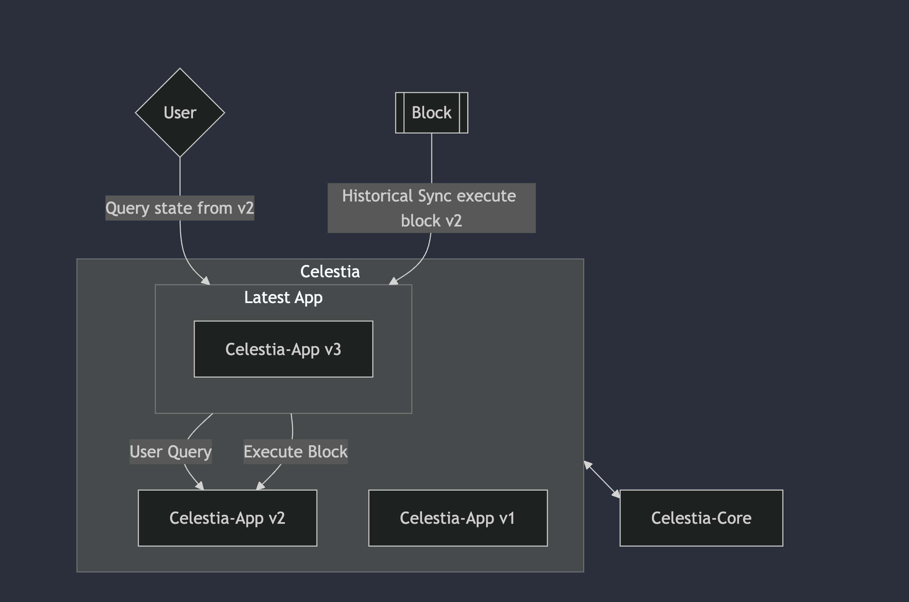

# ADR 23: Multiplexed App

## Changelog

- 2024/10/14: Initial draft (@rootulp)
- 2024/10/20: Expand on alternative options (@rootulp)

## Status

Draft

## Glossary

**Single binary syncs**: the ability for a single binary to sync the entire history of the chain from genesis to the most recent block.
**Donwtime-minimized upgrades**: the ability for the network to upgrade app versions within the expected block time. The expected block time for app versions 1 and 2 is 12 seconds. The expected block time for app version 3 is 6 seconds.

## Context

Celestia-app v2.x and v3.x binaries support multiple versions of the state machine. This capability is necessary for single binary syncs and downtime-minimized upgrades. The current implementation of this feature involves conditionals littered throughout the codebase to perform version-specific logic. This ADR proposes a new design that abstracts the version-specific logic into separate Go modules (i.e. `celestia-app/v2`, `celestia-app/v3`). Each module will contain an implementation of the state machine for a particular app version. In other words `celestia-app/v2` will not contain any conditional statements to implement features in v3 and vice versa. A multiplexer will be responsible for routing ABCI messages to the appropriate Go module of the state machine based on the app version.

## Decision

TBD

## Detailed Design



As a prerequisite to this work, Go modules must be extracted for all state machine modules (e.g. `x/blob`, `x/mint`). This is necessary so that the types defined by one module do not conflict with the types defined by the same module imported via a different state machine version.

### Potential issues

1. The protobuf registry. There exists a protobuf registry where proto types are registered via auto-generated code. For example, `celestia-app/x/blob/types/tx.pb.go` contains:

    ```go
    func init() {
        proto.RegisterType((*MsgPayForBlobs)(nil), "celestia.blob.v1.MsgPayForBlobs")
        proto.RegisterType((*MsgPayForBlobsResponse)(nil), "celestia.blob.v1.MsgPayForBlobsResponse")
    }
    ```

    In order to avoid warnings of the form: `proto: duplicate proto type registered:`, we must define repeat Protobuf types in distinct packages (for example: `celestia.blob.v1.MsgPayForBlob`, `celestia.blob.v2.MsgPayForBlob`)

2. The Cosmos SDK interface registry. There exists a Cosmos SDK interface registry that contains a map from typeURL to protobuf message. For example `celestia-app/x/blob/types/codec.go` contains:

    ```go
	registry.RegisterImplementations((*sdk.Msg)(nil),
		&MsgPayForBlobs{},
	)
    ```

    In order to avoid registering duplicate messages, we can de-duplicate the Protobuf messages defined in state machine modules by extracting them into Go modules.

3. How to handle changes to the ABCI interface? For example, when we use a later version of the SDK we might have VoteExtensions and FinalizeBlock.

    We can add new methods to the ABCI interface that the multiplexer implements but older state machines will have no-op implementations for these methods.

## Alternative Approaches

### Option 1: Conditional statements

Continue adding conditional statements to the codebase to implement version-specific logic. Note: this approach may no longer be viable when two different state machine versions need to use different versions of the same dependency. For example, celestia-app v3.x uses `github.com/cosmos/ibc-go/v6 v6.2.2` but it isn't possible to update that dependency for future celestia-app versions without having the bump also impact the v3.x state machine.

### Option 2: Run old state machines out of process



Pros:

- Fault isolation: If one state machine crashes or experiences an error, it does not necessarily impact the others.
- Resource consumption: After a state machine is no longer needed, it can be shut down and its resources can be reclaimed.

Cons:

- Communication overhead: Communication between the state machines and the multiplexer may be slower than if the state machines were running in-process. Benchmarks are needed to determine the impact of this overhead.

### Option 3: Run CometBFT out of process



CometBFT supports connecting to an application that is running in-process and out-of-process. For example, to run CometBFT and connect to an application that is running out-of-process, one can use the `--proxy_app` flag like so: `cometbft node --proxy_app=/var/run/abci.sock`. If this ADR is implemented, we can connect an out-of-process CometBFT to the multiplexer using the `--proxy_app` flag.

Pros:

Cons:

## Consequences

### Positive

- Potentially simplifies the codebase by removing conditionals for version-specific logic.

### Negative

- Makes the release process more cumbersome because we must create new releases for state machine modules. Previously the state machine modules were included in the celestia-app go module and therefore releaseed every time we created a celestia-app release.

### Neutral

- Increases the number of exported Go modules exported by the celestia-app repo.

## References

- A prototype implementation of this design: <https://github.com/celestiaorg/celestia-app/pull/3729>
