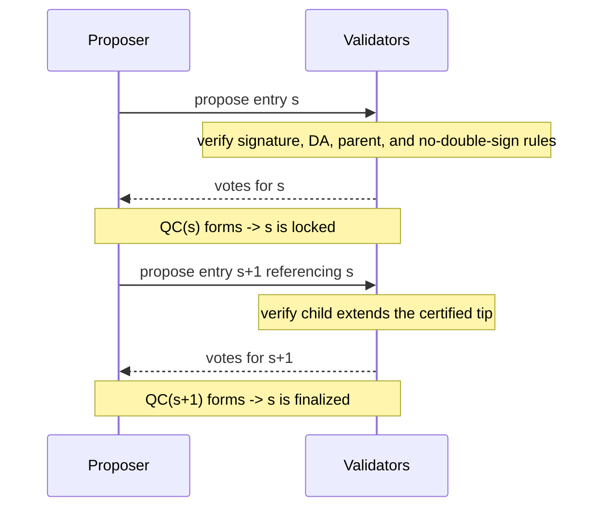
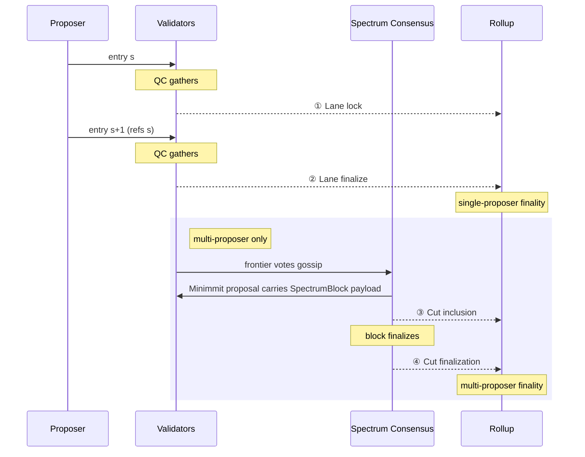
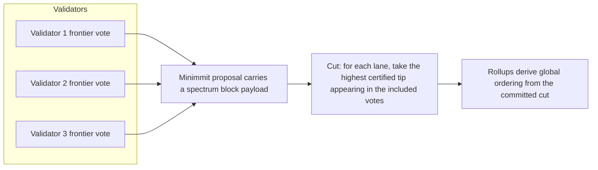

# ADR: Spectrum Ordering Protocol

## Status

Draft

## Context

Fibre provides data availability: validators attest that erasure-coded blob data can be reconstructed. Fibre does not provide ordering. A sequencer can present conflicting blobs at the same height to disjoint validator subsets, and both subsets will sign, because Fibre has no cross-validator state-checking for ordering.

Spectrum adds BFT-safe total ordering for individual lanes and a censorship-resistant composition mechanism for multiple lanes, using the Celestia validator set running Fibre.

## Decision

Adopt the Spectrum protocol as specified below. The protocol has two layers: a lane protocol that gives each proposer a certified append-only chain, and a spectrum layer that composes many lanes into a single canonical global order via consensus over validator frontier votes.

## Specification

This document isolates the technical core shared by the single-proposer and multi-proposer designs. The validator set is the Celestia validator set running Fibre. DA throughout this document refers to Fibre: validators attest blob availability by signing over erasure-coded data commitments.

A proposer owns a lane. A lane is certified locally. Many certified lanes are composed globally. This split is why the design can be both fast and high-throughput:

- lane certification is local to each proposer and runs in parallel across lanes
- the spectrum layer orders validator votes over certified lane progress instead of raw transaction data
- user data stays in the lanes and in DA

### Constraints

The protocol must provide:

1. A total order within each lane.
2. BFT safety for that order under the standard lane-local quorum assumption.
3. A way to compose many lanes into one canonical global order.
4. A formulation where adding proposers does not change the per-lane safety rules.
5. Per-block censorship resistance at the spectrum layer: once a lane tip has a valid certificate, a spectrum proposer must not be able to omit it from a valid block.

### Glossary

- **Proposer** (also called a sequencer) — authors lane entries and submits the corresponding data to DA.
- **Validator** — certifies lane entries by verifying DA availability and signing valid proposals, and participates in spectrum consensus.
- **Sequence** (`s`) — a lane-local counter (`0, 1, 2, ...`). Each lane entry occupies exactly one sequence.
- **Height** (`h`) — a spectrum block number. Distinct from lane sequence.
- **QC** (quorum certificate) — a collection of `> 2/3` validator signatures over a single statement. Proves supermajority agreement.
- **Certified tip** — the highest lane entry for which a QC exists. Because lane entries are chained, a certified tip at sequence `s` transitively commits the entire prefix `0..s`.
- **Frontier** — a validator's cumulative map from lane identifiers to certified tips, representing everything that validator has accepted so far.
- **Frontier vote** — a signed statement binding a validator's full current frontier. Used as input to the spectrum block payload.
- **Cut** — the pointwise-max across a quorum of frontier votes: for each lane, the highest certified tip appearing in any included vote.
- **Delta** — the per-lane sequence range between consecutive cuts. The new entries a rollup must process at a given spectrum height.
- **Lock** — a lane entry has a QC; equivocation at that sequence is impossible.
- **Finalize** — the entry after a locked entry has a QC referencing the locked entry; the locked prefix is immutable.

The proposer and validator sets are independent: there can be more proposers than validators, and a single node may fill both roles.

### Lane Protocol

A lane is an independently ordered append-only chain. In the ADR-027 form, a lane key is:

`(chain_id, namespace, signer_public_key)`

The `lane_id` used throughout this spec is the hash of the lane key: `lane_id = hash(chain_id, namespace, signer_public_key)`. Hashing keeps the identifier stable if the key gains additional fields and avoids requiring signers to include the full tuple in every signed structure.

The invariants are:

- one lane has one proposer authority
- one lane has one monotonic local order
- different lanes do not share ordering state

Each lane has sequences `0, 1, 2, ...`. A lane entry at sequence `s` contains:

- `lane_id`
- `sequence`
- `commitment`
- `previous_entry_hash`
- `parent_descriptor` — a `(lane_id, sequence, entry_commitment)` tuple identifying the parent entry
- `parent_qc`
- `signature`

Genesis is sequence `0` and has empty parent fields.

A validator signs lane entry `s` only if:

1. the proposer signature is valid
2. the blob's data commitment has a valid Fibre certificate (`> 2/3` validator signatures), providing DA
3. parent fields are empty iff `s = 0`
4. for `s > 0`, the parent descriptor belongs to the same lane and is exactly sequence `s - 1`
5. for `s > 0`, the parent QC is valid
6. for `s > 0`, the recomputed parent hash exactly matches `previous_entry_hash`
7. the validator has not already signed a different entry for `(lane_id, s)`
8. the proposal extends the certified lane state the validator has already adopted

If entry `s` gathers a QC, sequence `s` is locked. If entry `s + 1` gathers a QC and points to the exact hash of entry `s`, then `s` is finalized.



A single QC at sequence `s` is unique under the no-double-sign rule, but the child QC is what proves the lock was actually carried forward by another supermajority observation round. This matters for recovery and continuation after proposer failure.

#### Validator State

Lane safety requires two distinct pieces of durable per-lane state.

First, the validator must remember which hash it has signed at each lane sequence that has not yet been safely pruned. This enforces the no-double-sign rule: never sign two different hashes for the same `(lane_id, sequence)`.

Second, the validator must remember the highest certified lane tip it has adopted. This is a watermark over certified chain progress, and it prevents signing a proposal that does not extend the certified chain the validator already accepted.

The watermark does not replace the per-sequence signed-hash record. They protect against different faults:

- the signed-hash record prevents equivocation at one sequence
- the adopted-tip watermark prevents signing a fork that regresses from the certified chain already accepted

### Ordering Lifecycle

A rollup receives ordering guarantees in stages. In the single-proposer case the lifecycle can end as early as lane finalization. In the multi-proposer case two additional milestones follow.



The four milestones, and the guarantee each one gives the rollup:

- **Lane lock** — entry s has a QC; equivocation at s is impossible; lane order up to s is determined.
- **Lane finalize** — entry s+1 has a QC referencing s; prefix 0..s is immutable within the lane. *In the single-proposer case this is the terminal milestone — the rollup derives its transaction sequence directly from finalized lane entries.*
- **Cut inclusion** *(multi-proposer)* — a Minimmit proposal for height `h` carries a `SpectrumBlock` payload whose claimed cut records this lane's certified tip, placing the entry in a proposed cross-lane ordering.
- **Cut finalization** *(multi-proposer)* — height `h` is finalized; the cut is canonical; the rollup derives its transaction sequence from the per-lane delta between heights `h-1` and `h`.

### Multi-Proposer Cut

In the single-proposer case, the lane protocol above is instantiated once. If the only proposer for the only lane halts, ordering halts.

Multiple proposers are many independently certified lanes plus spectrum consensus over block payloads that commit to validator frontier votes. The censorship argument below assumes every valid spectrum block payload uses the same validator set and the same `> 2/3` frontier-vote quorum threshold as lane certification.

#### Validator Frontier

Each validator maintains a cumulative frontier `F_v`. For each lane `L`, `F_v[L]` is the highest certified tip that validator has signed or adopted for `L`. Because lane certification is chained, a tip at sequence `s` commits transitively to the entire prefix `0..s`, so the frontier is enough to represent everything the validator has accepted so far.

The frontier is a sparse map:

`lane_id -> certified_tip`

Sparse means:

- the frontier does not allocate one permanent slot per lane
- unchanged lanes are inherited rather than re-listed
- vote size grows with changed lane activity, not with the total number of known lanes

#### Frontier Vote

Each validator's spectrum-layer signature must bind its full current frontier state. When the frontier is encoded sparsely, the vote must therefore also bind the prior frontier state from which unchanged lanes are inherited. This is the mechanism by which the spectrum layer can provide guarantees back to each lane: once a validator has advanced its cumulative frontier to include a certified lane tip, a valid frontier vote from that validator must reflect that state.

Each certified tip in the frontier contains at least:

- lane identifier
- lane sequence
- the lane entry commitment

The frontier vote names certified lane tips; it does not embed the lane QC for each tip. Certification evidence belongs to the lane protocol and may be retained or fetched separately by implementations that need independent verification.

Because frontier votes are cumulative, including a validator's vote means including the entire certified lane progress that validator has accepted so far. Without this binding, a validator could sign a lane update locally and later omit it from the state it presents to the spectrum layer.

> Note: Validators could also include an updated commitment to their local frontier state in each lane-local response, not only in the later frontier vote. That gives a lane immediate evidence that the validator's acceptance of the update also advanced the validator's cumulative spectrum-layer state. The tradeoff is that lane-local signing now depends on the construction of the frontier-state commitment, which couples the fast path for individual lanes more tightly to the spectrum-layer state representation.

#### Spectrum Block Payload, Minimmit Proposal, and Cut Derivation

Frontier votes still propagate continuously between validators. That gossip path is independent of block cadence.

The secondary consensus protocol orders and finalizes spectrum blocks using Minimmit. In view `v`, the Minimmit leader proposes one `SpectrumBlock` payload for height `h`. The proposal carries the payload; it does not replace the frontier-vote validity rules that define the cut.

A `SpectrumBlock` payload contains:

- the spectrum height and parent block reference
- a signer bitmap over the validator set for height `h`
- one compact reference for each signer bitmap bit that is set, identifying the exact `FrontierVote` from that validator that this payload includes
- the proposer-claimed canonical tips derived from those included frontier votes

The signer bitmap gives the validator set membership of the included frontier votes without forcing the proposal to inline every vote body. The bitmap is interpreted against the canonical validator ordering for the spectrum height. The vote references are listed in ascending bitmap order.

Each vote reference identifies one exact signed `FrontierVote`, at minimum by:

- validator identity
- frontier version
- frontier root

If a validator already has the referenced `FrontierVote` in its local frontier-vote cache, it can validate the proposal directly. If it does not, it requests the missing vote from the proposer before voting on the Minimmit proposal. A proposal is not validly verifiable unless the proposer can supply every referenced vote body.

From the included frontier votes, the block at height `h` derives the cut:

- for each lane, the highest certified tip appearing in any included frontier vote

This pointwise-max cut is the committed overlap induced by the included frontier votes. In the one-lane case, it is just the current certified prefix of that lane. In the many-lane case, it is the certified cross-lane view downstream rollups use to derive canonical global ordering.



To validate a Minimmit proposal carrying a spectrum block payload, a validator performs three conceptual steps:

1. Recover every referenced `FrontierVote` named by the signer bitmap and vote references, using local cache hits first and proposer fetches for misses.
2. Reconstruct and verify each included validator frontier from `base_frontier_root`, `updated_tips`, `frontier_root`, and `signature`.
3. Derive the canonical cut by taking, for each lane, the highest certified tip that appears in any reconstructed frontier, and verify that the result exactly matches the `canonical_tips` claimed in the payload.

At a high level:

```text
derive_canonical_cut(block_payload):
  cut := empty map lane_id -> certified_tip

  for each vote_ref in block_payload.included_votes:
    vote := recover_frontier_vote(vote_ref)
    if vote is missing:
      reject proposal as unverifiable

    frontier := reconstruct_and_verify_frontier(vote)

    for each (lane_id, tip) in frontier:
      if lane_id not in cut:
        cut[lane_id] := tip
      else if tip.sequence > cut[lane_id].sequence:
        cut[lane_id] := tip
      else if tip.sequence == cut[lane_id].sequence and
              tip.entry_commitment != cut[lane_id].entry_commitment:
        reject block as conflicting certified tips

  if cut != block_payload.canonical_tips:
    reject proposal as incorrectly derived

  return CanonicalCut{height = block_payload.height, tips = cut}
```

For example, if a block includes three reconstructed frontiers:

```text
V1: A -> 5, B -> 3
V2: A -> 4, B -> 4, C -> 1
V3: A -> 5, C -> 2
```

then the derived canonical cut is:

```text
A -> 5
B -> 4
C -> 2
```

That cut becomes the canonical tips for the block height. It is proposer-claimed in the payload but validator-derived during proposal verification.

#### Censorship Resistance

The spectrum layer is Minimmit consensus over `SpectrumBlock` payloads, where each payload is itself a commitment to a quorum of validator frontier votes and to the cut derived from them.

That cut rule is what gives the spectrum layer per-block censorship resistance:

- every certified lane tip already has a lane QC, so it was signed by a supermajority of validators
- every frontier vote is cumulative and must include every certified tip that validator has signed or adopted
- every valid `SpectrumBlock` payload must name a frontier-vote quorum using the same validator set and the same `> 2/3` threshold as lane certification, even though Minimmit separately handles proposal ordering and finalization
- because both the lane-certification quorum and the payload frontier-vote quorum are `> 2/3` over the same validator set, they intersect in more than `1/3` of validators, so at least one honest validator included in the payload must carry that tip
- the cut takes the maximum certified tip per lane across the included frontier votes

As a result, a spectrum proposer may exclude entire validator frontier votes from a candidate payload, but if the payload is valid it may not selectively strip one lane from an included frontier, and it may not omit an already certified lane tip from the cut at height `h`.

#### Delta Derivation

Once the cut at height `h` is known, each node computes the delta from the prior cut at height `h - 1` and feeds that committed delta into the deployment's deterministic cross-lane merge rule:

```text
derive_delta(previous_cut, current_cut):
  delta := empty map lane_id -> sequence_range

  for each (lane_id, current_tip) in current_cut:
    if lane_id not in previous_cut:
      delta[lane_id] := [0, current_tip.sequence]
    else if current_tip.sequence > previous_cut[lane_id].sequence:
      delta[lane_id] := [previous_cut[lane_id].sequence + 1, current_tip.sequence]

  return delta
```

A node may retrieve newly recognized lane entries from DA when it needs the underlying data, or it may rely on the certified tips alone when it only needs the ordered view. Certification evidence remains part of the lane protocol and can be retained or fetched separately when needed. This document isolates the certification and cut mechanism; it does not fix one particular cross-lane merge function.

The distinction between the objects matters:

- a validator signs a `FrontierVote`
- a Minimmit validator vote signs a proposal carrying a `SpectrumBlock`
- consensus finalizes a `SpectrumBlock`
- every node derives the same `CanonicalCut`
- the rollup derives canonical transaction ordering from the delta between consecutive cuts

This is the key difference from a design where the spectrum proposer directly chooses one tip tuple per lane. Here, the proposer carries a compact commitment to signed validator frontier votes, and the canonical tips are computed from those votes during proposal verification.

### Fixed and Dynamic Lane Sets

Fixed and dynamic proposer systems are both instantiations of the ordering lifecycle:

- **Fixed** — lane set known from genesis. The single-proposer case is the fixed instance: one lane, no spectrum consensus.
- **Dynamic** — new lanes can appear after genesis. The lane protocol is unchanged: entry format, parent-linking, double-sign protection, lock/finalize, and cut rules all apply without modification. The sparse frontier accommodates new lanes without pre-allocated slots.

In a dynamic set, a new lane appears when a proposer posts to a new namespace. Between heights `h` and `h+1`, an unbounded number of sequences from an unbounded number of lanes can be certified. The spectrum block height is the minimum window over which all certified lane progress is composed into a single rollup block.

### Wire Format

Use protobuf as the wire format. Go code can wrap the generated types if a local API needs helper methods or cached indexes, but the canonical serialized objects can be defined directly in protobuf.

```protobuf
// CertifiedTip is one lane-local certified tip.
// It identifies the lane, the highest certified sequence in that lane,
// and the commitment to that lane entry. Certification evidence is not
// embedded in this message.
message CertifiedTip {
  // lane_id is the stable lane identifier.
  bytes lane_id = 1;
  // sequence is the lane-local sequence number of this certified tip.
  uint64 sequence = 2;
  // entry_commitment commits to the lane entry at sequence.
  bytes entry_commitment = 3;
}

// FrontierVote is one validator's signed cumulative frontier statement.
// It says: starting from base_frontier_root, apply updated_tips to obtain
// frontier_root; this resulting frontier is the validator's current view.
message FrontierVote {
  // validator_id identifies the validator who signed this vote.
  bytes validator_id = 1;
  // frontier_version is this validator's monotonic local vote version.
  uint64 frontier_version = 2;
  // base_frontier_root identifies the prior frontier state from which
  // unchanged lanes are inherited.
  bytes base_frontier_root = 3;
  // updated_tips lists only the lanes whose certified tips advanced relative
  // to the base frontier.
  repeated CertifiedTip updated_tips = 4;
  // frontier_root commits to the validator's full frontier after applying
  // updated_tips to the base frontier.
  bytes frontier_root = 5;
  // signature signs the full FrontierVote payload.
  bytes signature = 6;
}

// IncludedFrontierVoteRef identifies one exact FrontierVote named by
// a SpectrumBlock payload. The vote body may be carried inline, cached
// locally, or fetched from the proposer.
message IncludedFrontierVoteRef {
  // validator identity is determined by this ref's position relative to the
  // set bits in signer_bitmap.
  // frontier_version is the monotonic vote version for this validator.
  uint64 frontier_version = 1;
  // frontier_root commits to the full frontier named by that vote.
  bytes frontier_root = 2;
}

// SpectrumBlock is the payload ordered by Minimmit for one spectrum height.
// It names the included frontier-vote quorum compactly and commits to the
// canonical tips derived from those votes.
message SpectrumBlock {
  // height is the spectrum block height.
  uint64 height = 1;
  // parent_block_id identifies the parent spectrum block payload.
  bytes parent_block_id = 2;
  // signer_bitmap marks which validators' frontier votes are included.
  bytes signer_bitmap = 3;
  // included_votes is aligned with the set bits in signer_bitmap, in
  // ascending validator-index order.
  repeated IncludedFrontierVoteRef included_votes = 4;
  // canonical_tips is the proposer-claimed cut derived from the included
  // frontier votes. Validators recompute and verify it before voting.
  repeated CertifiedTip canonical_tips = 5;
}

// MinimmitProposal is the secondary-consensus proposal for one view.
// Minimmit orders and finalizes the SpectrumBlock payload.
message MinimmitProposal {
  // view is the Minimmit view number.
  uint64 view = 1;
  // proposer_id identifies the Minimmit leader for this proposal.
  bytes proposer_id = 2;
  // spectrum_block is the payload being proposed and voted on.
  SpectrumBlock spectrum_block = 3;
  // signature signs the full MinimmitProposal payload.
  bytes signature = 4;
}
```

The protobuf form above is the canonical serialized representation. An implementation may expose richer local wrapper types, but those wrappers are not part of the protocol.

## Consequences

### Positive

- Single-lane ordering reuses the existing Fibre validator set with minimal additions (per-sequencer watermark tracking).
- Multi-lane composition scales horizontally: adding proposers does not change per-lane safety rules.
- Per-block censorship resistance is a protocol property, not a social guarantee.

### Negative

- Validators must maintain durable per-lane state (signed-hash records and adopted-tip watermarks).
- The spectrum layer adds a secondary consensus round on top of lane certification latency.

### Neutral

- The cross-lane merge function is not specified here; it is deployment-specific.
