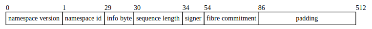
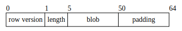

# Encoding

## What goes into the original data square?

The Fibre DA scheme does not store Fibre blob data in the original data square. Instead, the blob data is only stored in RSEMA1d rows and metadata for the Fibre blob is stored in the original data square. The two pieces of Fibre blob metadata stored in the original data square are:

1. Similar to `MsgPayForBlobs`, txs that contain a `MsgPayForFibre` are included in their own reserved namespace. The `PAY_FOR_FIBRE_NAMESPACE` is `0x0000000000000000000000000000000000000000000000000000000005`. Txs with this namespace are encoded as [transaction shares](https://celestiaorg.github.io/celestia-app/shares.html#transaction-shares).
2. A system-level blob is generated by the state machine for each Fibre blob. It conforms to share version 2 which differs from [share version 1](https://celestiaorg.github.io/celestia-app/shares.html#share-version-1) in that it includes the Fibre `fibre_blob_version` and the Fibre commitment:
    - namespace verison: 0
    - namespace: the namespace specified in the `MsgPayForFibre`
    - share version: 2
    - sequence start indicator: 1
    - sequence length: Fibre blob version (4 bytes) + Fibre commitment (32 bytes) = 36 bytes
    - signer: the signer of the `MsgPayForFibre`
    - fibre blob version: the version of the Fibre blob encoding
    - commitment: the Fibre commitment

    

## What goes into the RSEMA1D original rows?

### Assumptions

Taken from [network params](https://github.com/celestiaorg/fibre-da-spec/pull/6/files):

- number of original rows = 4096
- row size = ceil(fibre blob size / number of original rows)

### RSEMA1D row encoding

The Fibre blob data is encoded into RSEMA1d original rows.

If the blob content in a row does not fill the entire row, the row is padded with zeros. To differentiate between significant zeros and padding zeros, the row is prefixed with a length.

Note: this diagram uses a row length of 64 bytes but the actual row length can be a multiple of 64 bytes.
