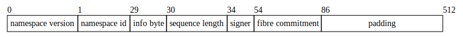

# Encoding

## What goes into the original data square?

The Fibre DA scheme does not store Fibre blob data in the original data square. Instead, the original data square has two pieces of data pertaining to Fibre blobs:

1. Txs that contain a `MsgPayForFibre` are included in their own reserved namespace (similar to `MsgPayForBlobs`).
2. A system-level blob is generated by the state machine for each Fibre blob. It conforms to the existing [share version 1](https://celestiaorg.github.io/celestia-app/shares.html#share-version-1) format and contains:
    - namespace verison: 0
    - namespace: the namespace specified in the `MsgPayForFibre`
    - share version: 1
    - sequence start indicator: 1
    - sequence length: length of the Fibre commitment
    - signer: the signer of the `MsgPayForFibre`
    - blob: the Fibre commitment

    
