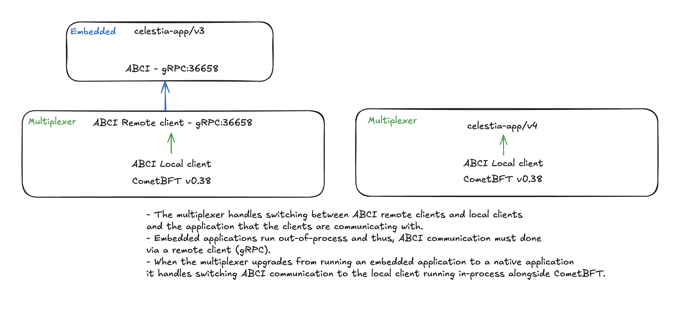

# Multiplexer

This repository contains an improved Cosmos SDK Upgrading system: the multiplexer.
The multiplexer enables node operators to sync from genesis and upgrade a Cosmos SDK chain without switching binaries.

## Features

- **Automatic Upgrading**: The system automatically upgrades the chain to the latest version of the software after an `AppVersion` change.
- **No binary switch required**: At the upgrade height, no binary switch is required, a huge improvement compared to solely relying on the `x/upgrade` module.
- **One binary**: The system uses only one binary for all upgrades, which simplifies  **syncing from genesis**, the upgrade process and reduces the risk of errors.
- **Passthrough mode**: The system can be used in passthrough mode, where a user can interact with an older binary directly.
- **Speed of native**: `Multiplexer` is designed to minimize overhead and only uses standalone applications running through embedded binaries for the duration of the upgrade process. Once the upgrade is complete, the system uses the native app whereby the celestia-core consensus engine and application run together in-process.

## How it works

The system works by running a single CometBFT instance and multiple embedded binaries for previous consensus breaking versions.

This means the `multiplexer` manages:

- the CometBFT instance for all chains
- the embedded binaries and their lifecycle
- the version switch (upgrade process)
- the connection between the standalone app, native app and CometBFT instance.

By sitting between the standalone app and the CometBFT instance, the `multiplexer` is able to listen to an `AppVersion` change and trigger the upgrade process automatically.

In order to limit any P2P disruption, like it happens today when not using the `multiplexer`; it uses one single CometBFT instance for all versions. This is possible because there has been no P2P and Block breaking changes in CometBFT.

The multiplexer supports ABCI 1.0 and ABCI 2.0, which means it can be used with any version of CometBFT, including the latest versions. This is done via the `ABCIClientVersion`.
The multiplexer has two remote clients, those remote clients interact with the App and CometBFT via gRPC:

- `RemoteABCIClientV1`: This client is used for CometBFT v0.34 and below. It uses the `ABCIClientVersion` 1.
- `RemoteABCIClientV2`: This client is used for CometBFT v0.38 and above. It uses the `ABCIClientVersion` 2.

A chain defines a list of versions per `AppVersion` up until the last one.
The `Appd` field a slice of `[]byte` which holds a compressed archive of the binary (`tar.gz`). This archive is uncompressed and extracted to a temporary directory, which is then used to start the embedded binary.

```go
 v3, err := appd.New("v3", v3AppBinary)
 if err != nil {
  panic(err)
 }

versions, err := abci.NewVersions(abci.Version{
 Appd:        v3,
 ABCIVersion: abci.ABCIClientVersion1,
 AppVersion:  3,
})
```

Multiple versions can be defined, allowing to sync from genesis with only one binary (for the node operators).

Once the `AppVersion` changes, the `multiplexer` takes the best matching embedded binary (useful when syncing from genesis) or switch to the native binary if none matches (useful when upgrading).



## Installation

`Multiplexer` integrates seamlessly in any Cosmos SDK chain. It simply replaces the `StartCommandHandler` of the chain:

```diff
server.AddCommandsWithStartCmdOptions(
 rootCommand,
 app.DefaultNodeHome,
 NewApp,
 appExporter,
 server.StartCmdOptions{
  AddFlags:            addStartFlags,
+ StartCommandHandler: multiplexercmd.New(versions),
 },
)
```

Optionally add the passthrough mode command:

```go
rootCommand.AddCommand(
 multiplexercmd.NewPassthroughCmd(versions),
)
```

## Customizing the embedded binaries

As the `multiplexer` manages the start and stop of embedded binaries and the connection between the standalone app <-> the `multiplexer` <-> CometBFT instance, it is important to ensure that the embedded binaries are properly started.

Some chains may require custom flags while starting the binaries. This can be done when setting up the `abci.Version`:

```go
versions, err := abci.NewVersions(abci.Version{
 Appd:        v3,
 ABCIVersion: abci.ABCIClientVersion1,
 AppVersion:  3,
 StartArgs: []string{
  "--grpc.address=0.0.0.0:9090",
  "--grpc.enable=false",
  "--api.enable=false",
  "--api.swagger=false",
  "--with-tendermint=false",
  "--transport=grpc",
 },
})
```

The default list of flags, unless overridden is the following:

```go
"--grpc.enable",
"--api.enable",
"--api.swagger=false",
"--with-tendermint=false",
"--transport=grpc",
```

Note: Flags passed when starting the application are passed down to each embedded binary. `Multiplexer` then adds the extra flags.
For instance, when calling `appd start --force-no-bbr`, the native app runs with only `--force-no-bbr` flag, while the embedded app runs with `--force-no-bbr` and the default flags.

Note 2: The remote clients work via `gRPC` connection, when overriding the start flags, please always make sure to include `--with-tendermint=false` and `--transport=grpc` in the list of flags.

## Passthrough mode

Passthrough mode is an optional command that can be added to a chain.
It allows a user to interact via an embedded binary via CLI.

```bash
appd passthrough v2 q bank balances <foo>
```

For instance, the above command queries the bank balances by using the embedded binary of `v2` and not the current version of the chain.

## Assumptions

While the `multiplexer` is designed to work with any Cosmos SDK-based chain, it is specifically tailored to the needs of `Celestia` due to the following assumptions:

- `RemoteABCIClientV1` is tailored to work with `celestia-core` v0.34
- `RemoteABCIClientV2` is tailored to work with `celestia-core` v0.38

For other chains, the remote clients should be configured to work solely with an unforked version of CometBFT.

Additionally, Celestia enjoys a better UX thanks to their [`x/signal` module](https://github.com/celestiaorg/celestia-app/tree/main/x/signal), that ensures, regardless of the multiplexer usage, that all nodes are on the latest version of the software before upgrading.
Traditionally, there are no confirmation steps for the upgrade process, when relying on the `x/upgrade` module.

Lastly, the `multiplexer` watches any `AppVersion` changes. This means a chain cannot solely rely on the current version of `x/upgrade`, which sets the `AppVersion` in its `PreBlocker`. Setting the new `AppVersion` should happen in the `EndBlocker` of the last block prior to the upgrade.
This can be done with minimal changes in Cosmos SDK mainline, but wasn't required for Celestia thanks to their `x/signal` module.

## Alternatives

The current alternative to the `multiplexer` is [`cosmovisor`](https://docs.cosmos.network/main/build/tooling/cosmovisor).

`Cosmovisor` simplifies the upgrade process by automatically switching the whole binary at the upgrade height. However, node operators need to download the new binary and add it to `cosmovisor`. Additionally, `cosmovisor` restarts the whole binary, including the consensus layer, which can lead to P2P disruption and a longer downtime for the node operators.
`Cosmovisor` is a great tool, but it is not the best solution for all chains. `Multiplexer` is designed to be a more flexible and powerful solution for upgrading Cosmos SDK-based chains.
