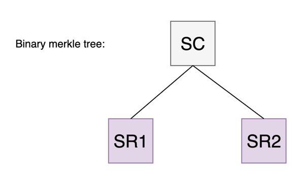
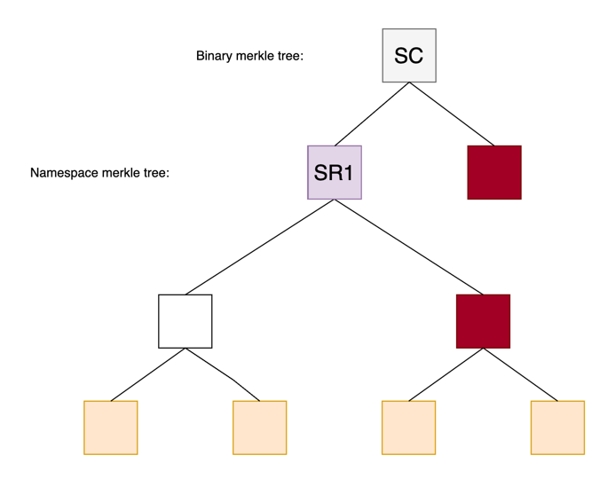
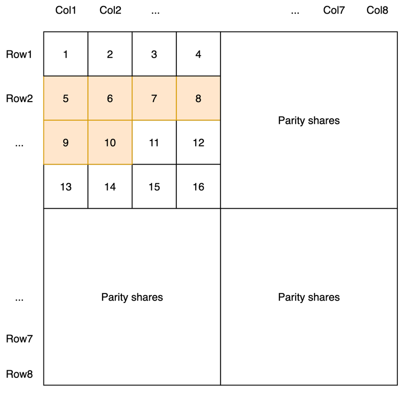
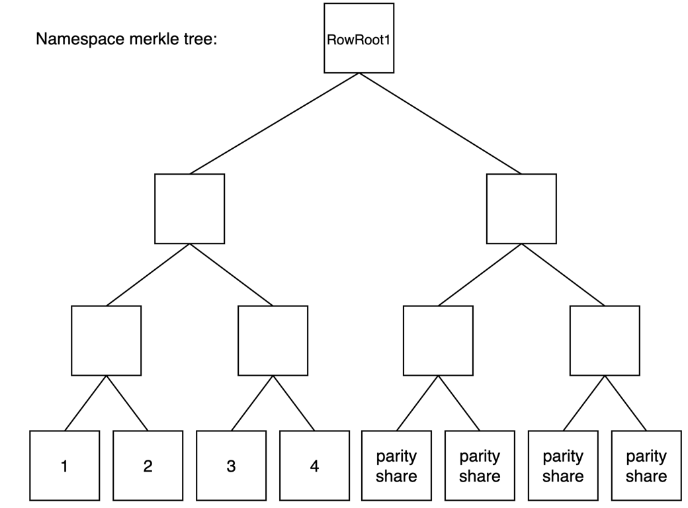
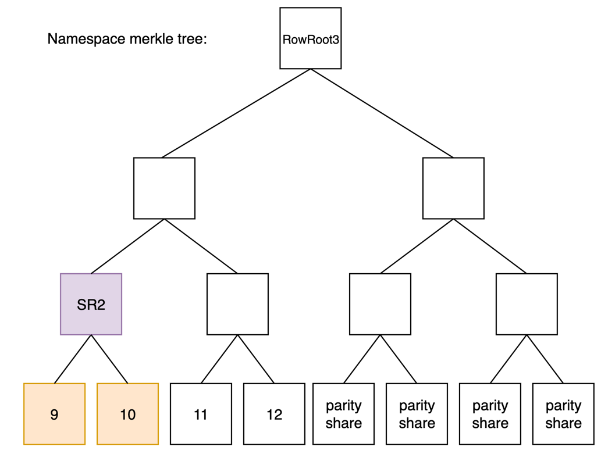
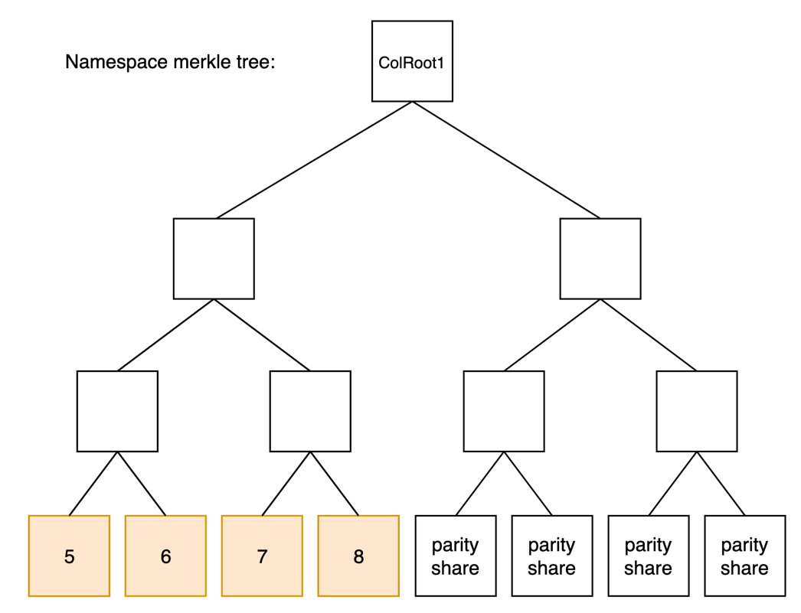
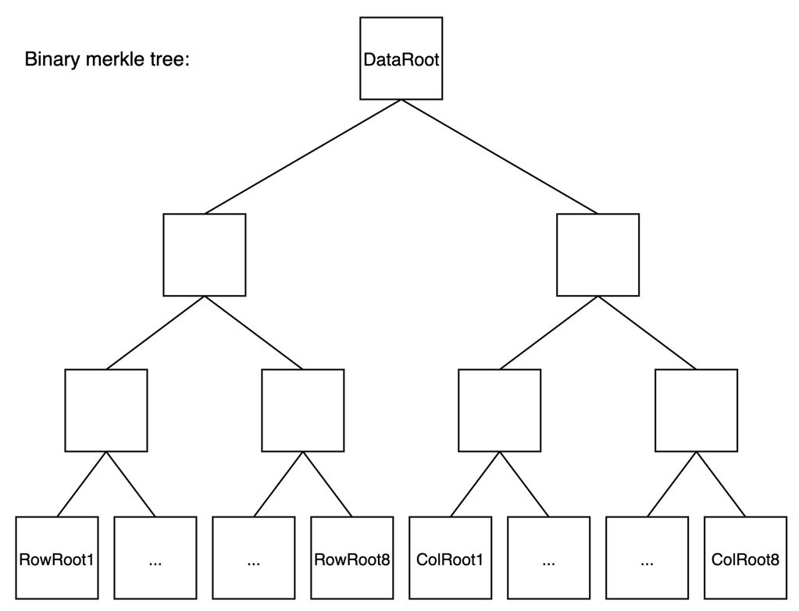
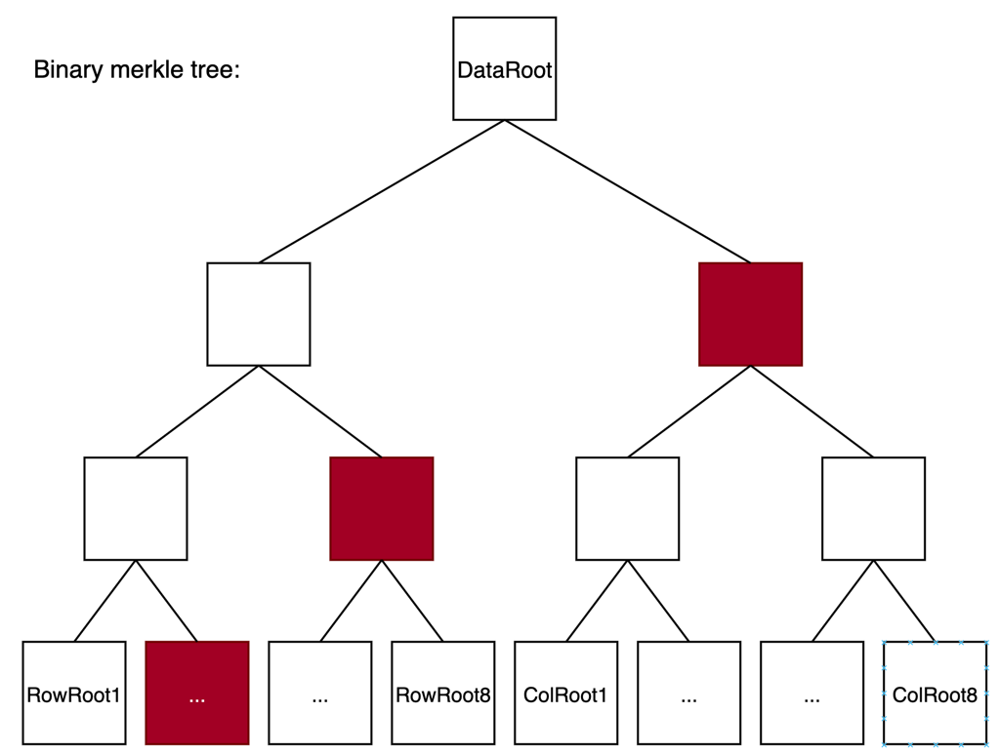
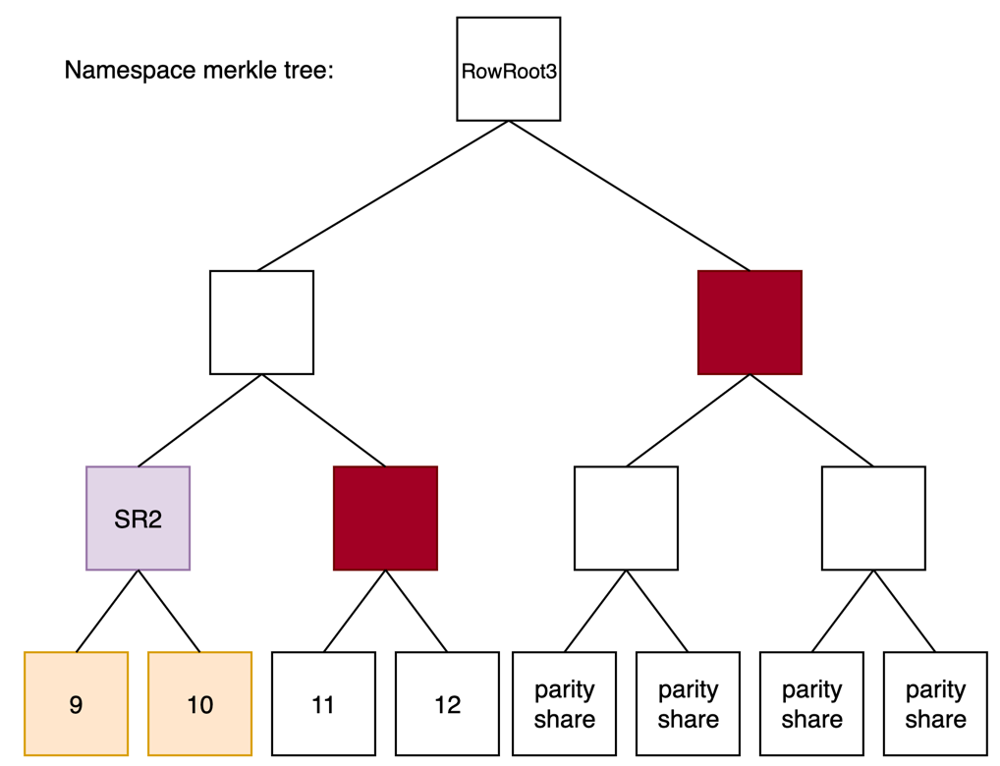

# Proof

This package enables proof queries for Celestia transactions and blobs.

## Details

The following section will cover transaction inclusion proofs and blob inclusion proofs.

## Prerequisites

To understand the proof mechanisms,
a good understanding of [binary merkle proofs](https://celestiaorg.github.io/celestia-app/specs/data_structures.html#merkle-trees) and [namespace merkle proofs](https://celestiaorg.github.io/celestia-app/specs/data_structures.html#namespace-merkle-tree) is required.

## PFB transaction

When creating a [PayForBlob](https://github.com/celestiaorg/celestia-app/blob/v1.0.0-rc2/proto/celestia/blob/v1/tx.proto#L16-L31) transaction,
the blob data is separated into a set of [shares](https://celestiaorg.github.io/celestia-app/specs/shares.html).
This set of shares is used
to generate a [*share commitment*](https://celestiaorg.github.io/celestia-app/specs/data_square_layout.html?highlight=share%20commitment#blob-share-commitment-rules)
which commits to the data contained in the PFB,
i.e., the blob.

### Share commitment generation 

Generating a *share commitment* starts with laying the shares into a [merkle mountain range](https://docs.grin.mw/wiki/chain-state/merkle-mountain-range/) structure.
For example, if the blob contains six shares, the following structure will be generated:

The blob shares are colored in orange,
and are used
to generate a set of roots following the [merkle mountain range](https://docs.grin.mw/wiki/chain-state/merkle-mountain-range/) structure.
These roots are called *subtree roots*.
In the above case, we end up with two *subtree roots*: `SR1` and `SR2`.

Then, these *subtree roots* are used to generate the *share commitment*:

The *share commitment* is the binary merkle root over the set of *subtree roots* generated from the shares.

## Share to share commitment inclusion

Using the above merkle trees,
share proofs can be generated to prove inclusion of a set of shares to the *share commitment*.

For instance, if we want to prove the first two shares, we will need two merkle proofs:

- The first merkle proof is a namespace merkle inclusion proof from the first two shares to the *subtree root* `SR1`.
- The second merkle proof is a binary merkle inclusion proof from `SR1`,
  which is the subtree root committing to the shares, to the *share commitment*.

Note: the nodes colored in maroon are the inner nodes used to construct the inclusion proof.

## Square layout

Now that the [*share commitment*](https://celestiaorg.github.io/celestia-app/specs/data_square_layout.html?highlight=share%20commitment#blob-share-commitment-rules) is generated.
The transaction gets broadcasted to the Celestia network to be picked up by validators.
Once it's included in a block, the transaction, without the blob,
is placed in the [transaction namespace](https://celestiaorg.github.io/celestia-app/specs/namespace.html#reserved-namespaces)
and the blob is placed in the [namespace](https://github.com/celestiaorg/celestia-app/blob/72be251f044bcece659603248bc27711b2c039a0/proto/celestia/blob/v1/tx.proto#L22)
specified in the PFB transaction.

If we use the same transaction from above,
where the blob consists of six shares,
an example Celestia square containing the blob and the PFB transaction can look like this:

The share range `[5, 10]`, colored in orange, is the blob data.

### Row roots

To compute the Celestia block [data root](https://celestiaorg.github.io/celestia-app/specs/data_structures.html),
we first start by computing the row roots and column roots.

For instance, if we want to compute the first row root:

We use the first row of shares to generate a namespace merkle root.
The first four shares, i.e., the shares `[1, 4]` are part of the square data,
and the last four are [parity shares](https://celestiaorg.github.io/celestia-app/specs/data_structures.html?highlight=extended#2d-reed-solomon-encoding-scheme). 

Now if we take the second row, which contains four shares of the above blob `[5,8]`:

The inner node in purple is the same as the *subtree root* `SR1`
generated in the [PFB transaction](#pfb-transaction) section. 

Similarly, if we generate the third row, which contains the remaining two shares of the blob, and some other data:

We will see that the *subtree root* `SR2` is an inner node of the tree used to compute the third row root.

This property holds for all the subtree roots
computed for the blob data
and is derived
from applying [Blob Share Commitment Rules](https://celestiaorg.github.io/celestia-app/specs/data_square_layout.html#blob-share-commitment-rules)
when constructing the square.
This means
that it is possible to prove the inclusion of a blob to a set of row roots using the generated *share commitment*.
The subtree roots used to generate it will be the same regardless of the square size.
This proof will be discussed in the [prove share commitment inclusion to data root](#prove-share-commitment-inclusion-to-data-root) section.
  
### Column roots

Similar to row roots, column roots are the namespace merkle root of the set of shares contained in the column:

Generally, the column roots are only used for [bad encoding fraud proofs,
BEFP](https://celestiaorg.github.io/celestia-app/specs/fraud_proofs.html#bad-encoding-fraud-proofs)
and won't be used concretely in inclusion proofs.
They're only mentioned for completeness.

### Data root

The Celestia block [data root](https://celestiaorg.github.io/celestia-app/specs/data_structures.html) is computed
by generating a binary merkle root over the set of row roots and column roots of the square:

This allows inclusion proofs of the shares to the data root which will be discussed below.

## Inclusion proof

### Share to data root inclusion proof

To prove that a share was included in a Celestia block,
we can create an inclusion proof from the share to the data root.
This proof consists of the following:

#### Share to row root namespace merkle inclusion proof:

First, we prove inclusion of the share in question to the row root it belongs to.
If we take, for example, share *three*, its inclusion proof can be constructed using the inner nodes in maroon: 

Now, if we have this inclusion proof, and we verify it against the `RowRoot1`, the proof would be valid.

#### Row root to data root inclusion proof

Now that we proved the share to the row root,
we will need to complete the proof with a row root to the data root inclusion proof.
This means that we will be proving that the row root commits to the share, and the data root commits to the row root.
Since share *three* is committed to by `RowRoot1`, we will be proving that row root to the data root. 

The inner nodes in maroon are the nodes needed to construct the merkle inclusion proof.

So, if we have access to these two proofs,
the [share to row root inclusion proof](#share-to-row-root-namespace-merkle-inclusion-proof) and [row root to data root inclusion proof](#row-root-to-data-root-inclusion-proof),
we can successfully prove inclusion of share *three* to the Celestia data root.

### Prove share commitment inclusion to data root

To prove that a blob,
referenced by its *share commitment*, was included in a Celestia block, we need the following proofs:

#### Subtree roots inclusion proof to the data root

As we've seen in the [row roots generation](#row-roots) section,
the subtree roots are inner nodes of the namespace merkle tree used to generate the row root.
This means that it's possible to create an inclusion proof of a subtree root to the row root:

The inner nodes in brown would be used to construct the `SR2` node inclusion proof to the `RowRoot3`.

After having this proof, we will need to prove the `RowRoot3` inclusion to the data root.
This is described in the [row root to data root inclusion proof](#row-root-to-data-root-inclusion-proof) section.

With this, we would be able to prove that `SR2` was committed to by a Celestia data root.

#### Subtree roots inclusion proof to the *share commitment*

Now that we can prove `SR2` inclusion to `RowRoot3`,
what's left is proving that `SR2` was committed to by the *share commitment*.

Proving inclusion of `SR1` or `SR2` to the *share commitment* goes back
to creating a binary merkle inclusion proof to the *share commitment*:

So, if we manage to prove that `SR1` and `SR2` were both committed to by the Celestia data root, and that the *share commitment* was generated using `SR1` and `SR2`, then, we would have proven that the *share commitment* was committed to by the Celestia data root, which means that **the blob data that generated the *share commitment* was included in a Celestia block**.

[IMPORTANT] As of the current version,
the API for generating and verifying share commitment proofs to data root is still not exposed.
These proofs are only used as part of the Celestia [consensus](https://celestiaorg.github.io/celestia-app/specs/consensus.html) internally.

#### Compact proofs

More compact proofs can be generated, but are out of the scope of this document.
More details can be found in [ADR-011](https://github.com/celestiaorg/celestia-app/blob/main/docs/architecture/adr-011-optimistic-blob-size-independent-inclusion-proofs-and-pfb-fraud-proofs.md).