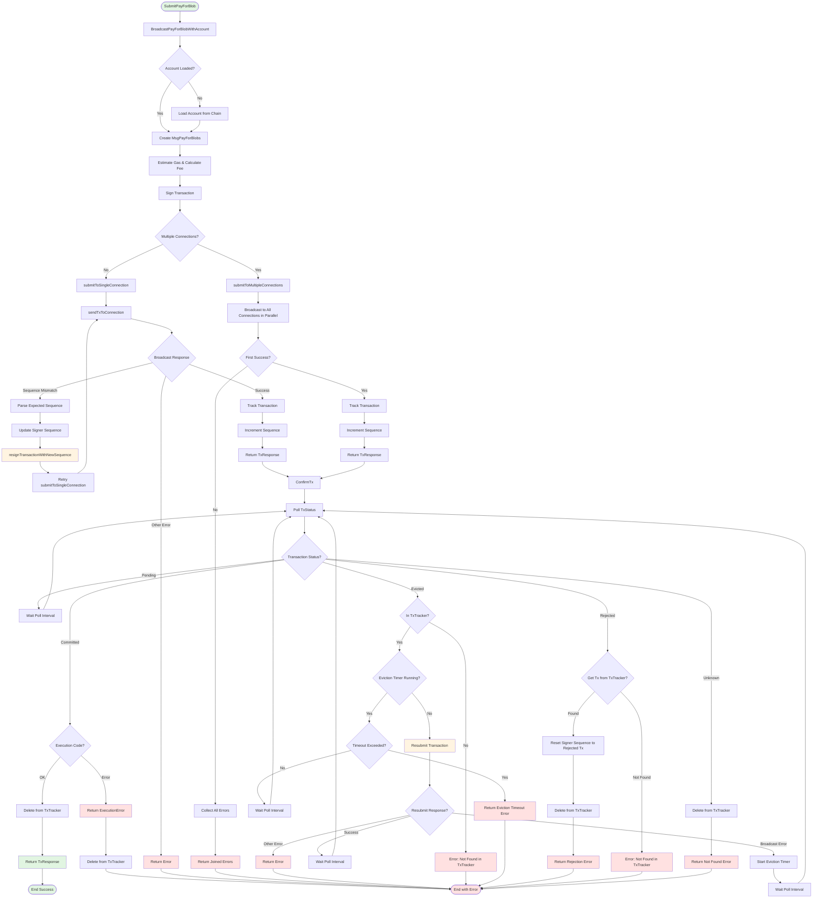
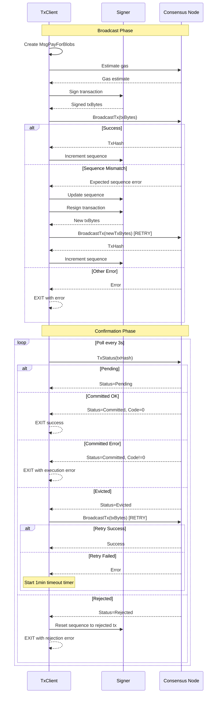

# TxClient SubmitPayForBlob Flow

This document describes the transaction submission flow for the TxClient when submitting a PayForBlob transaction.

## Key Flow Components

### Broadcasting Phase
1. **Account Check**: Verifies the account is loaded, loads from chain if needed
2. **Transaction Preparation**: Creates the MsgPayForBlobs, estimates gas, calculates fee, and signs
3. **Routing**: Decides between single or multi-connection submission based on configuration
4. **Sequence Mismatch Handling**: On sequence mismatch during broadcast, parses expected sequence, updates signer, resigns transaction, and retries

### Confirmation Phase
1. **Polling**: Continuously polls the TxStatus endpoint at configured intervals
2. **Status Handling**:
   - **Pending**: Continues polling
   - **Committed**: Returns success if execution code is OK, otherwise returns ExecutionError
   - **Evicted**: Attempts resubmission; if resubmission fails with broadcast error, starts eviction timer (1 minute timeout)
   - **Rejected**: Resets signer sequence to the rejected transaction's sequence and returns error
   - **Unknown**: Returns not found error

### Error Recovery Mechanisms
1. **Sequence Mismatch**: Automatically resigns transaction with corrected sequence and retries broadcast
2. **Eviction**: Resubmits transaction once; if resubmission fails, waits up to 1 minute for transaction to be included before timing out
3. **Rejection**: Resets sequence number to enable resubmission of subsequent transactions

## Sequence Diagram

