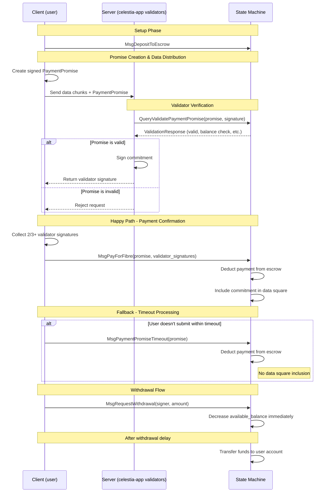

# `x/fibre`

## Abstract

The `x/fibre` payment mechanism enables users to pay for fibre blobs without waiting for a transaction to be confirmed. This is done by users depositing funds into [escrow accounts](#escrow-accounts), and signing over off-chain messages (a.k.a `PaymentPromise`) that can be moved on-chain (a.k.a `MsgPayForFibre`) at a later point.

DoS resistance for a protocol with a global limit on throughput requires a guarantee for payment. Normally this is done simply by paying for gas, however paying for gas requires waiting for a transaction to be confirmed. The payment portion of this module (mainly the [`PaymentPromise`](#paymentpromise-validation) and [`EscrowAccount`](#escrow-accounts)) is to provide a guarantee for payment without having to wait for a transaction to be confirmed.

Therefore, it is an invariant of the payment system that a signed [`PaymentPromise`](#paymentpromise-validation) guarantees payment.

## Contents

1. [Abstract](#abstract)
1. [State](#state)
1. [Messages](#messages)
1. [Automatic State Transitions](#automatic-state-transitions)
1. [Events](#events)
1. [Queries](#queries)
1. [Parameters](#parameters)
1. [Client](#client)

## State

The fibre module maintains state for [escrow accounts](#escrow-accounts), [withdrawals](#withdrawals), and module [parameters](#parameters).

### Params

#### `GasPerBlobByte`

`GasPerBlobByte` is the amount of gas consumed per byte of blob data when a payment promise is processed. This determines the gas cost for fibre blob inclusion.

#### `WithdrawalDelay`

`WithdrawalDelay` is the duration that must pass between a user requesting a withdrawal and when funds are withdrawn (default: 24 hours).

#### `PaymentPromiseTimeout`

`PaymentPromiseTimeout` is the duration after which anyone can submit a `MsgPaymentPromiseTimeout` transaction on-chain if the user hasn't submitted a [`MsgPayForFibre`](#msgpayforfibre) for their payment promise (default: 1 hour).

#### `PaymentPromiseRetentionWindow`

`PaymentPromiseRetentionWindow` is the duration after which a payment promise can be pruned from the state machine (default: 24 hours).

### Escrow Accounts

Escrow accounts help guarantee payment for a signed [`PaymentPromise`](#paymentpromise-validation) by ensuring that a user does not remove funds after validators sign over and provide service for a Fibre blob. Each address can only have one escrow account, indexed by their signer address.

```proto
// EscrowAccount helps guarantee payment for a signed PaymentPromise by ensuring
// that a user does not remove funds directly after validators sign over and
// provide service for a blob.
message EscrowAccount {
  // signer is the address that controls this escrow account
  string signer = 1 [(cosmos_proto.scalar) = "cosmos.AddressString"];
  // balance is the total amount currently held in escrow
  cosmos.base.v1beta1.Coin balance = 2 [(gogoproto.nullable) = false];
  // available_balance is the amount available for new payments. This is usually
  // the same as balance except if a user has requested a withdrawal in the past
  // 24 hours in which case available_balance = balance - pending withdrawal
  // amount.
  cosmos.base.v1beta1.Coin available_balance = 3 [(gogoproto.nullable) = false];
}
```

### Withdrawals

Withdrawal requests are tracked to implement the delay mechanism.

```proto
// Withdrawal tracks requests to withdraw funds from an escrow account. It is
// needed to implement a delay mechanism between when a withdrawal is requested
// and when it is executed. By default the withdrawal delay is 24 hours.
message Withdrawal {
  // signer is the address that owns the escrow account this withdrawal is for
  string signer = 1 [(cosmos_proto.scalar) = "cosmos.AddressString"];
  // amount is the amount to be withdrawn
  cosmos.base.v1beta1.Coin amount = 2 [(gogoproto.nullable) = false];
  // requested_timestamp is the timestamp when withdrawal was requested
  google.protobuf.Timestamp requested_timestamp = 3 [(gogoproto.nullable) = false, (gogoproto.stdtime) = true];
}
```

### Payment Promises

To prevent double payment, the module tracks which payment promises have been processed. Only the processing timestamp is stored, indexed by the promise hash.

#### Indexing

**Escrow Accounts:**

- Primary Index: `escrows/{signer}` → `EscrowAccount`

**Withdrawals:**

- By signer: `withdrawals/{signer}/{requested_timestamp}` → `Withdrawal`
- By availability: `available_withdrawals/{available_at}/{signer}` → `cosmos.base.v1beta1.Coin` (amount only, for efficient processing)

**Payment Promises:**

- Processed promises: `processed/{promise_hash}` → `google.protobuf.Timestamp` (processed_at)
- Pruning index: `pruning/{processed_at}/{promise_hash}` → `∅` (empty value, used for time-ordered iteration)

#### Pruning

Payment promises are automatically pruned after [`payment_promise_retention_window`](#paymentpromiseretentionwindow) to prevent unbounded state growth. See [Payment Promise Pruning](#payment-promise-pruning) for implementation details.

## Messages

### Gas Consumption

All messages use the existing gas consumption mechanism in the cosmos-sdk. In addition to the standard resource pricing, the messages that deduct fees for blobs, `MsgPayForFibre` and `MsgPaymentPromiseTimeout`, manually add gas consumption based on blob size.

**Blob Gas Calculation**:

Gas cost is calculated using the following formula:

```text
total_gas = (rows * row_size(blob_size) * gas_per_blob_byte)
```

This means that users pay for padding as well, just like PFBs.

Where:

- `rows` is the constant number of rows needed for the blob data
- `row_size(blob_size)` is the size of each row in bytes
- `gas_per_blob_byte` is the gas cost per byte parameter

### MsgDepositToEscrow

Deposits funds to the signer's escrow account. If no escrow account exists for the signer, one will be created automatically. Deposits are processed instantly.

```proto
// MsgDepositToEscrow deposits funds to the signer's escrow account.
message MsgDepositToEscrow {
  option (cosmos.msg.v1.signer) = "signer";
  // signer is the bech32 encoded signer address
  string signer = 1 [(cosmos_proto.scalar) = "cosmos.AddressString"];
  // amount is the amount to deposit
  cosmos.base.v1beta1.Coin amount = 2 [(gogoproto.nullable) = false];
}
```

#### Validation and Processing

**Stateless Validation**:

- Signer address must be valid
- Amount must be positive

**Stateful Processing**:

1. If signer's escrow account doesn't exist, create one with zero balance
2. Transfer funds from signer to module account // Question: is the same module account used for all escrow accounts?
3. Increase both balance and available_balance by deposit amount
4. Emit EventDepositToEscrow

### MsgRequestWithdrawal

Requests withdrawal from the signer's escrow account. Funds are withdrawn after the withdrawal delay.

```proto
// MsgRequestWithdrawal requests withdrawal from the signer's escrow account.
message MsgRequestWithdrawal {
  option (cosmos.msg.v1.signer) = "signer";
  // signer is the bech32 encoded signer address
  string signer = 1 [(cosmos_proto.scalar) = "cosmos.AddressString"];
  // amount is the amount to withdraw
  cosmos.base.v1beta1.Coin amount = 2 [(gogoproto.nullable) = false];
}
```

#### Validation

**Stateless Validation**:

- Signer address must be valid
- Amount must be positive

**Stateful Processing**:

1. Verify signer's escrow account exists
2. Verify sufficient available balance
3. Verify no existing withdrawal request at current timestamp (prevents key collision in `withdrawals/{signer}/{requested_timestamp}` index)
4. Decrease available_balance immediately (balance remains unchanged until withdrawal is processed)
5. Store withdrawal amount in both indexes with available_at = current_timestamp + withdrawal_delay
6. Emit EventRequestWithdrawalFromEscrow

#### Withdrawal Processing

Withdrawals are automatically processed in `BeginBlocker` when `current_time >= withdrawal.available_at`:

```go
func processAvailableWithdrawals(ctx sdk.Context, k Keeper) {
    currentTime := ctx.BlockTime()

    // Iterate over available_withdrawals index starting from earliest timestamp
    iterator := k.GetAvailableWithdrawalsIterator(ctx, currentTime)
    defer iterator.Close()

    for ; iterator.Valid(); iterator.Next() {
        // Parse key to extract available_at timestamp and signer address
        available_at, signer := k.ParseAvailableWithdrawalKey(iterator.Key())

        // Stop if we've reached withdrawals not yet available
        if available_at.After(currentTime) {
            break
        }

        // Get withdrawal amount from value
        var amount cosmos.base.v1beta1.Coin
        k.cdc.Unmarshal(iterator.Value(), &amount)

        // Process withdrawal: transfer from module to user account
        err := k.bankKeeper.SendCoinsFromModuleToAccount(
            ctx, types.ModuleName, signer, amount)
        if err != nil {
            // Log error but continue processing other withdrawals
            ctx.Logger().Error("failed to process withdrawal", "error", err, "signer", signer)
            continue
        }

        // Update escrow account balance (decrease total balance)
        escrow := k.GetEscrowAccount(ctx, signer)
        escrow.balance = escrow.balance.Sub(amount)
        k.SetEscrowAccount(ctx, escrow)

        // Remove from both withdrawal indexes
        requested_at := available_at.Add(-k.GetWithdrawalDelay(ctx))
        k.DeleteAvailableWithdrawal(ctx, available_at, signer)

        // Emit event
        ctx.EventManager().EmitEvent(EventProcessWithdrawal{
            processor: types.AutomaticProcessor, // system account
            signer:    signer,
            amount:    amount,
        })
    }
}
```

### MsgPayForFibre

Contains the original payment promise with validator signatures, submitted by the user. Successful `MsgPayForFibre` transactions are included in their own reserved namespace. The commitment from the payment promise is also included in the original data square in the namespace specified in the payment promise.

```proto
// MsgPayForFibre contains the original payment promise with validator signatures.
message MsgPayForFibre {
  option (cosmos.msg.v1.signer) = "signer";
  // signer is the bech32 encoded address submitting this message
  string signer = 1 [(cosmos_proto.scalar) = "cosmos.AddressString"];
  // payment_promise is the original payment promise
  PaymentPromise payment_promise = 2 [(gogoproto.nullable) = false];
  // validator_signatures contains signatures from validators
  repeated bytes validator_signatures = 3;
}

// PaymentPromise is a promise to pay for a fibre blob. It contains the
// commitment and payment details for the fibre blob.
message PaymentPromise {
  // signer_public_key is the public key of the owner of the escrow account to charge
  google.protobuf.Any signer_public_key = 1 [(cosmos_proto.accepts_interface) = "cosmos.crypto.PubKey"];
  // namespace is the namespace the blob is associated with.
  bytes namespace = 2;
  // blob_size is the size of the blob in bytes
  uint32 blob_size = 3;
  // commitment is the hash of the row root and the Random Linear Combination (RLC) root
  bytes commitment = 4;
  // row_version is the version of the row format
  uint32 row_version = 5;
  // creation_timestamp is the timestamp when this promise was created. This
  // is critical for determining which validators sign the commitment and
  // determining when service stops for this blob.
  google.protobuf.Timestamp creation_timestamp = 6 [(gogoproto.nullable) = false, (gogoproto.stdtime) = true];
  // signature is the signer (escrow account owner) signature over the sign bytes
  bytes signature = 7;
  // height is the height that is used to determine the validator set that is used
  int64 height = 8;
  // chain_id is the chain ID that this payment promise is valid for.
  // Example: arabica-11, mocha-4, or celestia.
  string chain_id = 9;
}
```

#### PaymentPromise Validation

**Stateless Validation**:

- `signer_public_key` must be a valid public key and the derived address must match the escrow account owner
- `namespace` must be valid
- `blob_size` must be positive
- `commitment` must be 32 bytes
- `row_version` must be supported version
- `height` must be positive
- `creation_timestamp` must be positive
- `signature` must be properly formatted and non-empty

**Gas Consumption**:

Gas cost is calculated as described in the [Gas Consumption](#gas-consumption) section.

**Stateful Validation**:

1. Verify `creation_timestamp` is:

    - less than or equal to current confirmed timestamp
    - greater than (header_timestamp - withdrawal_delay)

2. Verify escrow account exists for `signer`
3. Verify sufficient available balance for gas cost (see [Gas Consumption](#gas-consumption) section). This includes all yet to be processed `PaymentPromises` that the validator has signed over.
4. Verify promise signature by escrow owner over promise sign bytes (see [Sign Bytes Format](#sign-bytes-format) below)
5. Verify promise hasn't been processed already

#### Sign Bytes Format

The sign bytes for a PaymentPromise signature are constructed by concatenating all fields except the `signature` field, along with prepending the chainID:

```text
sign_bytes = chainID || signer_bytes || namespace || blob_size_bytes || commitment || row_version_bytes || height_bytes || creation_timestamp_bytes
```

**Field Encoding**:

- `signer`: raw bytes of signer address secp256k1 (20 bytes)
- `namespace`: Raw namespace bytes (fixed 29 bytes)
- `blob_size_bytes`: Big-endian encoded uint32 (4 bytes)
- `commitment`: Raw commitment bytes (32 bytes)
- `row_version_bytes`: Big-endian encoded uint32 (4 bytes)
- `height_bytes`: Big-endian encoded int64 (8 bytes)
- `creation_timestamp_bytes`: Protobuf-encoded google.protobuf.Timestamp (variable length)

**Total Length**: Variable length (20 + 29 + 4 + 32 + 4 + 8 + timestamp_bytes)

#### MsgPayForFibre Validation and Processing

**Stateless Validation**:

- Must have at least one validator signature
- All validator signatures must be properly formatted

**Stateful Processing**:

1. Validate PaymentPromise (see [PaymentPromise Validation](#paymentpromise-validation) above)
2. Verify validator signatures represent 2/3+ threshold from validator set at `promise.height` (obtained via historical info query from staking module):
   - Signatures must represent 2/3+ of total voting power AND 2/3+ of validator count
3. Calculate gas cost (see [Gas Consumption](#gas-consumption) section) and deduct from both escrow balance and available_balance
4. Mark promise as processed (stores `processed_at` timestamp and creates pruning index entry)
5. Include commitment in data square (see [MsgPayForFibre Processing](#msgpayforfibre-processing))
6. Emit EventPayForFibre

#### MsgPayForFibre Processing

When processing a successful `MsgPayForFibre`, two pieces of metadata are written to the original data square:

1. The tx containing the `MsgPayForFibre` is included in the reserved namespace for fibre transactions.
2. A system-level blob is generated with the namespace from the payment promise and the blob data is the fibre blob commitment.

### MsgPaymentPromiseTimeout

Processes a payment promise after the timeout period if no `MsgPayForFibre` was submitted. This mechanism is critical to guaranteeing that payment occurs. `MsgPaymentPromiseTimeout` transactions are included in the default transaction reserved namespace. A system-level blob is not generated for this transaction.

```proto
message MsgPaymentPromiseTimeout {
  // signer is the bech32 encoded address submitting this message (can be anyone)
  string signer = 1;
  // promise contains the original payment promise
  PaymentPromise promise = 2;
}
```

#### MsgPaymentPromiseTimeout Validation and Processing

**Stateless Validation**:

- All [PaymentPromise](#paymentpromise-validation) stateless validation applies (including signature validation)

**Stateful Processing**:

1. Validate PaymentPromise (see [PaymentPromise Validation](#paymentpromise-validation) above)
2. Verify `promise.creation_timestamp + promise_timeout <= header_timestamp` (timeout has passed)
3. Calculate gas cost (see [Gas Consumption](#gas-consumption) section) and deduct from both escrow balance and available_balance
4. Mark promise as processed (stores `processed_at` timestamp and creates pruning index entry)
5. DO NOT include commitment in data square (since no validator consensus was reached)
6. Emit EventProcessPromiseTimeout

#### Payment Promise Pruning

Payment promises are automatically pruned in `BeginBlocker` when `current_time >= processed_at + payment_promise_retention_window` to prevent unbounded state growth:

```go
func pruneProcessedPromises(ctx sdk.Context, k Keeper) {
    currentTime := ctx.BlockTime()
    pruneThreshold := currentTime.Add(-k.GetPaymentPromiseRetentionWindow(ctx))

    // Iterate over pruning index starting from earliest timestamp
    iterator := k.GetPruningIterator(ctx, pruneThreshold)
    defer iterator.Close()

    for ; iterator.Valid(); iterator.Next() {
        // Extract processed_at timestamp and promise_hash from key
        processed_at, promise_hash := k.ParsePruningKey(iterator.Key())

        // Stop if we've reached promises not yet eligible for pruning
        if processed_at.After(pruneThreshold) {
            break
        }

        // Remove from both indexes atomically
        k.DeleteProcessedPromise(ctx, promise_hash)
        k.DeletePruningEntry(ctx, processed_at, promise_hash)
    }
}
```

## Transaction Flow

The Fibre blob submission follows this flow:



### Flow Description

1. **Setup Phase**: User deposits funds using [`MsgDepositToEscrow`](#msgdeposittoescrow), which creates an escrow account if one doesn't exist.

2. **Promise Creation**: User creates a signed [`PaymentPromise`](#paymentpromise-validation) containing escrow details, commitment, validator set height, and creation timestamp.

3. **Data Distribution Phase**: User distributes data chunks to validators along with the signed promise.

4. **Validator Verification**: Validators query the celestia-app instance using [`QueryValidatePaymentPromise`](#validatepaymentpromise) to verify the promise signature, check escrow has sufficient funds, and confirm the promise hasn't been processed. If valid, validators sign over the commitment.

5. **Payment Confirmation (Happy Path)**: User collects 2/3+ validator signatures and submits [`MsgPayForFibre`](#msgpayforfibre) containing the promise and signatures. The commitment gets included in the data square.

6. **Timeout Processing (Fallback)**: If user doesn't submit [`MsgPayForFibre`](#msgpayforfibre) within `promise_timeout_blocks`, anyone can submit [`MsgPaymentPromiseTimeout`](#msgpaymentpromisetimeout) to process payment. This prevents the user from getting free service.

7. **Withdrawal**: Users can request withdrawals via [`MsgRequestWithdrawal`](#msgrequestwithdrawal) (decreases available balance immediately) and process them after the delay (which decreases total balance and transfers funds to user). Processing occurs automatically in BeginBlocker (see [Withdrawal Processing](#withdrawal-processing)).

## Automatic State Transitions

The fibre module requires automatic processing in `BeginBlocker` to handle time-based state transitions that cannot rely on user-submitted transactions. Two key operations must occur automatically:

1. **Withdrawal Processing**: Transfer funds from escrow to user accounts when withdrawal delay expires (see [Withdrawal Processing](#withdrawal-processing))
2. **Promise Pruning**: Remove old processed promises to prevent unbounded state growth (see [Payment Promise Pruning](#payment-promise-pruning))

### BeginBlocker Implementation

```go
func BeginBlocker(ctx sdk.Context, k Keeper) {
    // Process available withdrawals first (affects escrow balances)
    processAvailableWithdrawals(ctx, k)

    // Prune old processed promises (cleanup operation)
    pruneProcessedPromises(ctx, k)
}
```

## Events

### Escrow Events

#### `EventDepositToEscrow`

| Attribute Key | Attribute Value                 |
|---------------|---------------------------------|
| signer        | {bech32 encoded signer address} |
| amount        | {deposit amount}                |

#### `EventRequestWithdrawalFromEscrow`

| Attribute Key | Attribute Value                 |
|---------------|---------------------------------|
| signer        | {bech32 encoded signer address} |
| amount        | {withdrawal amount}             |
| available_at  | {timestamp when available}      |

#### `EventProcessWithdrawal`

| Attribute Key | Attribute Value                    |
|---------------|------------------------------------|
| processor     | {bech32 encoded processor address} |
| signer        | {bech32 encoded escrow owner}      |
| amount        | {withdrawal amount}                |

#### `EventPayForFibre`

| Attribute Key   | Attribute Value                      |
|-----------------|--------------------------------------|
| signer          | {bech32 encoded submitter address}   |
| signer          | {bech32 encoded escrow owner}        |
| namespace       | {namespace the blob is published to} |
| validator_count | {number of validator signatures}     |

#### `EventProcessPromiseTimeout`

| Attribute Key | Attribute Value                                |
|---------------|------------------------------------------------|
| processor     | {bech32 encoded processor address}             |
| signer        | {bech32 encoded escrow owner}                  |
| promise_hash  | {hash for the promise that is being timed out} |

## Queries

### EscrowAccount

Queries an [escrow account](#escrow-accounts) by ID.

**Request**:

```proto
message QueryEscrowAccountRequest {
  string signer = 1;
}
```

**Response**:

```proto
message QueryEscrowAccountResponse {
  EscrowAccount escrow_account = 1;
  bool found = 2;
}
```

### PendingWithdrawals

Queries pending [withdrawals](#withdrawals) for an escrow account.

**Request**:

```proto
message QueryPendingWithdrawalsRequest {
  string signer = 1;
  cosmos.base.query.v1beta1.PageRequest pagination = 2;
}
```

**Response**:

```proto
message QueryPendingWithdrawalsResponse {
  repeated PendingWithdrawal pending_withdrawals = 1;
  cosmos.base.query.v1beta1.PageResponse pagination = 2;
}
```

### ProcessedPromise

Queries whether a [promise](#payment-promises) has been processed.

**Request**:

```proto
message QueryProcessedPromiseRequest {
  bytes promise_hash = 1;
}
```

**Response**:

```proto
message QueryProcessedPromiseResponse {
  google.protobuf.Timestamp processed_at = 1;
  bool found = 2;
}
```

### ValidatePaymentPromise

Validates a [payment promise](#paymentpromise-validation) for server use, performing all required checks including escrow balance and processing status.

**Request**:

```proto
message QueryValidatePaymentPromiseRequest {
  PaymentPromise promise = 1;
}
```

**Response**:

```proto
message QueryValidatePaymentPromiseResponse {
  bool valid = 1;
  string error_message = 2;
  bool sufficient_balance = 3;
  bool already_processed = 4;
  cosmos.base.v1beta1.Coin required_payment = 5;
  cosmos.base.v1beta1.Coin available_balance = 6;
}
```

**Validation Checks**:

1. Verify escrow account exists and has sufficient available balance for the gas cost (see [Gas Consumption](#gas-consumption) section)
2. Verify promise hasn't been processed already
3. Perform all standard PaymentPromise validation (see [PaymentPromise Validation](#paymentpromise-validation) section)

## Parameters

All parameters are modifiable via governance.

| Key                           | Type                     | Default | Description                                                              |
|-------------------------------|--------------------------|--------:|--------------------------------------------------------------------------|
| GasPerBlobByte                | uint32                   |       8 | Gas cost per byte of blob data                                           |
| PromiseTimeout                | google.protobuf.Duration |      1h | Duration before promise can be processed by timeout                      |
| WithdrawalDelay               | google.protobuf.Duration |     24h | Duration to wait before withdrawal                                       |
| PaymentPromiseRetentionWindow | google.protobuf.Duration |     24h | Duration to wait before processed payment promises are pruned from state |

## Client

### CLI

#### Transactions

```shell
# Deposit to escrow account (creates escrow if it doesn't exist)
celestia-appd tx fibre deposit-to-escrow <amount> [flags]

# Request withdrawal from escrow
celestia-appd tx fibre request-withdrawal <amount> [flags]

# Generate signed promise for validators
celestia-appd tx fibre create-promise <namespace> <blob_size> <commitment> [flags]

# Submit payment with validator signatures
celestia-appd tx fibre pay-for-fibre <promise_json> <validator_signatures_json> [flags]

# Process promise timeout (fallback mechanism)
celestia-appd tx fibre process-promise-timeout <promise_json> <promise_signature> [flags]
```

#### CLI Queries

```shell
# Query escrow account
celestia-appd query fibre escrow-account <signer_address>

# Query pending withdrawals
celestia-appd query fibre pending-withdrawals <signer_address>

# Query if promise was processed
celestia-appd query fibre processed-promise <promise_hash>

# Query module parameters
celestia-appd query fibre params
```
