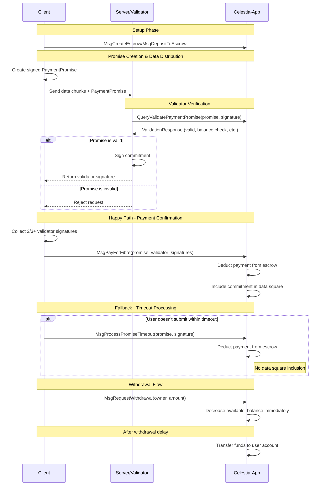

# `x/fibre`

## Abstract

The `x/fibre` payment mechanism enables users to pay for fibre blobs without waiting for a transaction to be confirmed. This is done by users depositing funds into escrow accounts, and signing over offchain messages that can be moved onchain at a later point.

## Contents

1. [Abstract](#abstract)
1. [State](#state)
1. [Messages](#messages)
1. [Events](#events)
1. [Queries](#queries)
1. [Parameters](#parameters)
1. [Client](#client)

## Abstract

DoS resistance for a protocol with a global limit on throughput requires a guarantee for payment. Normally this is done simply by paying for gas, however paying for gas requires waiting for a transaction to be confirmed. The payment portion of this module (mainly the `PaymentPromise` and `EscrowAccount`) is to provide a guarantee for payment without having to wait for a transaction to be confirmed.

Therefore, it is an invariant of the payment system that a signed `PaymentPromise` guarantees payment.

## State

The fibre module maintains state for escrow accounts, pending withdrawals, and module parameters.

### Params

```proto
message Params {
  option (gogoproto.goproto_stringer) = false;
  uint32 gas_per_blob_byte = 1
      [ (gogoproto.moretags) = "yaml:\"gas_per_blob_byte\"" ];
  uint64 withdrawal_delay = 2
      [ (gogoproto.moretags) = "yaml:\"withdrawal_delay\"" ];
  uint64 promise_timeout_blocks = 3
  [ (gogoproto.moretags) = "yaml:\"promise_timeout_blocks\"" ];
}
```

#### `GasPerBlobByte`

`GasPerBlobByte` is the amount of gas consumed per byte of blob data when payment is processed. This determines the gas cost for fibre blob inclusion.

#### `WithdrawalDelay`

`WithdrawalDelay` is the number of seconds that must pass between requesting a withdrawal and when funds become available for withdrawal (default: ~24 hours worth of blocks). This value is also used for pruning ProcessedPromise from the state.

#### `PromiseTimeoutBlocks`

`PromiseTimeoutBlocks` is the number of blocks after which anyone can submit a promise for processing if the user hasn't submitted a `MsgPayForFibre` (default: ~1 hour worth of blocks).

### Escrow Accounts

Escrow accounts help guarantee payment for a signed `PaymentPromise` by ensuring that a user does not remove funds directly after validators sign over and provide service for a blob. Each user can only have one escrow account, indexed by their owner address.

```proto
message EscrowAccount {
  // owner is the address that controls this escrow account
  string owner = 1;
  // balance is the total deposited amount
  cosmos.base.v1beta1.Coin balance = 2;
  // available_balance is the amount available for payments (balance - pending_withdrawals)
  cosmos.base.v1beta1.Coin available_balance = 3;
}
```

### Pending Withdrawals

Withdrawal requests are tracked to implement the delay mechanism.

```proto
message PendingWithdrawal {
  // owner is the address that owns the escrow account this withdrawal is for
  string owner = 1;
  // amount is the amount to be withdrawn
  cosmos.base.v1beta1.Coin amount = 2;
  // requested_at is the block height when withdrawal was requested
  int64 requested_at = 3;
  // available_at is the block height when funds become available
  int64 available_at = 4;
}
```

### Processed Promises

To prevent double payment, the module tracks which promises have been processed.

```proto
message ProcessedPromise {
  // promise_hash is the hash of the promise that was processed
  bytes promise_hash = 1;
  // processed_at is the block height when the promise was processed
  int64 processed_at = 2;
}
```

#### Indexing

**Escrow Accounts**:
- **Primary Index**: `escrows/{owner}` → `EscrowAccount`

**Pending Withdrawals**:
- **By Owner**: `withdrawals/{owner}/{requested_at}` → `PendingWithdrawal`
- **By Availability**: `available_withdrawals/{available_at}/{owner}` → `null` (for processing)

**Processed Promises**:
- **Primary Index**: `processed/{promise_hash}` → `ProcessedPromise`
- **By Height**: `pruning/{processed_at}/{promise_hash}` → `null` (for pruning)

#### Pruning Mechanism

Processed promises are automatically pruned after `withdrawal_delay` to prevent unbounded state growth.

## Messages

### MsgCreateEscrow

Creates a new escrow account for the signer. Each signer can only have one escrow account.

```proto
message MsgCreateEscrow {
  // signer is the bech32 encoded signer address who will own the escrow
  string signer = 1;
  // initial_deposit is the initial amount to deposit (optional)
  cosmos.base.v1beta1.Coin initial_deposit = 2;
}
```

#### Validation and Processing

**Stateless Validation**:
- Signer address must be valid
- Initial deposit amount must be non-negative

**Stateful Processing**:
1. Verify signer doesn't already have an escrow account
1. Create escrow account with signer as owner
1. If initial_deposit > 0, transfer funds and update balances
1. Emit EventCreateEscrow

### MsgDepositToEscrow

Deposits funds to the signer's escrow account. Deposits are processed instantly.

```proto
message MsgDepositToEscrow {
  // signer is the bech32 encoded signer address
  string signer = 1;
  // amount is the amount to deposit
  cosmos.base.v1beta1.Coin amount = 2;
}
```

#### Validation and Processing

**Stateless Validation**:
- Signer address must be valid
- Amount must be positive

**Stateful Processing**:
1. Verify signer's escrow account exists
2. Transfer funds from signer to module account
3. Update escrow account balance and available_balance
4. Emit EventDepositToEscrow

### MsgRequestWithdrawal

Requests withdrawal from the signer's escrow account. Funds become available after the withdrawal delay.

```proto
message MsgRequestWithdrawal {
  // signer is the bech32 encoded signer address
  string signer = 1;
  // amount is the amount to withdraw
  cosmos.base.v1beta1.Coin amount = 2;
}
```

#### Validation and Processing

**Stateful Processing**:
1. Verify signer's escrow account exists
2. Verify sufficient available balance
3. Decrease available_balance immediately
4. Create PendingWithdrawal with available_at = current_height + withdrawal_delay_blocks
5. Emit EventRequestWithdrawalFromEscrow

### MsgPayForFibre

Contains the original payment promise with validator signatures, submitted by the user. Successful `MsgPayForFibre` transactions are included in their own reserved namespace. The commitment from the promise is also included in the data square in the namespace specified in the promise.

```proto
message MsgPayForFibre {
  // signer is the bech32 encoded address submitting this message
  string signer = 1;
  // promise contains the original payment promise
  PaymentPromise promise = 2;
  // validator_signatures contains signatures from 2/3+ validators
  repeated bytes validator_signatures = 3;
}

message PaymentPromise {
  // owner is the owner of the escrow account to charge
  string owner = 1;
  // namespace is the namespace the blob is associated with. namespace version must be 2.
  bytes namespace = 2;
  // blob_size is the size of the blob in bytes
  uint64 blob_size = 3;
  // commitment is the hash of the row root and the RLC root
  bytes commitment = 4;
  // row_version is the version of the row format
  uint32 row_version = 5;
  // creation_height is the block height when this promise was created. This is critical for determining which validators sign along with when service stops for this blob.
  int64 creation_height = 6;
  // signature is the escrow owner's signature over the sign bytes
  bytes signature = 7;
}
```

#### PaymentPromise Validation

**Stateless Validation**:
- `owner` must be valid bech32 address
- `namespace` must be valid and version 2
- `blob_size` must be positive
- `commitment` must be 32 bytes
- `row_version` must be supported version
- `creation_height` must be positive
- `signature` must be properly formatted and non-empty

**Gas Consumption**:

Gas cost is calculated using the following formula:
```
total_gas = (sparse_shares_needed(blob_size) * share_size * gas_per_blob_byte)
```

Where:
- `rows_needed(blob_size)` is the number of rows needed for the blob data
- `row_size` is the size of each share in bytes
- `gas_per_blob_byte` is the gas cost per byte parameter

**Stateful Validation**:
1. Verify `creation_height` is:
  - less than or equal to current confirmed height
  - greater than (current_height - WithdrawalDelay)

2. Verify escrow account exists for `owner`
3. Verify sufficient available balance for gas cost (see Gas Consumption above). This includes all yet to be processed `PaymentPromises` that the validator has signed over.
4. Verify promise signature by escrow owner over promise sign bytes (see Sign Bytes Format below)
5. Verify promise hasn't been processed already

#### Sign Bytes Format

The sign bytes for a PaymentPromise signature are constructed by concatenating all fields except the `signature` field:

```
sign_bytes = owner_bytes || namespace || blob_size_bytes || commitment || row_version_byte || creation_height_bytes
```

**Field Encoding**:
- `owner`: raw bytes of owner address secp256k1 (20 bytes)
- `namespace`: Raw namespace bytes (fixed 29 bytes)
- `blob_size_bytes`: Varint encoded uint64 (1-10 bytes)
- `commitment`: Raw commitment bytes (32 bytes)
- `row_version_bytes`: Big-endian encoded uint32 (4 bytes)
- `creation_height_bytes`: Big-endian encoded int64 (8 bytes)

**Total Length**: Variable length of 94-103 bytes (20 + 29 + 1-10 + 32 + 4 + 8)

#### MsgPayForFibre Validation and Processing

**Stateless Validation**:
- Must have at least one validator signature
- All validator signatures must be properly formatted

**Stateful Processing**:
1. Validate PaymentPromise (see PaymentPromise Validation above)
2. Verify validator signatures represent 2/3+ voting power from validator set at `promise.creation_height` (obtained via historical info query from staking module)
3. Calculate gas cost (see Gas Consumption in PaymentPromise Validation) and deduct from escrow available balance
4. Mark promise as processed
5. Include commitment in data square (see Inclusion Processing below)
6. Emit EventPayForFibre

#### Inclusion Processing

When processing a successful `MsgPayForFibre`, the commitment must be included in the data square:

1. Extract the namespace from `promise.namespace`
2. Place the commitment as the sole data in the specified namespace
3. The commitment data is included as a single blob in the namespace
4. No other data should be present in this namespace for this block

### MsgProcessPromiseTimeout

Processes a payment promise after the timeout period if no `MsgPayForFibre` was submitted. This mechanism is critical to guaranteeing that payment occurs. `MsgProcessPromiseTimeout` transactions are included in the default transaction reserved namespace.

```proto
message MsgProcessPromiseTimeout {
  // signer is the bech32 encoded address submitting this message (can be anyone)
  string signer = 1;
  // promise contains the original payment promise
  PaymentPromise promise = 2;
}
```

#### MsgProcessPromiseTimeout Validation and Processing

**Stateless Validation**:
- All PaymentPromise stateless validation applies (including signature validation)

**Stateful Processing**:
1. Validate PaymentPromise (see PaymentPromise Validation above)
2. Verify `promise.creation_height + promise_timeout_blocks <= current_height` (timeout has passed)
3. Calculate gas cost (see Gas Consumption in PaymentPromise Validation) and deduct from escrow available balance
4. Mark promise as processed
5. DO NOT include commitment in data square (since no validator consensus was reached)
6. Emit EventProcessPromiseTimeout

## Transaction Flow

The Fibre blob submission follows this flow:



### Flow Description

1. **Setup Phase**: User creates escrow account and deposits funds using `MsgCreateEscrow` and/or `MsgDepositToEscrow`.

2. **Promise Creation**: User creates a signed `PaymentPromise` containing escrow details, commitment, and creation height.

3. **Data Distribution Phase**: User distributes data chunks to validators along with the signed promise.

4. **Validator Verification**: Validators query the celestia-app instance using `QueryValidatePaymentPromise` to verify the promise signature, check escrow has sufficient funds, and confirm the promise hasn't been processed. If valid, validators sign over the commitment.

5. **Payment Confirmation (Happy Path)**: User collects 2/3+ validator signatures and submits `MsgPayForFibre` containing the promise and signatures. The commitment gets included in the data square.

6. **Timeout Processing (Fallback)**: If user doesn't submit `MsgPayForFibre` within `promise_timeout_blocks`, anyone can submit `MsgProcessPromiseTimeout` to process payment. This prevents the user from getting free service.

7. **Withdrawal**: Users can request withdrawals via `MsgRequestWithdrawal` (decreases available balance immediately) and process them after the delay automatically.

## Events

### Escrow Events

#### `EventCreateEscrow`

| Attribute Key | Attribute Value                    |
|---------------|------------------------------------|
| owner         | {bech32 encoded owner address}     |
| initial_deposit | {initial deposit amount}         |

#### `EventDepositToEscrow`

| Attribute Key | Attribute Value                    |
|---------------|------------------------------------|
| signer        | {bech32 encoded signer address}    |
| amount        | {deposit amount}                   |

#### `EventRequestWithdrawalFromEscrow`

| Attribute Key | Attribute Value                    |
|---------------|------------------------------------|
| owner         | {bech32 encoded owner address}     |
| amount        | {withdrawal amount}                |
| available_at  | {block height when available}      |

#### `EventProcessWithdrawal`

| Attribute Key | Attribute Value                    |
|---------------|------------------------------------|
| processor     | {bech32 encoded processor address} |
| amount        | {withdrawal amount}                |

#### `EventPayForFibre`

| Attribute Key | Attribute Value                      |
|---------------|--------------------------------------|
| signer        | {bech32 encoded submitter address}   |
| owner  | {bech32 encoded escrow owner}        |
| namespace     | {namespace the blob is published to} |
| validator_count | {number of validator signatures}   |

#### `EventProcessPromiseTimeout`

| Attribute Key | Attribute Value                      |
|---------------|--------------------------------------|
| processor     | {bech32 encoded processor address}   |
| owner  | {bech32 encoded escrow owner}        |
| namespace     | {namespace the blob is published to} |

## Queries

### EscrowAccount

Queries an escrow account by ID.

**Request**:
```proto
message QueryEscrowAccountRequest {
  string owner = 1;
}
```

**Response**:
```proto
message QueryEscrowAccountResponse {
  EscrowAccount escrow_account = 1;
  bool found = 2;
}
```

### PendingWithdrawals

Queries pending withdrawals for an escrow account.

**Request**:
```proto
message QueryPendingWithdrawalsRequest {
  uint64 owner = 1;
  cosmos.base.query.v1beta1.PageRequest pagination = 2;
}
```

**Response**:
```proto
message QueryPendingWithdrawalsResponse {
  repeated PendingWithdrawal pending_withdrawals = 1;
  cosmos.base.query.v1beta1.PageResponse pagination = 2;
}
```

### ProcessedPromise

Queries whether an promise has been processed.

**Request**:
```proto
message QueryProcessedPromiseRequest {
  bytes promise_hash = 1;
}
```

**Response**:
```proto
message QueryProcessedPromiseResponse {
  ProcessedPromise processed_promise = 1;
  bool found = 2;
}
```

### ValidatePaymentPromise

Validates a payment promise for server use, performing all required checks including escrow balance and processing status.

**Request**:
```proto
message QueryValidatePaymentPromiseRequest {
  PaymentPromise promise = 1;
}
```

**Response**:
```proto
message QueryValidatePaymentPromiseResponse {
  bool valid = 1;
  string error_message = 2;
  bool sufficient_balance = 3;
  bool already_processed = 4;
  cosmos.base.v1beta1.Coin required_payment = 5;
  cosmos.base.v1beta1.Coin available_balance = 6;
}
```

**Validation Checks**:
1. Verify escrow account exists and has sufficient available balance for the gas cost (see Gas Consumption in PaymentPromise Validation)
2. Verify promise hasn't been processed already
3. Perform all standard PaymentPromise validation (see PaymentPromise Validation section)
4. Verify promise signature by escrow owner (signature is embedded in the PaymentPromise)

## Parameters

| Key                  | Type   | Default | Description |
|----------------------|--------|---------|-------------|
| GasPerBlobByte       | uint32 | 8       | Gas cost per byte of blob data |
| WithdrawalDelay      | uint64 | 144     | Blocks to wait before withdrawal |
| PromiseTimeoutBlocks | uint64 | 100     | Blocks before promise can be processed by timeout |

## Client

### CLI

#### Transactions

```shell
# Create new escrow account
celestia-appd tx fibre create-escrow <initial_deposit> [flags]

# Deposit to escrow account
celestia-appd tx fibre deposit-to-escrow <amount> [flags]

# Request withdrawal from escrow
  celestia-appd tx fibre request-withdrawal <amount> [flags]

# Process withdrawal (after delay)
celestia-appd tx fibre process-withdrawal <requested_at> [flags]

# Generate signed promise for validators
celestia-appd tx fibre create-promise <namespace> <blob_size> <commitment> [flags]

# Submit payment with validator signatures
celestia-appd tx fibre pay-for-fibre <promise_json> <validator_signatures_json> [flags]

# Process promise timeout (fallback mechanism)
celestia-appd tx fibre process-promise-timeout <promise_json> <promise_signature> [flags]
```

#### Queries

```shell
# Query escrow account
celestia-appd query fibre escrow-account <owner_address>

# Query pending withdrawals
celestia-appd query fibre pending-withdrawals <owner_address>

# Query if promise was processed
celestia-appd query fibre processed-promise <promise_hash>

# Query module parameters
celestia-appd query fibre params
```
