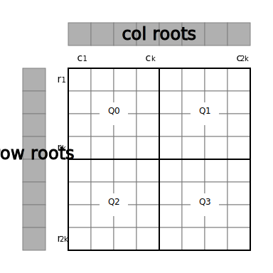

# Block Validity Rules

## Introduction

Unlike most blockchains, Celestia derives most of its functionality from
stateless commitments to data rather than stateful transitions. This means that
the protocol relies heavily on block validity rules. Notably, resource
constrained light clients must be able to detect when a subset of these validity
rules have not been followed in order to avoid making an honest majority
assumption on the consensus network. This has a significant impact on their
design. More information on how light clients can check the invalidity of a
block can be found in the [Fraud Proofs](./fraud_proofs.md) spec.

> **Note** Celestia relies on CometBFT (formerly tendermint) for consensus,
> meaning that it has single slot finality and is fork-free. Therefore, in order
> to ensure that an invalid block is never committed to, each validator must
> check that each block follows all validity rules before voting. If over two
> thirds of the voting power colludes to break a validity rule, then fraud
> proofs are created for light clients. After light clients verify fraud proofs,
> they halt.

## Validity Rules

Before any Celestia specific validation is performed, all CometBFT [block
validation
rules](https://github.com/cometbft/cometbft/blob/v0.34.28/spec/core/data_structures.md#block)
must be followed.

Notably, this includes verifying data availability. Consensus nodes verify data
availability by simply downloading the entire block.

> **Note** Light clients only sample a fraction of the block. More details on
> how sampling actually works can be found in the seminal ["Fraud and Data
> Availability Proofs: Maximising Light Client Security and Scaling Blockchains
> with Dishonest Majorities"](https://arxiv.org/abs/1809.09044) and in the
> [`celestia-node`](https://github.com/celestiaorg/celestia-node) repo.

Celestia specific validity rules can be categorized into multiple groups:

### Block Rules

1. In `Block.Data.Txs`, all `BlobTx` transactions must be ordered after non-`BlobTx` transactions.

### Transaction Validity Rules

#### App Version 1

There is no validity rule that transactions must be decodable so the following rules only apply to transactions that are decodable.

1. Decodable transactions must pass all [AnteHandler](./ante_handler.md) checks.
1. Decodable non-`BlobTx` transactions must not contain a `MsgPayForBlobs` message.
1. Decodable `BlobTx` transactions must be valid according to the [BlobTx validity rules](../../x/blob/README.md#validity-rules).

#### App Version 2

1. All transactions must be decodable.
1. All transactions must pass all [AnteHandler](./ante_handler.md) checks.
1. Non-`BlobTx` transactions must not contain a `MsgPayForBlobs` message.
1. `BlobTx` transactions must be valid according to the [BlobTx validity rules](../../x/blob/README.md#validity-rules).

### Data Root Construction

The data root must be calculated from a correctly constructed data square per the [data square layout](./data_square_layout.md) rules.

  
