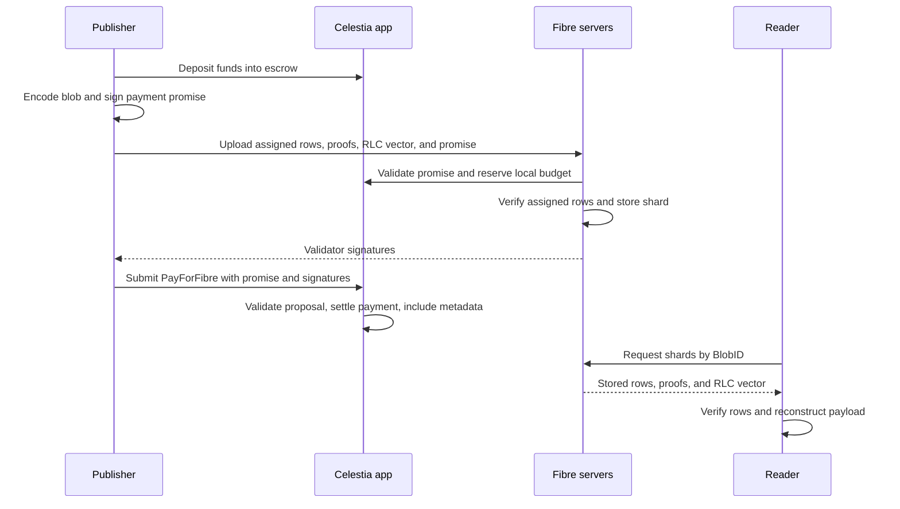

# How Fibre works

Fibre is Celestia's protocol for publishing blobs whose payloads are stored by validator-operated Fibre servers. It erasure-codes each blob so a reader can recover it from a subset of the encoded rows. Consensus records the payment and a commitment to the blob in the data square, while the payload travels directly between clients and Fibre servers.

This guide follows one blob through the current v0 implementation. For working code, start with the [Go client quickstart](../../fibre/README.md). Validators can use the [server setup guide](../../fibre/cmd/README.md).

## The participants

| Participant | Responsibility |
| --- | --- |
| Publisher / escrow owner | Funds escrow, encodes a blob, and signs a promise to pay for it |
| Fibre server | Stores its validator's assigned rows, verifies them, and signs the promise |
| Celestia app | Records provider hosts, validates settlement, charges escrow, and includes blob metadata in the square |
| Reader | Downloads enough verified rows and reconstructs the original bytes |

The publisher and the account submitting the settlement transaction can be different accounts. The promise owner pays the blob charge from escrow; the transaction submitter pays the transaction fee.

## Follow a blob

### 1. Fund escrow

The publisher deposits tokens into `x/fibre`. A payment promise authorizes a later charge against that escrow for one blob. It names the chain, namespace, blob commitment and version, padded upload size, creation time, and the validator-set height used for assignment.

A promise is a signed liability, even if an upload fails. Anyone holding it can submit a timeout settlement once it expires, subject to the freshness and balance checks. Expiry does not automatically charge the account: someone must submit a transaction. The standalone Fibre server currently has no timeout-submission worker.

### 2. Encode and assign rows

The client prepends a five-byte version-and-length header, pads the payload, and arranges it into 4,096 original rows. Reed-Solomon encoding adds 12,288 parity rows. For a correctly encoded blob, any 4,096 distinct rows from the resulting 16,384 rows suffice to reconstruct the original data.

Each server receives a **shard**: its assigned rows, their Merkle proofs, and a shared random linear combination (RLC) vector. Assignment is deterministic from the commitment and validator set. Validators with more voting power receive more rows, with a minimum allocation for small validators and a cap of 4,096 rows per validator. Assignments can overlap; downloading 4,096 rows with duplicates is not sufficient.

Merkle proofs bind rows to a commitment. RLC checks also test their consistency with the encoding; membership in a Merkle tree alone does not establish that a malicious publisher encoded correctly. See the [encoding reference](./fibre_encoding.md) and [RSEMA1D specification](../../pkg/rsema1d/SPEC.md) for the construction and security assumptions.

### 3. Upload and collect signatures

The client discovers server hosts through `x/valaddr` and authenticates each server's TLS key against the expected validator consensus key. Servers validate the promise, check that the rows match their assignment, verify the shard, enforce their storage budget, and store it before signing.

The default client returns when signatures reach the implemented threshold, `floor(2 * total_voting_power / 3)`. Remaining uploads can continue in the background. This is a voting-power threshold, not a count of servers, and the implementation does not require strictly more than two thirds.

The design targets recovery from an honest, reachable subset of the signing validators, using a one-third voting-power liveness parameter in assignment. That stake parameter is different from the codec's one-quarter row recovery threshold. Availability also depends on correct verification, enough distinct rows remaining reachable, and retrieval before pruning.

### 4. Settle and record the commitment

The publisher submits a `MsgPayForFibre` (PFF) containing the promise and validator signatures. Each PFF transaction must contain exactly that one message. The app checks signatures in CheckTx and ProcessProposal and checks that promises can settle against proposal state, including the effects of earlier payments.

Settlement deducts the blob charge from the owner's escrow and transfers it to the fee collector. FinalizeBlock does not repeat validator-signature verification. See the [module reference](./fibre_module.md) for the execution phases and replay protection.

The square contains two pieces of metadata:

- The PFF transaction in the reserved Fibre transaction namespace.
- A system blob in the publisher's namespace containing the Fibre version and commitment, with the transaction signer's address in the share metadata.

The original payload is stored on Fibre servers. `Client.Upload` only collects endorsements; `fibre.Put` additionally submits and confirms the settlement transaction.

### 5. Retrieve and reconstruct

A **BlobID** is the one-byte blob version followed by its 32-byte commitment. A reader requests shards by BlobID, verifies them, and reconstructs the payload after collecting enough distinct valid rows. Downloading requires no on-chain payment or client authentication at the server.

Preserve the promise's validator-set height for later retrieval and pass it to `Download` with `WithHeight`. Otherwise the client selects the current head validator set, which may have changed. The height returned by `Put` is the settlement height, not necessarily the promise height.

A successful download verifies the bytes against the supplied commitment. It does not itself prove that the commitment was included or settled on chain. An application that needs that assurance must also verify the on-chain record.

## Three different clocks

These defaults are governance parameters, not fixed protocol constants:

| Clock | Default | Meaning |
| --- | --- | --- |
| Payment promise timeout | 1 hour | Ends normal PFF settlement and opens timeout settlement |
| Shard retention | 4 hours | Sets the storage deadline from promise creation; servers retain until the later of this deadline and promise expiry |
| Withdrawal delay | 24 hours | Delays returning escrow funds and contributes to the promise freshness cutoff |

Timeout settlement remains possible after promise expiry until the freshness cutoff rejects the promise. A persisted freshness floor prevents governance from reviving old promises. This is why waiting one promise timeout after a client restart does not, by itself, make outstanding promises harmless.

Servers prune periodically. Settlement does not restart the retention clock, and `PutResult.TTL` is currently unpopulated. Applications needing long-term access must retain a copy elsewhere.

## What is paid for?

The charge uses the padded original rows, including the header, but excludes parity rows, proofs, and RLC overhead. Rows are aligned to 64 bytes, so the smallest paid upload is 256 KiB even for a tiny payload. The current escrow charge is `650,000 + 45,000 * ceil(upload_size / 262,144)` utia, separate from the settlement transaction fee.

`Put` can opt into local budget tracking and automatic deposits with `Escrow.AutoFund`. Direct `Upload` calls do not use that ledger. Neither the client ledger nor a validator's local promise cache is a global reservation on escrow; see the [client accounting limits](./fibre_client.md#escrow-ledger-accounting-and-limits).

## Reference map

- [Client](./fibre_client.md): Go API, upload/download flows, retries, and escrow accounting.
- [Server](./fibre_server.md): RPC validation, storage, pruning, and resource limits.
- [Module](./fibre_module.md): On-chain escrow, settlement, queries, and parameters.
- [Encoding](./fibre_encoding.md): Blob bytes, commitments, and data-square metadata.
- [Registry](./fibre_registry_module.md): Provider registration and discovery.
- [TLS identity](./fibre_tls_identity.md): Validator-endorsed transport identity.
- [RSEMA1D](../../pkg/rsema1d/SPEC.md): Codec and proof construction.

ADRs under `docs/architecture` describe design decisions and proposals. Check their status and the current references before treating proposed behavior as implemented.
