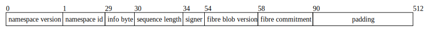

# Encoding

## What goes into the original data square?

The Fibre DA scheme does not store Fibre blob payload data in the original data square. Blob payload data is encoded separately into RSEMA1D rows. The original data square only stores metadata that lets readers find and verify the Fibre blob.

There are two Fibre-related entries in the original data square:

1. Accepted SDK transactions containing exactly one `MsgPayForFibre` and no other messages are included in their own reserved namespace. The `PAY_FOR_FIBRE_NAMESPACE` is `0x0000000000000000000000000000000000000000000000000000000005`. These transactions are encoded as compact transaction shares using share version 0.

2. During data-square construction, the state machine synthesizes one system-level blob for each accepted `MsgPayForFibre`. This blob is appended as sparse shares. It uses the namespace from the `PaymentPromise` and share version 2.

The share version 2 system blob has the following first-share layout:

- namespace version: 0
- namespace ID: the namespace ID specified in the `PaymentPromise`
- share version: 2
- sequence start indicator: 1
- sequence length: 36 bytes
- signer: the 20-byte signer address decoded from `MsgPayForFibre.Signer`
- Fibre blob version: the 4-byte big-endian `PaymentPromise.BlobVersion`
- Fibre commitment: the 32-byte `PaymentPromise.Commitment`
- padding: zeros to the end of the 512-byte share

The 36-byte sequence is exactly:

```text
fibre_blob_version_u32be || fibre_commitment_32
```



## What goes into the RSEMA1D rows?

### Protocol defaults

The current implementation supports Fibre blob version 0.

Default protocol parameters for version 0:

- original rows: 4096
- parity rows: 12288
- total rows: 16384
- encoding ratio: 0.25
- minimum row size: 64 bytes
- maximum blob size, including the Fibre blob header: 128 MiB
- maximum user payload size: 128 MiB - 5 bytes

The `4096` original-row count pairs with the 64-byte minimum row size to make the smallest paid upload step `4096 * 64 = 256 KiB`. The 64-byte minimum comes from the Leopard/GF(2^16) Reed-Solomon layout. Fewer rows would reduce this step size for small blobs, but would increase Merkle proof overhead per byte; very small choices such as 512 or 1024 rows make proof bandwidth large enough that validators may be close to downloading the whole blob anyway.

The `1:3` original-to-parity ratio means any `4096` rows out of `16384` are enough to reconstruct the blob, so the row recovery threshold is `1/4` of the extended data. Fibre uses this instead of a `1:2` ratio, where recovery would require `1/3` of the extended data, because the validator liveness target is already `1/3` of voting power. A `1/4` row threshold gives room for assignment rounding, duplicate rows, slow or missing validators, and bad rows discarded by RLC verification.

The chosen shape also fits the codec cleanly: `K = 4096` and `K + N = 16384` are both powers of two, and the total row count is well below the GF(2^16) limit of `65536`. It also satisfies stricter compatible-library bounds such as `K + next_power_of_two(N) = 4096 + 16384 = 20480 <= 65536`. A `1/3` encoding ratio with `K = 4096` would imply `12288` total rows, which is mathematically plausible but not a power-of-two total for the current RSEMA1D configuration.

### Fibre blob v0 byte stream

Fibre blob payload data is not prefixed with a length in every row. Instead, the whole blob has one 5-byte header at the start of row 0:

```text
blob_version_u8 || original_data_size_u32be || original_data
```

For version 0:

- `blob_version_u8` is always `0`
- `original_data_size_u32be` is the original user payload length, encoded as a 4-byte big-endian unsigned integer
- `original_data` is the user payload

The user payload must be non-empty and must not exceed `128 MiB - 5 bytes`.

### Row size

For a payload of `data_len` bytes:

```text
total_len = 5 + data_len
row_size = ceil(total_len / 4096), rounded up to the nearest multiple of 64
```

The upload size paid for by the `PaymentPromise` is:

```text
upload_size = row_size * 4096
```

### Original row assembly

The original rows are assembled as follows:

- row 0 reserves the first 5 bytes for the Fibre blob header
- row 0 payload bytes begin immediately after the header
- full middle rows contain payload bytes directly, with no row-local metadata
- if the final payload row is partial, it is zero-padded to `row_size`
- any remaining original rows are all-zero rows

Padding zeros are distinguished from significant payload zeros by the `original_data_size_u32be` field in the blob header, not by per-row length prefixes.

### Parity rows and commitment

The RSEMA1D encoder receives `4096 + 12288` rows. Original rows occupy `rows[0:4096]`; parity rows occupy `rows[4096:16384]`.

Encoding fills the parity rows, builds a Merkle tree over all extended rows, derives random linear combination coefficients from the row Merkle root, computes RLC values for the 4096 original rows, and builds a Merkle tree over those RLC values.

The Fibre commitment is:

```text
SHA256(row_root || rlc_root)
```

### Decoding

Decoding reconstructs enough rows to recover the original row region, parses the 5-byte v0 header at the start of row 0, verifies that the blob version is `0`, checks that the original data size is non-zero and within the configured maximum, and returns exactly:

```text
bytes[5 : 5 + original_data_size]
```
