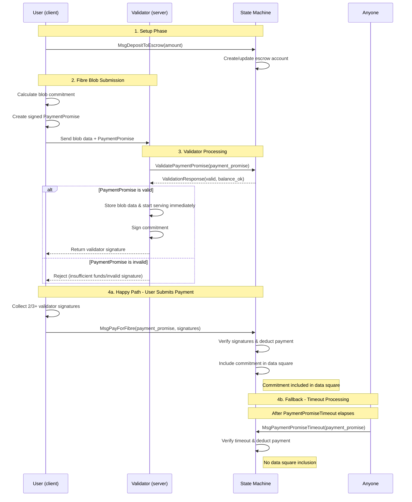
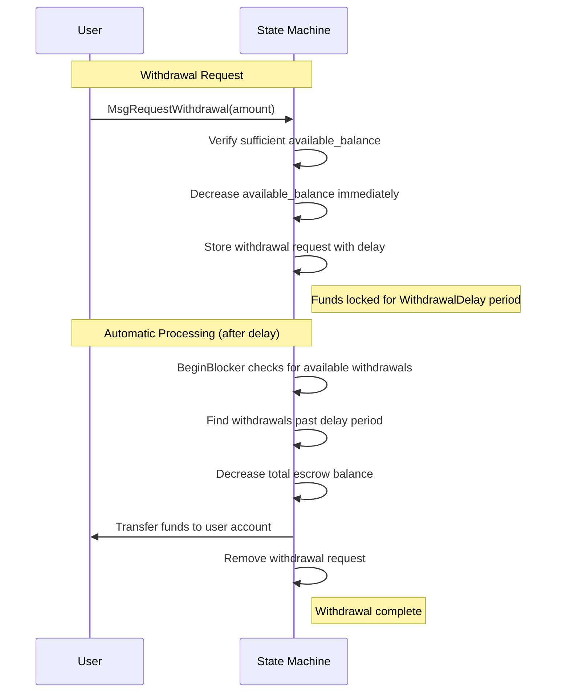

# Fibre SDK Module `x/fibre`

## Abstract

**Problem**: Currently, users must wait for a `MsgPayForBlob` transaction to be included on-chain for a blob to be available on the network. This creates UX friction and delays data availability service.

**Solution**: The `x/fibre` module enables data availability for Fibre blobs without waiting for a transaction to be included on-chain by using a pre-funded escrow system. Users deposit funds into escrow accounts and then create signed PaymentPromises that guarantee future payment from the escrow account. This enables users to get data availability for the Fibre blob before the PaymentPromise transaction is included on-chain. This also enables validators to start providing data availability service for the Fibre blob before the PaymentPromise transaction is included on-chain.

**How it works**:

1. A user funds their escrow account via `MsgDepositToEscrow`
2. When a user wants to make data available, they create a PaymentPromise off-chain and submit it along with their blob data to validators.
3. Validators verify the PaymentPromise off-chain and immediately start providing service for the data they received.
4. Payment settlement occurs later through on-chain transactions (`MsgPayForFibre`) or a timeout mechanism (`MsgPaymentPromiseTimeout`)

**Key guarantee**: A valid [`PaymentPromise`](#paymentpromise) guarantees payment for a blob, enabling validators to provide immediate service for blob data with confidence that the protocol will charge the user later when the `MsgPayForFibre` or `MsgPaymentPromiseTimeout` transactions are submitted on-chain.

## Key Concepts

### Fibre Blob

A Fibre blob is a piece of data that users want to make available through Celestia's data availability network with immediate service. Unlike regular blob submissions that require waiting for transaction confirmation, Fibre blobs use pre-paid escrow accounts to enable instant processing by validators.

### PaymentPromise

A PaymentPromise is an off-chain signed message that commits a user to pay for a specific Fibre blob. It contains the blob commitment, size, namespace, and cryptographic proof that the user has sufficient funds in escrow. Validators can verify this promise instantly without waiting for on-chain transaction confirmation.

### Escrow Account

An escrow account is a module-controlled account that holds user funds to guarantee payment for PaymentPromises. Users deposit funds in advance, and the module ensures these funds cannot be withdrawn immediately, providing validators with payment assurance so they can process Fibre blobs.

### Commitment

A cryptographic hash that uniquely identifies a Fibre blob's content. Validators sign over this commitment to prove they have received and will make the data available. The commitment is eventually included in Celestia's data square.

### Signature Schemes

The `x/fibre` module uses two different cryptographic signature schemes, following the same pattern as celestia-app:

1. **User Signatures (secp256k1)**: PaymentPromises are signed by users using secp256k1, the same curve used for transaction submission in celestia-app.

2. **Validator Signatures (ed25519)**: Validators sign blob commitments using ed25519, the same curve used for validator consensus signatures in celestia-app.

## Contents

1. [Abstract](#abstract)
1. [Key Concepts](#key-concepts)
1. [Sequence Diagram](#sequence-diagrams)
1. [State](#state)
1. [Messages](#messages)
1. [Automatic State Transitions](#automatic-state-transitions)
1. [Events](#events)
1. [Queries](#queries)
1. [Parameters](#parameters)
1. [Client](#client)

## Sequence Diagrams

### Fibre blob flow



1. **Setup Phase**: User deposits funds using [`MsgDepositToEscrow`](#msgdeposittoescrow), which creates or updates their escrow account with the specified amount.

2. **Fibre Blob Submission**:
   - User calculates the cryptographic commitment for their blob data
   - User creates a signed [`PaymentPromise`](#paymentpromise) containing the commitment, blob size, namespace, and escrow account reference
   - User sends the blob data and PaymentPromise to validators

3. **Validator Processing**:
   - Validators query the state machine using [`ValidatePaymentPromise`](#validatepaymentpromise) to validate the PaymentPromise signature, check escrow balance, and confirm the PaymentPromise hasn't been processed
   - If valid: validators store the blob data locally, sign the commitment, return their signature to the user, and **immediately start serving the blob data**
   - If invalid: validators reject the request (insufficient funds, invalid signature, etc.)

4. **Payment Settlement** (Two possible paths):

   **4a. Happy Path - User Submits Payment**: User collects 2/3+ validator signatures and submits [`MsgPayForFibre`](#msgpayforfibre). The state machine verifies signatures, deducts payment from escrow, and includes the commitment in the data square.

   **4b. Fallback - Timeout Processing**: If the user doesn't submit [`MsgPayForFibre`](#msgpayforfibre) within the timeout period, anyone can submit [`MsgPaymentPromiseTimeout`](#msgpaymentpromisetimeout) to force payment. The state machine deducts payment but does **not** include the commitment in the data square.

### Key Insights

- **Immediate Service**: Validators start serving blob data as soon as they verify the PaymentPromise, before any on-chain payment
- **Payment Guarantee**: The PaymentPromise guarantees payment will occur either via user submission or timeout mechanism
- **Data Square Inclusion**: Only successful `MsgPayForFibre` submissions result in commitment inclusion in the data square

## Withdrawal Processing Flow

Users can withdraw funds from their escrow accounts but withdrawals are subject to a delay period to ensure that the protocol can charge user's for any pending PaymentPromises.



### Withdrawal Flow Details

1. **Request Phase**: User submits [`MsgRequestWithdrawal`](#msgrequestwithdrawal) specifying the amount to withdraw
2. **Immediate Lock**: The system immediately decreases the user's `available_balance` to prevent double-spending, but keeps the funds in the escrow account
3. **Delay Period**: Funds remain locked for the `WithdrawalDelay` period (default: 24 hours) to ensure any pending PaymentPromises can still be processed
4. **Automatic Processing**: The state machine's `BeginBlocker` automatically processes eligible withdrawals, transferring funds back to the user and updating the escrow account balance

This delay mechanism ensures that validators can trust PaymentPromises even when users have requested withdrawals, since the funds remain available for the delay period.

## State

The fibre module maintains state for [escrow accounts](#escrow-accounts), [withdrawals](#withdrawals), and module [parameters](#parameters).

### Escrow Accounts

Escrow accounts help guarantee payment for a signed [`PaymentPromise`](#paymentpromise) by ensuring that a user does not remove funds after validators sign over and provide service for a Fibre blob. Each address can only have one escrow account, indexed by their signer address.

```proto
// EscrowAccount helps guarantee payment for a signed PaymentPromise by ensuring
// that a user does not remove funds directly after validators sign over and
// provide service for a blob.
message EscrowAccount {
  // signer is the address that controls this escrow account
  string signer = 1 [(cosmos_proto.scalar) = "cosmos.AddressString"];
  // balance is the total amount currently held in escrow
  cosmos.base.v1beta1.Coin balance = 2 [(gogoproto.nullable) = false];
  // available_balance is the amount available for new payments. This is usually
  // the same as balance except if a user has requested a withdrawal in the past
  // 24 hours in which case available_balance = balance - pending withdrawal
  // amount.
  cosmos.base.v1beta1.Coin available_balance = 3 [(gogoproto.nullable) = false];
}
```

### Withdrawals

Withdrawal requests are tracked to implement the delay mechanism.

```proto
// Withdrawal tracks requests to withdraw funds from an escrow account. It is
// needed to implement a delay mechanism between when a withdrawal is requested
// and when it is executed. By default the withdrawal delay is 24 hours.
message Withdrawal {
  // signer is the address that owns the escrow account this withdrawal is for
  string signer = 1 [(cosmos_proto.scalar) = "cosmos.AddressString"];
  // amount is the amount to be withdrawn
  cosmos.base.v1beta1.Coin amount = 2 [(gogoproto.nullable) = false];
  // requested_timestamp is the timestamp when withdrawal was requested
  google.protobuf.Timestamp requested_timestamp = 3 [(gogoproto.nullable) = false, (gogoproto.stdtime) = true];
  // available_timestamp is the timestamp when withdrawal becomes available for processing
  // This is calculated as requested_timestamp + withdrawal_delay at creation time
  google.protobuf.Timestamp available_timestamp = 4 [(gogoproto.nullable) = false, (gogoproto.stdtime) = true];
}
```

### Processed Payments

To prevent double payment, the module tracks which payment promises have been processed. Each processed payment stores the payment promise hash and the timestamp when it was processed.

```proto
// ProcessedPayment represents a PaymentPromise that has been processed and
// stored in genesis state. ProcessedPayment intentionally omits many fields
// from the original PaymentPromise to avoid bloating the state. This exists for
// replay protection.
message ProcessedPayment {
  bytes payment_promise_hash = 1;
  google.protobuf.Timestamp processed_at = 2 [(gogoproto.nullable) = false, (gogoproto.stdtime) = true];
}
```

Processed payments use a dual-index pattern for efficient querying and pruning:

- **By hash**: `processed_payments_by_hash/{payment_promise_hash}` → `ProcessedPayment` (for replay protection)
- **By time**: `processed_payments_by_time/{processed_at}/{payment_promise_hash}` → `ProcessedPayment` (for time-ordered pruning)

## Messages

### Gas Consumption

All messages use the existing gas consumption mechanism in the cosmos-sdk. In addition to the standard resource pricing, the messages that deduct fees for blobs, `MsgPayForFibre` and `MsgPaymentPromiseTimeout`, manually add gas consumption based on Fibre blob size.

**Blob Gas Calculation**:

Gas cost is calculated using the following formula:

```text
total_gas = (rows * row_size(blob_size) * gas_per_blob_byte)
```

This means that users pay for padding as well, just like PFBs.

Where:

- `rows` is the constant number of rows needed for the blob data
- `row_size(blob_size)` is the size of each row in bytes
- `gas_per_blob_byte` is the gas cost per byte parameter

### MsgDepositToEscrow

Deposits funds to the signer's escrow account. If no escrow account exists for the signer, one will be created automatically. Deposits are processed instantly.

```proto
// MsgDepositToEscrow deposits funds to the signer's escrow account.
message MsgDepositToEscrow {
  option (cosmos.msg.v1.signer) = "signer";
  // signer is the bech32 encoded signer address
  string signer = 1 [(cosmos_proto.scalar) = "cosmos.AddressString"];
  // amount is the amount to deposit
  cosmos.base.v1beta1.Coin amount = 2 [(gogoproto.nullable) = false];
}
```

#### Validation and Processing

**Stateless Validation**:

- Signer address must be valid
- Amount must be positive

**Stateful Processing**:

1. If signer's escrow account doesn't exist, create one with zero balance
2. Transfer funds from signer to module account
3. Increase both balance and available_balance by deposit amount
4. Emit EventDepositToEscrow

### MsgRequestWithdrawal

Requests withdrawal from the signer's escrow account. Funds are withdrawn after the withdrawal delay.

```proto
// MsgRequestWithdrawal requests withdrawal from the signer's escrow account.
message MsgRequestWithdrawal {
  option (cosmos.msg.v1.signer) = "signer";
  // signer is the bech32 encoded signer address
  string signer = 1 [(cosmos_proto.scalar) = "cosmos.AddressString"];
  // amount is the amount to withdraw
  cosmos.base.v1beta1.Coin amount = 2 [(gogoproto.nullable) = false];
}
```

#### Validation

**Stateless Validation**:

- Signer address must be valid
- Amount must be positive

**Stateful Processing**:

1. Verify signer's escrow account exists
2. Verify sufficient available balance
3. Verify no existing withdrawal request at current timestamp (prevents key collision in `withdrawals_by_signer/{signer}/{requested_timestamp}` index)
4. Calculate available_timestamp = requested_timestamp + withdrawal_delay
5. Create Withdrawal with both requested_timestamp and available_timestamp
6. Decrease available_balance immediately (balance remains unchanged until withdrawal is processed)
7. Store withdrawal in both indexes (by signer and by available time)
8. Emit EventWithdrawFromEscrowRequest

#### Withdrawal Processing

Withdrawals are automatically processed in `BeginBlocker` when `current_time >= withdrawal.available_timestamp`:

```go
func processAvailableWithdrawals(ctx sdk.Context, k Keeper) {
    currentTime := ctx.BlockTime()

    // Iterate over withdrawals-by-available index starting from earliest timestamp
    iterator := k.GetWithdrawalsByAvailableIterator(ctx, currentTime)
    defer iterator.Close()

    for ; iterator.Valid(); iterator.Next() {
        // Parse key to extract available_at timestamp and signer address
        availableAt, signer, err := k.ParseWithdrawalsByAvailableKey(iterator.Key())
        if err != nil {
            // Log error but continue processing other withdrawals
            k.Logger(ctx).Error("failed to parse withdrawals-by-available key", "error", err)
            continue
        }

        // Stop if we've reached withdrawals not yet available
        if availableAt.After(currentTime) {
            break
        }

        // Get full withdrawal from value
        var withdrawal types.Withdrawal
        k.cdc.MustUnmarshal(iterator.Value(), &withdrawal)
        amount := withdrawal.Amount

        // Convert signer string to AccAddress
        signerAddr, err := sdk.AccAddressFromBech32(signer)
        if err != nil {
            // Log error but continue processing other withdrawals
            k.Logger(ctx).Error("failed to parse signer address", "error", err, "signer", signer)
            continue
        }

        // Process withdrawal: transfer from module to user account
        err = k.bankKeeper.SendCoinsFromModuleToAccount(
            ctx, types.ModuleName, signerAddr, sdk.NewCoins(amount))
        if err != nil {
            // Log error but continue processing other withdrawals
            k.Logger(ctx).Error("failed to process withdrawal", "error", err, "signer", signer)
            continue
        }

        // Update escrow account balance (decrease total balance)
        escrowAccount, found := k.GetEscrowAccount(ctx, signer)
        if !found {
            // This shouldn't happen, but log and continue
            k.Logger(ctx).Error("escrow account not found during withdrawal processing", "signer", signer)
            continue
        }
        escrowAccount.Balance = escrowAccount.Balance.Sub(amount)
        k.SetEscrowAccount(ctx, escrowAccount)

        // Remove from both withdrawal indexes using withdrawal.AvailableTimestamp
        k.DeleteWithdrawal(ctx, withdrawal)

        // Emit event
        event := types.NewEventWithdrawFromEscrowExecuted(signer, amount)
        if err := ctx.EventManager().EmitTypedEvent(event); err != nil {
            // Log error but continue - event emission failure shouldn't stop processing
            k.Logger(ctx).Error("failed to emit withdrawal executed event", "error", err, "signer", signer)
        }
    }
}
```

<!-- markdownlint-disable MD024 -->
### PaymentPromise
<!-- markdownlint-enable MD024 -->

```proto
// PaymentPromise is a promise to pay for a Fibre blob. It contains the
// commitment and payment details for the Fibre blob.
message PaymentPromise {
  // chain_id is the chain ID that this payment promise is valid for.
  // Example: arabica-11, mocha-4, or celestia.
  string chain_id = 1;
  // namespace is the namespace the blob is associated with.
  bytes namespace = 2;
  // blob_size is the size of the blob in bytes
  uint32 blob_size = 3;
  // commitment is the hash of the row root and the Random Linear Combination (RLC) root
  bytes commitment = 4;
  // fibre_blob_version is the version of the Fibre blob encoding
  uint32 fibre_blob_version = 5;
  // height is the height that is used to determine the validator set that is used
  int64 height = 6;
  // creation_timestamp is the timestamp when this promise was created. This
  // is critical for determining which validators sign the commitment and
  // determining when service stops for this blob.
  google.protobuf.Timestamp creation_timestamp = 7 [(gogoproto.nullable) = false, (gogoproto.stdtime) = true];
  // signer_public_key is the public key of the owner of the escrow account to charge
  google.protobuf.Any signer_public_key = 8 [(cosmos_proto.accepts_interface) = "cosmos.crypto.PubKey"];
  // signature is the signer (escrow account owner) secp256k1 signature over the sign bytes
  bytes signature = 9;
}
```

Stateless Validation

- `chain_id` must be non-empty.
- `namespace` must be a valid blob namespace. Must be 29 bytes.
- `blob_size` must be positive.
- `commitment` must be 32 bytes.
- `fibre_blob_version` must be a supported Fibre blob version.
- `height` must be positive.
- `creation_timestamp` must be positive.
- `signer_public_key` must be non-empty.
- `signature` must be properly formatted and non-empty.

Stateful Validation

1. Verify `creation_timestamp` is:

    - less than or equal to current confirmed timestamp
    - greater than (header_timestamp - withdrawal_delay)

2. Verify escrow account exists for `signer_public_key`
3. Verify sufficient available balance for gas cost (see [Gas Consumption](#gas-consumption) section). This includes all yet to be processed `PaymentPromises` that the validator has signed over.
4. Verify PaymentPromise secp256k1 signature by escrow owner over PaymentPromise sign bytes
5. Verify PaymentPromise hasn't been processed already

#### Sign Bytes Format

The sign bytes for a PaymentPromise secp256k1 signature are constructed by concatenating a prefix and all fields except the `signature` field:

```text
sign_bytes = prefix || chain_id || signer_public_key || namespace || blob_size || commitment || fibre_blob_version || height || creation_timestamp
```

- `prefix`: "fibre/pp:v0" (11 bytes)
- `chain_id`: Raw chain ID bytes (variable length)
- `signer_public_key`: Raw bytes of signer public key secp256k1 (33 bytes)
- `namespace`: Raw namespace bytes (29 bytes)
- `blob_size`: Big-endian encoded uint32 (4 bytes)
- `commitment`: Raw commitment bytes (32 bytes)
- `fibre_blob_version`: Big-endian encoded uint32 (4 bytes)
- `height`: Big-endian encoded int64 (8 bytes)
- `creation_timestamp`: UTC timestamp encoded using Go's time.Time.MarshalBinary() (variable but usually 15 bytes)

The total length of the sign bytes is: 1 + len(chain_id) + 33 + 29 + 4 + 32 + 4 + 8 + len(creation_timestamp) = 111 + len(chain_id) + len(creation_timestamp) bytes.

#### Payment Promise Hash

The PaymentPromise hash is calculated using the following formula:

```text
payment_promise_hash = SHA256(sign_bytes || signature)
```

- `sign_bytes`: Raw sign bytes (variable length)
- `signature`: Raw signature bytes (64 bytes)

#### Processed Payments Pruning

Processed payments are automatically pruned in `BeginBlocker` when `current_time >= processed_at + payment_promise_retention_window` to prevent unbounded state growth:

The pruning mechanism ensures that:

- Processed payments outside the retention window are removed to prevent unbounded state growth
- Both indexes (by hash and by time) are deleted atomically
- An event is emitted for each pruned payment for observability
- Errors in parsing or deleting individual entries don't stop the entire pruning process

### MsgPayForFibre

Contains the original PaymentPromise with validator signatures, submitted by the user. Successful `MsgPayForFibre` transactions are included in their own reserved namespace. The commitment from the PaymentPromise is also included in the original data square in the namespace specified in the PaymentPromise.

```proto
// MsgPayForFibre contains the original PaymentPromise with validator signatures.
message MsgPayForFibre {
  option (cosmos.msg.v1.signer) = "signer";
  // signer is the bech32 encoded address submitting this message
  string signer = 1 [(cosmos_proto.scalar) = "cosmos.AddressString"];
  // payment_promise is the original PaymentPromise
  PaymentPromise payment_promise = 2 [(gogoproto.nullable) = false];
  // validator_signatures contains ed25519 signatures from validators
  repeated bytes validator_signatures = 3;
}
```

Stateless Validation:

- `signer` must be a valid address
- `PaymentPromise` must be valid
- Must have at least one validator signature
- All validator signatures must be non-empty

Stateful Processing:

1. Validate PaymentPromise
2. Verify validator ed25519 signatures represent 2/3+ threshold from validator set at `promise.height` (obtained via historical info query from staking module):
   - Signatures must represent 2/3+ of total voting power AND 2/3+ of validator count
   - Each signature is verified using the validator's ed25519 public key from the validator set
3. Calculate gas cost (see [Gas Consumption](#gas-consumption) section) and deduct from both escrow balance and available_balance
4. Mark promise as processed by storing `ProcessedPayment` with `processed_at` timestamp in both indexes:
   - `processed_payments_by_hash/{payment_promise_hash}` for replay protection
   - `processed_payments_by_time/{processed_at}/{payment_promise_hash}` for time-ordered pruning
5. Include commitment in data square
6. Emit EventPayForFibre

When processing a successful `MsgPayForFibre`, two pieces of metadata are written to the original data square:

1. The tx containing the `MsgPayForFibre` is included in the reserved namespace for Fibre transactions.
2. A system-level blob is generated with the namespace from the PaymentPromise and the blob data is the Fibre blob commitment.

### MsgPaymentPromiseTimeout

Processes a PaymentPromise after the timeout period if no `MsgPayForFibre` was submitted. This mechanism is critical to guaranteeing that payment occurs. `MsgPaymentPromiseTimeout` transactions are included in the default transaction reserved namespace. A system-level blob is not generated for this transaction.

```proto
// MsgPaymentPromiseTimeout processes a payment promise after the timeout period.
message MsgPaymentPromiseTimeout {
  option (cosmos.msg.v1.signer) = "signer";
  // signer is the bech32 encoded address submitting this message (can be anyone)
  string signer = 1 [(cosmos_proto.scalar) = "cosmos.AddressString"];
  // payment_promise is the original payment promise
  PaymentPromise payment_promise = 2 [(gogoproto.nullable) = false];
}
```

**Stateless Validation**:

- `signer` must be a valid address
- `PaymentPromise` must be valid

**Stateful Processing**:

1. Validate PaymentPromise
2. Verify `promise.creation_timestamp + payment_promise_timeout <= header_timestamp` (timeout has passed)
3. Calculate gas cost (see [Gas Consumption](#gas-consumption) section) and deduct from both escrow balance and available_balance
4. Mark promise as processed by storing `ProcessedPayment` with `processed_at` timestamp in both indexes:
   - `processed_payments_by_hash/{payment_promise_hash}` for replay protection
   - `processed_payments_by_time/{processed_at}/{payment_promise_hash}` for time-ordered pruning
5. DO NOT include commitment in data square (since no validator consensus was reached)
6. Emit EventPaymentPromiseTimeout

## Automatic State Transitions

The fibre module requires automatic processing in `BeginBlocker` to handle time-based state transitions that cannot rely on user-submitted transactions. Two key operations must occur automatically:

1. **Withdrawal Processing**: Transfer funds from escrow to user accounts when withdrawal delay expires (see [Withdrawal Processing](#withdrawal-processing))
2. **Processed Payment Pruning**: Remove old processed payments to prevent unbounded state growth (see [Processed Payments Pruning](#processed-payments-pruning))

### BeginBlocker Implementation

```go
func BeginBlocker(ctx sdk.Context, k Keeper) error {
    // Process available withdrawals first (affects escrow balances)
    if err := k.processAvailableWithdrawals(ctx); err != nil {
        return err
    }

    // Prune payment promises that are outside the retention window
    if err := k.pruneProcessedPayments(ctx); err != nil {
        return err
    }

    return nil
}
```

## Events

### `EventDepositToEscrow`

| Attribute Key | Attribute Value                 |
|---------------|---------------------------------|
| signer        | {bech32 encoded signer address} |
| amount        | {deposit amount}                |

### `EventWithdrawFromEscrowRequest`

| Attribute Key | Attribute Value                 |
|---------------|---------------------------------|
| signer        | {bech32 encoded signer address} |
| amount        | {withdrawal amount}             |
| requested_at  | {timestamp when requested}      |
| available_at  | {timestamp when available}      |

### `EventWithdrawFromEscrowExecuted`

| Attribute Key | Attribute Value               |
|---------------|-------------------------------|
| signer        | {bech32 encoded escrow owner} |
| amount        | {withdrawal amount}           |

### `EventPayForFibre`

| Attribute Key   | Attribute Value                      |
|-----------------|--------------------------------------|
| signer          | {bech32 encoded submitter address}   |
| namespace       | {namespace the blob is published to} |
| validator_count | {number of validator signatures}     |

### `EventPaymentPromiseTimeout`

| Attribute Key        | Attribute Value                                       |
|----------------------|-------------------------------------------------------|
| processor            | {bech32 encoded processor address}                    |
| signer               | {bech32 encoded escrow owner}                         |
| payment_promise_hash | {hash for the PaymentPromise that is being timed out} |

### `EventUpdateFibreParams`

| Attribute Key | Attribute Value                    |
|---------------|------------------------------------|
| signer        | {bech32 encoded authority address} |
| params        | {updated fibre module parameters}  |

### `EventProcessedPaymentPruned`

| Attribute Key        | Attribute Value                                       |
|----------------------|-------------------------------------------------------|
| payment_promise_hash | {hash of the PaymentPromise that was pruned}          |
| processed_at         | {timestamp when the payment was originally processed} |

## Queries

### EscrowAccount

Queries an [escrow account](#escrow-accounts) by signer.

**Request**:

```proto
message QueryEscrowAccountRequest {
  string signer = 1;
}
```

**Response**:

```proto
message QueryEscrowAccountResponse {
  EscrowAccount escrow_account = 1;
  bool found = 2;
}
```

### Query Withdrawals

Queries [withdrawals](#withdrawals) for an escrow account. Since withdrawals are automatically deleted from state when executed, this query returns all pending withdrawals for the specified signer.

**Request**:

```proto
message QueryWithdrawalsRequest {
  string signer = 1;
  cosmos.base.query.v1beta1.PageRequest pagination = 2;
}
```

**Response**:

```proto
message QueryWithdrawalsResponse {
  repeated Withdrawal withdrawals = 1;
  cosmos.base.query.v1beta1.PageResponse pagination = 2;
}
```

### IsPaymentProcessed

Queries whether a payment has been processed.

**Request**:

```proto
message QueryIsPaymentProcessedRequest {
  bytes promise_hash = 1;
}
```

**Response**:

```proto
message QueryIsPaymentProcessedResponse {
  google.protobuf.Timestamp processed_at = 1;
  bool found = 2;
}
```

### ValidatePaymentPromise

Validates a [PaymentPromise](#paymentpromise) for server use, performing all required checks including escrow balance and processing status.

**Request**:

```proto
message QueryValidatePaymentPromiseRequest {
  PaymentPromise promise = 1;
}
```

**Response**:

```proto
message QueryValidatePaymentPromiseResponse {
  bool is_valid = 1;
}
```

**Validation Checks**:

1. Verify escrow account exists and has sufficient available balance for the gas cost (see [Gas Consumption](#gas-consumption) section)
2. Verify PaymentPromise hasn't been processed already
3. Perform all standard PaymentPromise validation

## Parameters

All parameters are modifiable via governance.

### `GasPerBlobByte`

`GasPerBlobByte` is the amount of gas consumed per byte of blob data when a PaymentPromise is processed. This determines the gas cost for Fibre blob inclusion (default: 1).

### `WithdrawalDelay`

`WithdrawalDelay` is the duration that must pass between a user requesting a withdrawal and when funds are withdrawn (default: 24 hours).

### `PaymentPromiseTimeout`

`PaymentPromiseTimeout` is the duration after which anyone can submit a `MsgPaymentPromiseTimeout` transaction on-chain if the user hasn't submitted a [`MsgPayForFibre`](#msgpayforfibre) for their PaymentPromise (default: 1 hour).

### `PaymentPromiseRetentionWindow`

`PaymentPromiseRetentionWindow` is the duration after which a payment promise can be pruned from the state machine (default: 24 hours).

## Client

### CLI

#### Transactions

```shell
# Deposit to escrow account
celestia-appd tx fibre deposit-to-escrow <amount> [flags]

# Request withdrawal from escrow
celestia-appd tx fibre request-withdrawal <amount> [flags]

# Submit payment with validator signatures (hex-encoded signatures)
celestia-appd tx fibre pay-for-fibre <payment_promise_json> <hex_validator_signatures> [flags]

# Submit a PaymentPromise timeout
celestia-appd tx fibre payment-promise-timeout <payment_promise_json> [flags]
```

#### CLI Queries

```shell
# Query module parameters
celestia-appd query fibre params

# Query escrow account
celestia-appd query fibre escrow-account <signer_address>

# Query withdrawals
celestia-appd query fibre withdrawals <signer_address>

# Query if PaymentPromise was processed
celestia-appd query fibre is-payment-processed <payment_promise_hash>
```

## Indexing

**Escrow Accounts:**

- Primary Index: `escrow_accounts/{signer}` → `EscrowAccount`

**Withdrawals:**

Withdrawals use a dual-index pattern for efficient querying:

- By signer: `withdrawals_by_signer/{signer}/{requested_timestamp}` → `Withdrawal` (complete struct)
- By availability: `withdrawals_by_available/{available_timestamp}/{signer}` → `Withdrawal` (complete struct)

Both indexes store the full `Withdrawal` struct. The `available_timestamp` field in the struct is set at creation time and never changes, even if the `WithdrawalDelay` parameter changes via governance. This ensures correct deletion from both indexes.

**Processed Payments:**

Processed payments use a dual-index pattern for efficient replay protection and time-ordered pruning:

- By hash: `processed_payments_by_hash/{payment_promise_hash}` → `ProcessedPayment` (complete struct, for replay protection)
- By time: `processed_payments_by_time/{processed_at}/{payment_promise_hash}` → `ProcessedPayment` (complete struct, for time-ordered pruning)

Both indexes store the full `ProcessedPayment` struct. This dual-index design enables:

1. Fast O(1) lookup by hash to prevent double-processing of payment promises
2. Efficient time-ordered iteration for automatic pruning in `BeginBlocker`
3. Atomic deletion from both indexes when pruning occurs
