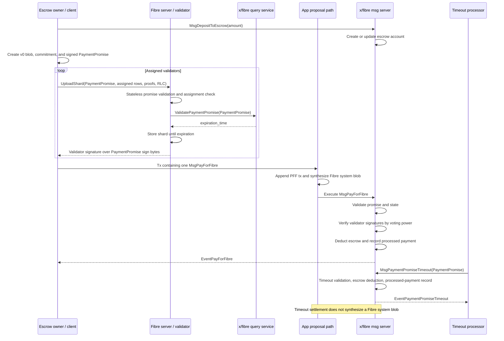
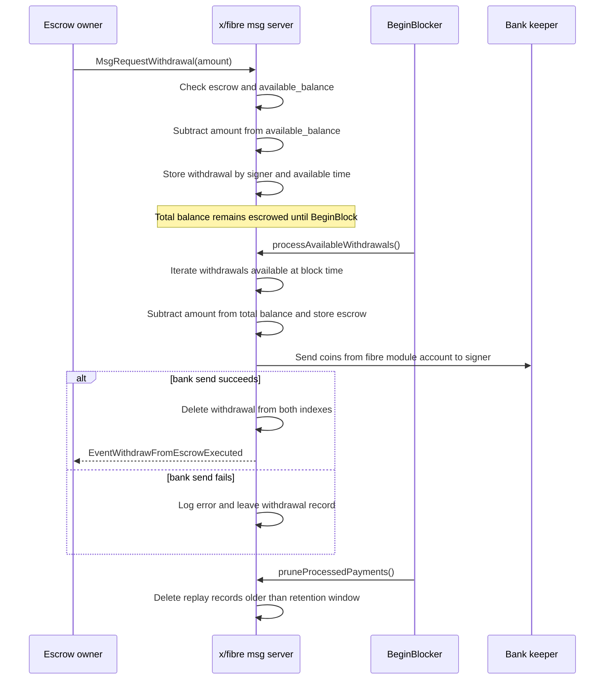

# Fibre SDK Module `x/fibre`

## Abstract

The `x/fibre` module is the escrow and settlement module for Fibre payment promises. Users deposit funds into module-controlled escrow accounts, sign off-chain `PaymentPromise` values for specific blobs, and later settle those promises on-chain either through `MsgPayForFibre` with validator signatures or through `MsgPaymentPromiseTimeout` after the promise expires.

The module manages escrow balances, delayed withdrawals, payment deduction, processed-payment replay protection, stateful payment-promise validation, events, queries, genesis state, and module parameters. It does not receive blob bytes and it does not directly build the data square; when the fibre app path is enabled, the app square builder recognizes valid standalone `MsgPayForFibre` transactions and synthesizes the corresponding Fibre system blob for square inclusion.

## Flow

1. The escrow owner funds an escrow account with `MsgDepositToEscrow`.
2. The escrow owner creates a signed `PaymentPromise` off-chain. The promise names the chain, validator-set height, namespace, blob size, blob version, commitment, creation timestamp, escrow-owner secp256k1 public key, and secp256k1 signature.
3. A validator or Fibre server performs stateless validation locally and can call `Query/ValidatePaymentPromise` for stateful validation. The query checks freshness, expiry, height window, replay status, escrow existence, and total escrow balance; it intentionally does not verify the signature or field format.
4. A normal settlement submits `MsgPayForFibre` containing exactly one payment promise and validator signatures. The message server validates the promise, verifies enough validator voting power signed the promise sign bytes at the promise height, deducts the payment from escrow, records the promise hash as processed, and emits `EventPayForFibre`.
5. A timeout settlement submits `MsgPaymentPromiseTimeout` after `creation_timestamp + payment_promise_timeout`. The message server validates the promise and state, skips normal expiry and height-window checks, deducts the same payment amount from escrow, records the promise hash as processed, and emits `EventPaymentPromiseTimeout`.
6. At the beginning of each block, the module processes available withdrawals first and then prunes processed payments outside the retention window.

### Fibre Blob Settlement


```mermaid
sequenceDiagram
    participant C as Escrow owner / client
    participant FS as Fibre server / validator
    participant Q as x/fibre query service
    participant A as App proposal path
    participant M as x/fibre msg server
    participant P as Timeout processor

    C->>M: MsgDepositToEscrow(amount)
    M->>M: Create or update escrow account

    C->>C: Create v0 blob, commitment, and signed PaymentPromise
    loop Assigned validators
        C->>FS: UploadShard(PaymentPromise, assigned rows, proofs, RLC)
        FS->>FS: Stateless promise validation and assignment check
        FS->>Q: ValidatePaymentPromise(PaymentPromise)
        Q-->>FS: expiration_time
        FS->>FS: Store shard until expiration
        FS-->>C: Validator signature over PaymentPromise sign bytes
    end

    C->>A: Tx containing one MsgPayForFibre
    A->>A: Append PFF tx and synthesize Fibre system blob
    A->>M: Execute MsgPayForFibre
    M->>M: Validate promise and state
    M->>M: Verify validator signatures by voting power
    M->>M: Deduct escrow and record processed payment
    M-->>C: EventPayForFibre

    P->>M: MsgPaymentPromiseTimeout(PaymentPromise)
    M->>M: Timeout validation, escrow deduction, processed-payment record
    M-->>P: EventPaymentPromiseTimeout
    Note over M,A: Timeout settlement does not synthesize a Fibre system blob
```

`ValidatePaymentPromise` is a stateful query. It checks freshness, expiry,
height window, replay status, escrow existence, and total escrow balance. The
Fibre server and `MsgPayForFibre` handler perform stateless validation and
signature verification outside that query.

### Withdrawal Processing


```mermaid
sequenceDiagram
    participant C as Escrow owner
    participant M as x/fibre msg server
    participant B as BeginBlocker
    participant Bank as Bank keeper

    C->>M: MsgRequestWithdrawal(amount)
    M->>M: Check escrow and available_balance
    M->>M: Subtract amount from available_balance
    M->>M: Store withdrawal by signer and available time
    Note over M: Total balance remains escrowed until BeginBlock

    B->>M: processAvailableWithdrawals()
    M->>M: Iterate withdrawals available at block time
    M->>M: Subtract amount from total balance and store escrow
    M->>Bank: Send coins from fibre module account to signer
    alt bank send succeeds
        M->>M: Delete withdrawal from both indexes
        M-->>C: EventWithdrawFromEscrowExecuted
    else bank send fails
        M->>M: Log error and leave withdrawal record
    end

    B->>M: pruneProcessedPayments()
    M->>M: Delete replay records older than retention window
```

## State

The module store key is `fibre`. Module params are stored under the raw key `params`. The other state objects use byte prefixes from `x/fibre/types/keys.go`: escrow accounts use `0x02`, withdrawals-by-signer use `0x03`, withdrawals-by-available-time use `0x04`, processed-payments-by-hash use `0x05`, and processed-payments-by-time use `0x06`.

### EscrowAccount

An escrow account is keyed by the escrow signer address with `0x02 || signer`. `balance` is the total amount held in the module account for that signer and `available_balance` is the amount that has not been reserved by pending withdrawal requests.

```proto
message EscrowAccount {
  string signer = 1 [(cosmos_proto.scalar) = "cosmos.AddressString"];
  cosmos.base.v1beta1.Coin balance = 2 [(gogoproto.nullable) = false];
  cosmos.base.v1beta1.Coin available_balance = 3 [(gogoproto.nullable) = false];
}
```

Payments are validated against and deducted from total `balance`, not only `available_balance`. If a payment spends funds that are currently locked in pending withdrawals, the module reduces or deletes those pending withdrawals so that the escrow state remains consistent.

### Withdrawal

Withdrawal requests are stored in two indexes. The signer index key is `0x03 || signer || "/" || sdk.FormatTimeBytes(requested_timestamp)` and the availability index key is `0x04 || sdk.FormatTimeBytes(available_timestamp) || "/" || signer`.

```proto
message Withdrawal {
  string signer = 1 [(cosmos_proto.scalar) = "cosmos.AddressString"];
  cosmos.base.v1beta1.Coin amount = 2 [(gogoproto.nullable) = false];
  google.protobuf.Timestamp requested_timestamp = 3 [(gogoproto.nullable) = false, (gogoproto.stdtime) = true];
  google.protobuf.Timestamp available_timestamp = 4 [(gogoproto.nullable) = false, (gogoproto.stdtime) = true];
}
```

`MsgRequestWithdrawal` immediately subtracts the amount from `available_balance` and records a withdrawal with `available_timestamp = block_time + withdrawal_delay`. The total escrow `balance` is not reduced until BeginBlock processes the withdrawal.

### ProcessedPayment

Processed payments are stored for replay protection and pruning. The hash index key is `0x05 || payment_promise_hash` and the time index key is `0x06 || sdk.FormatTimeBytes(processed_at) || "/" || payment_promise_hash`.

```proto
message ProcessedPayment {
  bytes payment_promise_hash = 1;
  google.protobuf.Timestamp processed_at = 2 [(gogoproto.nullable) = false, (gogoproto.stdtime) = true];
}
```

`MsgPayForFibre` and `MsgPaymentPromiseTimeout` both compute the internal payment-promise hash and store a `ProcessedPayment` at the current block time. BeginBlock prunes processed payments whose `processed_at` is outside the `payment_promise_retention_window`.

### GenesisState

Genesis contains params, escrow accounts, withdrawals, and processed payments.

```proto
message GenesisState {
  Params params = 1 [(gogoproto.nullable) = false];
  repeated EscrowAccount escrow_accounts = 2 [(gogoproto.nullable) = false];
  repeated Withdrawal withdrawals = 3 [(gogoproto.nullable) = false];
  repeated ProcessedPayment processed_payments = 4 [(gogoproto.nullable) = false];
}
```

Genesis validation checks params, rejects empty or duplicate escrow signers, requires escrow balances to be valid with `available_balance <= balance`, requires withdrawals to have a signer, positive valid amount, and nonzero requested timestamp, and requires processed payments to have a non-empty unique hash and nonzero `processed_at`.

## PaymentPromise

`PaymentPromise` is the on-chain protobuf representation of an off-chain promise signed by the escrow owner. The signer public key is a concrete `cosmos.crypto.secp256k1.PubKey`, not an `Any`.

```proto
message PaymentPromise {
  string chain_id = 1;
  int64 height = 2;
  bytes namespace = 3;
  uint32 blob_size = 4;
  uint32 blob_version = 5;
  bytes commitment = 6;
  google.protobuf.Timestamp creation_timestamp = 7 [(gogoproto.nullable) = false, (gogoproto.stdtime) = true];
  cosmos.crypto.secp256k1.PubKey signer_public_key = 8 [(gogoproto.nullable) = false];
  bytes signature = 9;
}
```

### Sign Bytes And Hash

The internal `fibre.PaymentPromise` canonical payload bytes are:

```text
stripped_sign_bytes =
  signer_public_key_compressed_33 ||
  namespace_29 ||
  big_endian_u32(blob_size) ||
  commitment_32 ||
  big_endian_u32(blob_version) ||
  big_endian_u64(height) ||
  creation_timestamp.UTC().MarshalBinary()
```

The bytes signed by the escrow owner and by validators are `core.RawBytesMessageSignBytes(chain_id, "fibre/pp:v0", stripped_sign_bytes)`. The chain ID and `"fibre/pp:v0"` prefix are applied by CometBFT raw-bytes domain separation and are not raw-concatenated into `stripped_sign_bytes`.

The payment-promise hash used for replay protection is:

```text
SHA256(sign_bytes || signature)
```

The internal `Hash` method requires a non-empty signature before computing this hash.

### Stateless Validation

The SDK `PaymentPromise.ValidateBasic` checks that `chain_id` is non-empty, `namespace` is exactly 29 bytes and valid for blob use, `blob_size` is positive, `commitment` is exactly 32 bytes, `blob_version` is `0`, `height` is positive, `creation_timestamp` is nonzero, `signer_public_key.key` is exactly 33 bytes, and `signature` is non-empty.

The message handlers also convert the protobuf value to `fibre.PaymentPromise` and call the internal `Validate` method. Internal validation requires a non-nil 33-byte secp256k1 signer key, non-empty chain ID no longer than 20 bytes, positive upload size, nonzero creation timestamp, a 64-byte compact secp256k1 signature, positive height, and a valid signature over the canonical sign bytes.

### Stateful Validation

`ValidatePaymentPromiseStateful` checks the current chain state and returns the promise expiration time on success. Normal validation requires `creation_timestamp` to be strictly after `block_time - withdrawal_delay`, rejects promises at or after `creation_timestamp + payment_promise_timeout`, rejects promises more than `payment_promise_height_window` blocks behind the current height, rejects promises more than one block ahead of the current height, rejects already processed promises, requires an escrow account for `sdk.AccAddress(signer_public_key.Address())`, and requires total escrow `balance` to cover the payment amount.

`ValidatePaymentPromiseStatefulForTimeout` performs the same checks except that it skips the normal expiration check and the normal height-window checks. Timeout processing still rejects promises whose creation timestamp is older than `block_time - withdrawal_delay`, still rejects already processed promises, still requires an escrow account, and still requires total escrow `balance` to cover the payment amount.

## Payment Amount

`MsgPayForFibre` and `MsgPaymentPromiseTimeout` both charge the same amount. The implementation estimates gas with a standalone formula and converts that gas amount to a coin in `appconsts.BondDenom` (`utia`).

```text
gas = 650000 + 45000 * ceil(blob_size / 262144)
amount = gas utia
```

If `EstimateGasForPayForFibre` is called with `blob_size == 0`, it returns only the fixed cost of `650000`, although valid payment promises require a positive blob size. This payment formula does not use `gas_per_blob_byte` or `GasPerCelestiaByte`; `gas_per_blob_byte` still exists as a positive module parameter but is currently not part of Fibre payment calculation.

## Messages

### MsgDepositToEscrow

```proto
message MsgDepositToEscrow {
  option (cosmos.msg.v1.signer) = "signer";
  string signer = 1 [(cosmos_proto.scalar) = "cosmos.AddressString"];
  cosmos.base.v1beta1.Coin amount = 2 [(gogoproto.nullable) = false];
}
```

`ValidateBasic` requires a valid bech32 signer address and a valid positive coin. The handler gets or creates the escrow account, sends the coin from the signer account to the `fibre` module account, adds the amount to both `balance` and `available_balance`, stores the escrow account, and emits `EventDepositToEscrow`.

### MsgRequestWithdrawal

```proto
message MsgRequestWithdrawal {
  option (cosmos.msg.v1.signer) = "signer";
  string signer = 1 [(cosmos_proto.scalar) = "cosmos.AddressString"];
  cosmos.base.v1beta1.Coin amount = 2 [(gogoproto.nullable) = false];
}
```

`ValidateBasic` requires a valid bech32 signer address and a valid positive coin. The handler requires an existing escrow account, requires `available_balance >= amount`, rejects a key collision with an existing withdrawal at the current block timestamp, stores a withdrawal with `requested_timestamp = block_time` and `available_timestamp = block_time + withdrawal_delay`, subtracts the amount from `available_balance`, and emits `EventWithdrawFromEscrowRequest`.

### MsgPayForFibre

```proto
message MsgPayForFibre {
  option (cosmos.msg.v1.signer) = "signer";
  string signer = 1 [(cosmos_proto.scalar) = "cosmos.AddressString"];
  PaymentPromise payment_promise = 2 [(gogoproto.nullable) = false];
  repeated bytes validator_signatures = 3;
}
```

`ValidateBasic` requires a valid transaction signer, a valid payment promise by `PaymentPromise.ValidateBasic`, and at least one validator signature. The handler converts the promise to the internal Fibre type, verifies the internal stateless validation and escrow-owner secp256k1 signature, runs normal stateful validation, verifies validator signatures, hashes the promise, derives the escrow signer from `payment_promise.signer_public_key`, deducts the calculated payment amount from escrow, stores the processed payment, and emits `EventPayForFibre`.

Validator signatures are interpreted as a slice indexed by the validator-set order at `payment_promise.height`. Empty signatures are skipped, non-empty signatures whose index exceeds the validator count are invalid, each non-empty signature must verify with the corresponding CometBFT ed25519 validator public key over the payment-promise sign bytes, and the only threshold enforced is collected voting power at least `floor(2/3 * total_voting_power)`. This means exactly two thirds can pass when the integer voting power calculation allows it, for example 2 of 3 total power. The implementation does not enforce a separate validator-count threshold. `EventPayForFibre.validator_count` is the length of the submitted signature slice.

Payment deduction first requires total escrow `balance >= payment_amount`. It subtracts the full payment from total `balance`, subtracts `min(available_balance, payment_amount)` from `available_balance`, and if the payment uses funds that were locked in pending withdrawals, it calls `ReduceWithdrawalsForPayment` to delete or reduce the signer's pending withdrawals in signer-index iteration order.

### MsgPaymentPromiseTimeout

```proto
message MsgPaymentPromiseTimeout {
  option (cosmos.msg.v1.signer) = "signer";
  string signer = 1 [(cosmos_proto.scalar) = "cosmos.AddressString"];
  PaymentPromise payment_promise = 2 [(gogoproto.nullable) = false];
}
```

`ValidateBasic` requires a valid transaction signer and a valid payment promise by `PaymentPromise.ValidateBasic`. The signer is the processor and can be any account. The handler converts and internally validates the promise, runs timeout stateful validation, requires `block_time >= creation_timestamp + payment_promise_timeout`, calculates and deducts the same payment amount used by `MsgPayForFibre`, stores the processed payment, and emits `EventPaymentPromiseTimeout`. Timeout processing does not require validator signatures and does not create a data-square system blob.

### MsgUpdateFibreParams

```proto
message MsgUpdateFibreParams {
  option (cosmos.msg.v1.signer) = "authority";
  string authority = 1 [(cosmos_proto.scalar) = "cosmos.AddressString"];
  Params params = 2 [(gogoproto.nullable) = false];
}
```

`ValidateBasic` requires a valid authority address and valid params. The handler requires `authority == keeper.GetAuthority()`, requires all params to be supplied and valid, stores the new params, and emits `EventUpdateFibreParams`.

## Data Square Construction

The SDK module does not insert commitments or blobs into the data square. Data-square metadata is synthesized during app square construction when the fibre build path is enabled.

A valid PayForFibre transaction for square construction is a plain SDK transaction that contains exactly one `MsgPayForFibre` and no other messages. PrepareProposal separates these transactions from normal SDK transactions, drops mixed or multi-PFF transactions, skips transactions after `MaxPayForFibreMessages`, and appends accepted Fibre transactions to the square builder. ProcessProposal rejects a block if a plain SDK transaction contains multiple `MsgPayForFibre` messages, mixes `MsgPayForFibre` with other messages, or causes the block to exceed `MaxPayForFibreMessages`.

The current production constant is:

```go
const MaxPayForFibreMessages = 200
```

`tx.TryParseFibreTx` parses the `MsgPayForFibre`, requires a present `payment_promise`, decodes the promise namespace, decodes the transaction `signer` bech32 address to raw bytes, and builds the system blob with:

```go
share.NewV2Blob(namespace, payment_promise.blob_version, payment_promise.commitment, signer_bytes)
```

Therefore the synthesized system blob includes the promise namespace, blob version, commitment, and raw message signer bytes. The v2 blob payload represents the blob version and 32-byte commitment; it is not just the commitment by itself. The PayForFibre transaction bytes are encoded under the PayForFibre namespace while the synthesized system blob is appended as the associated Fibre system blob by the square builder.

## Automatic State Transitions

`BeginBlocker` runs `processAvailableWithdrawals` first and `pruneProcessedPayments` second.

`processAvailableWithdrawals` iterates the withdrawals-by-available-time index in time order, stops when it reaches a future `available_timestamp`, parses the signer from the key, loads the withdrawal, loads the escrow account, subtracts the withdrawal amount from total `balance`, stores the escrow account, sends coins from the `fibre` module account to the signer account, deletes the withdrawal from both indexes after a successful send, and emits `EventWithdrawFromEscrowExecuted`. If key parsing, signer parsing, escrow lookup, balance sufficiency, bank send, or event emission fails, the implementation logs the error and continues; the escrow balance is stored before the bank send and the withdrawal is deleted only after a successful send.

`pruneProcessedPayments` computes `cutoff_time = block_time - payment_promise_retention_window`, iterates the processed-payments-by-time index in time order, stops when `processed_at` is after the cutoff, deletes each pruned processed payment from both indexes, and emits `EventProcessedPaymentPruned`.

## Events

```proto
message EventDepositToEscrow {
  string signer = 1 [(cosmos_proto.scalar) = "cosmos.AddressString"];
  cosmos.base.v1beta1.Coin amount = 2 [(gogoproto.nullable) = false];
}

message EventWithdrawFromEscrowRequest {
  string signer = 1 [(cosmos_proto.scalar) = "cosmos.AddressString"];
  cosmos.base.v1beta1.Coin amount = 2 [(gogoproto.nullable) = false];
  google.protobuf.Timestamp requested_at = 3 [(gogoproto.nullable) = false, (gogoproto.stdtime) = true];
  google.protobuf.Timestamp available_at = 4 [(gogoproto.nullable) = false, (gogoproto.stdtime) = true];
}

message EventWithdrawFromEscrowExecuted {
  string signer = 1 [(cosmos_proto.scalar) = "cosmos.AddressString"];
  cosmos.base.v1beta1.Coin amount = 2 [(gogoproto.nullable) = false];
}

message EventPayForFibre {
  string signer = 1 [(cosmos_proto.scalar) = "cosmos.AddressString"];
  bytes namespace = 2;
  bytes commitment = 3;
  uint32 validator_count = 4;
}

message EventPaymentPromiseTimeout {
  string processor = 1 [(cosmos_proto.scalar) = "cosmos.AddressString"];
  string escrow_signer = 2 [(cosmos_proto.scalar) = "cosmos.AddressString"];
  bytes payment_promise_hash = 3;
}

message EventUpdateFibreParams {
  string signer = 1 [(cosmos_proto.scalar) = "cosmos.AddressString"];
  Params params = 2 [(gogoproto.nullable) = false];
}

message EventProcessedPaymentPruned {
  bytes payment_promise_hash = 1;
  google.protobuf.Timestamp processed_at = 2 [(gogoproto.nullable) = false, (gogoproto.stdtime) = true];
}
```

`EventPayForFibre.signer` is the escrow signer derived from the payment promise public key, not necessarily the transaction signer. `EventPaymentPromiseTimeout.processor` is the transaction signer that submitted the timeout, while `escrow_signer` is derived from the payment promise public key.

## Queries

```proto
service Query {
  rpc Params(QueryParamsRequest) returns (QueryParamsResponse) {
    option (google.api.http).get = "/fibre/v1/params";
  }
  rpc EscrowAccount(QueryEscrowAccountRequest) returns (QueryEscrowAccountResponse) {
    option (google.api.http).get = "/fibre/v1/escrow-account/{signer}";
  }
  rpc Withdrawals(QueryWithdrawalsRequest) returns (QueryWithdrawalsResponse) {
    option (google.api.http).get = "/fibre/v1/withdrawals/{signer}";
  }
  rpc IsPaymentProcessed(QueryIsPaymentProcessedRequest) returns (QueryIsPaymentProcessedResponse) {
    option (google.api.http).get = "/fibre/v1/is-payment-processed/{promise_hash}";
  }
  rpc ValidatePaymentPromise(QueryValidatePaymentPromiseRequest) returns (QueryValidatePaymentPromiseResponse) {
    option (google.api.http) = {
      post: "/fibre/v1/validate-payment-promise",
      body: "*"
    };
  }
}
```

`Params` returns the current params. `EscrowAccount` returns an escrow account and a `found` bool. `Withdrawals` returns withdrawals for a signer; the protobuf request and response contain pagination fields, but the current query handler ignores pagination and returns all matching withdrawals with an empty pagination response. `IsPaymentProcessed` returns `processed_at` and `found`. `ValidatePaymentPromise` performs stateful validation only; callers are expected to perform stateless validation before using it, and an invalid promise is returned as a gRPC error rather than a successful response with `is_valid = false`.

```proto
message QueryValidatePaymentPromiseResponse {
  bool is_valid = 1;
  google.protobuf.Timestamp expiration_time = 2 [(gogoproto.stdtime) = true];
}
```

On success, `ValidatePaymentPromise` returns `is_valid = true` and `expiration_time = creation_timestamp + payment_promise_timeout`.

## Parameters

```proto
message Params {
  uint32 gas_per_blob_byte = 1 [(gogoproto.moretags) = "yaml:\"gas_per_blob_byte\""];
  google.protobuf.Duration withdrawal_delay = 2 [(gogoproto.moretags) = "yaml:\"withdrawal_delay\"", (gogoproto.stdduration) = true, (gogoproto.nullable) = false];
  google.protobuf.Duration payment_promise_timeout = 3 [(gogoproto.moretags) = "yaml:\"payment_promise_timeout\"", (gogoproto.stdduration) = true, (gogoproto.nullable) = false];
  google.protobuf.Duration payment_promise_retention_window = 4 [(gogoproto.moretags) = "yaml:\"payment_promise_retention_window\"", (gogoproto.stdduration) = true, (gogoproto.nullable) = false];
  uint64 payment_promise_height_window = 5 [(gogoproto.moretags) = "yaml:\"payment_promise_height_window\""];
}
```

| Parameter | Default | Validation | Current use |
| --- | --- | --- | --- |
| `gas_per_blob_byte` | `1` | Must be nonzero | Stored and exposed as a parameter, but not used by the current PayForFibre payment formula |
| `withdrawal_delay` | `24h` | Must be positive | Sets withdrawal availability and the oldest accepted payment-promise creation time |
| `payment_promise_timeout` | `1h` | Must be positive | Defines normal promise expiration and when timeout processing becomes valid |
| `payment_promise_retention_window` | `24h` | Must be positive | Defines when processed-payment replay records are pruned |
| `payment_promise_height_window` | `1000` | Must be nonzero | Limits how far behind the current height a normal payment promise can be |

## CLI

The transaction CLI exposes:

```text
celestia-appd tx fibre deposit-to-escrow [amount]
celestia-appd tx fibre request-withdrawal [amount]
celestia-appd tx fibre pay-for-fibre [payment-promise-json] [validator-signatures]
celestia-appd tx fibre payment-promise-timeout [payment-promise-json]
```

`pay-for-fibre` expects `payment-promise-json` to be a JSON representation of `PaymentPromise` and `validator-signatures` to be a comma-separated list of hex-encoded validator signatures.

The query CLI exposes:

```text
celestia-appd query fibre params
celestia-appd query fibre escrow-account [signer]
celestia-appd query fibre withdrawals [signer]
celestia-appd query fibre is-payment-processed [payment-promise-hash]
```

There is currently no CLI command wrapping the `ValidatePaymentPromise` gRPC query.
