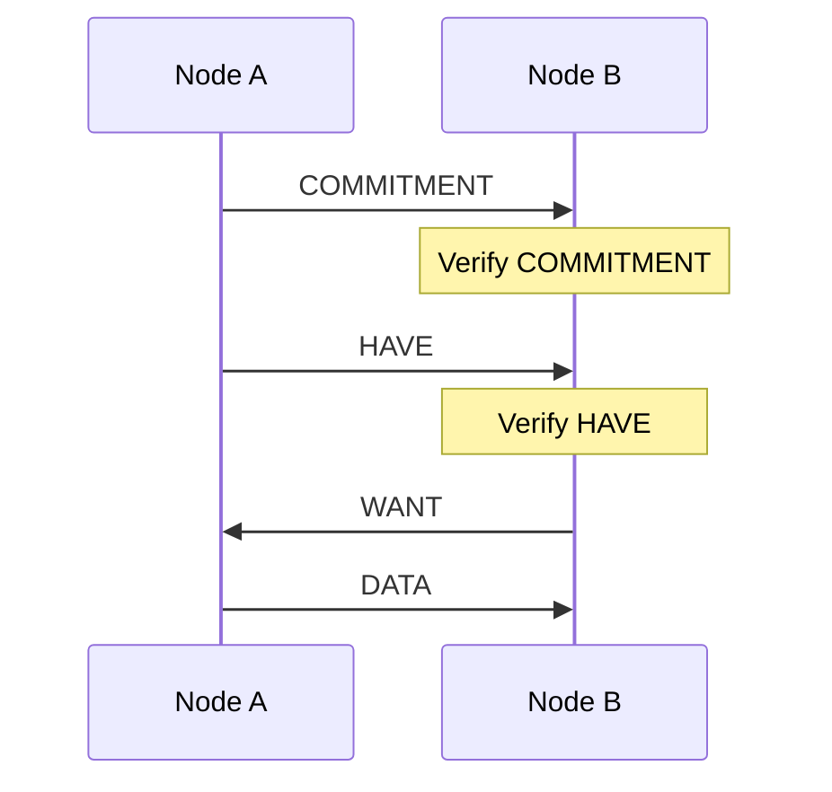
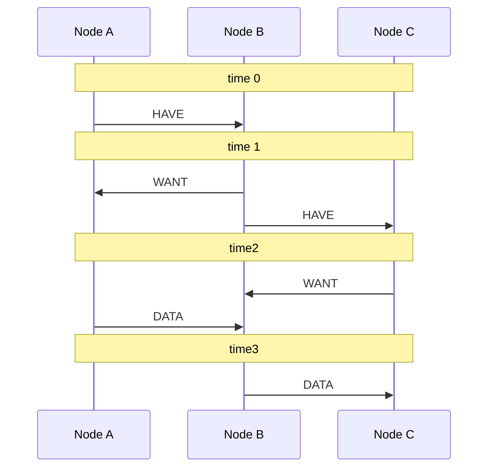
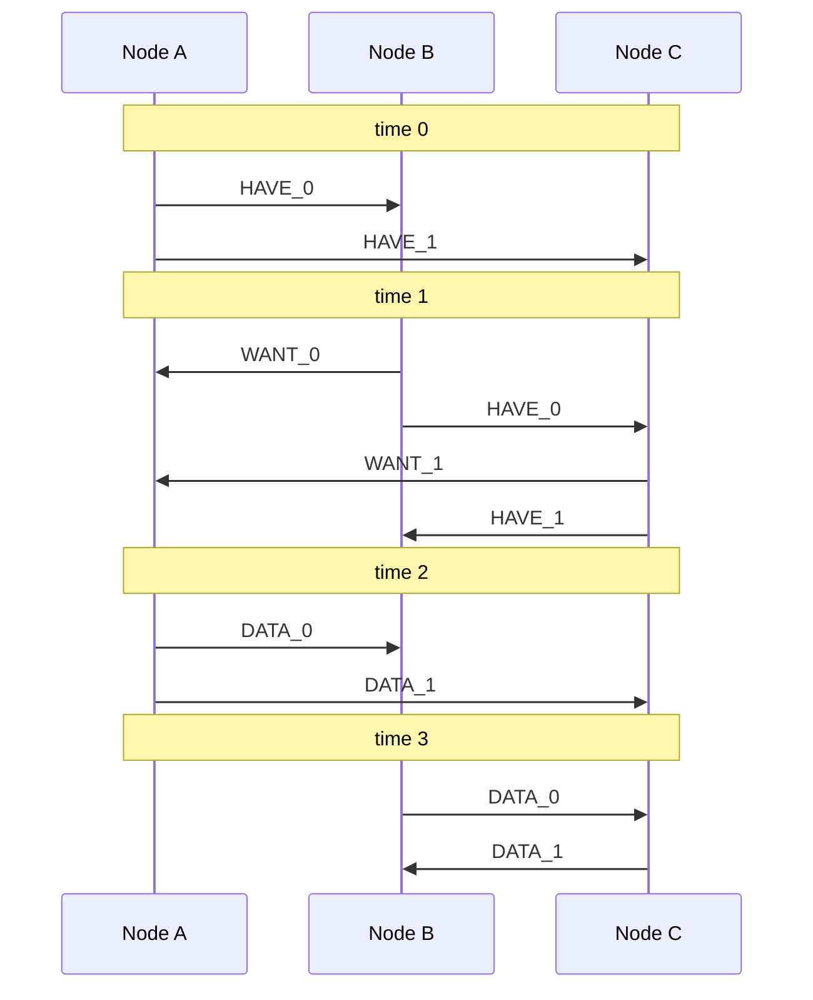

 # Vacuum! Part I: High Throughput Recovery

## Summary

High throughput recovery (the second half of block propagation) could be achieved using a "Pull Based Broadcast Tree" (PBBT). PBBT works by enabling the pipelining of `Have` and `Want` messages in otherwise standard pull based gossip, and by distributing the burden of propagation across the broadcaster's peers. Unlike push based broadcast trees, the route to distribute data is generated in a JIT fashion.

Determined attackers can sybil attack both broadcast trees and pull based gossip in time restricted applications such as recovery. To get around these attacks, PBBT relies on preparation (the first part of block propagation), erasure encoding data exchanged during recovery, and an overlay network.

Lastly, we suggest a simpler design that makes better use of the validator overlay network for future consideration.

## Intro

The Celestia protocol will likely separate block propagation into two phases. "Preparation", for distributing data *before* the block is created, and "recovery" for distributing data *after* the block has been created. This document focuses on recovery.


In order to use the data propagated during the preparation phase, the recovery phase has to use some form of pull based gossip.

Recovery has the following constraints:
- **100% of the Block data MUST be delivered to >2/3 of the voting power before the `ProposalTimeout` is reached**
- **MUST be able to utilize the data already distributed during preparation**


Given these constraints, we can isolate the different bottlenecks to throughput:
- **efficiency:** the overhead % of the block the validators must download (0% == downloading the block exactly once)
- **speed:** the rate at which the block data is delivered to a % of validators
- **broadcaster's bandwidth:** The % of the block the proposer must upload

Enter the Pull Based Broadcast Tree (PBBT).

PBBT addresses:
- **efficiency:** by utilizing pull based logic
- **speed:** by pipelining `Have` and `Want` messages, and by finding the optimal path for distributing data in JIT fashion
- **broadcaster's bandwidth:** by distributing the burden of propagation to the broadcaster's peers via only sending portions of a block data to each

This document focuses on "recovery", however, both share many mechanisms. Therefore, we first describe the relevant shared components in an abstract fashion.

## Pull Based Block Propagation

PBBT relies heavily on slightly modified pull based gossiping mechanisms. There are four generalized message types.

- `Commitment` is a commitment from the broadcaster over the `Haves` and `Data` that is being distributed.
- `Have` messages are propagated by nodes to search for the route `Data` messages will take while being distributed (the broadcast route)
- `Want` messages are used by nodes to indicate missing data and confirm the broadcast route
- `Data` the actual blobs of data

The only difference between typical pull based block propagation and what is used here, is that the ***`Have` messages can be verified to originate from the broadcaster***. Beyond simply avoiding gossiping `Have` and `Data` messages that do not originate from the broadcaster, this extra verification step unblocks the pipelining of `Have` and `Want` messages.



**Figure 0: General pull based gossip steps.**

### Distribution Rules

The rules below goal is to facilitate safe pull based propagation.

- **Nodes MUST only propagate validated messages**
    - `Commitment` messages MUST originate from the Proposer
    - `Have` messages MUST match those committed to in the `Commitment` message
    - `Data` messages MUST match their corresponding `Have` and `Commitment`
- **Nodes MUST Send the `Commitment` message before sending `Have` messages**
- **Nodes MUST only send `Data` messages if that data has been requested**
- **Nodes MUST avoid sending the same `Have` or `Want` message to the same peer more than once**
- **Nodes SHOULD request `Data` they don't have**
- **Upon first receiving `Commitment` and then `Have` messages, nodes SHOULD broadcast those messages to all peers.**

### Disconnection Rules

- **Nodes MUST disconnect from peers that send invalid messages**
- **Nodes MUST disconnect from peers that send `Data` messages that have not been requested**
- **Nodes MUST disconnect from peers that send more than one of the same `Have` or `Want` message**

## Pipelining `Have` and `Want` Messages

Pull based mechanisms are very efficient, but sacrifice speed. Here we describe how to pipeline the `Have` and `Want` messages so that push based mechanisms can get close to the speed of push.

Instead of waiting until data is downloaded to gossip `Have` messages, in PBT, they are gossiped after verifying them.

- **Nodes MUST gossip a `Have` message only if EITHER the `Want` message for that data has been successfully queued to for sending OR the `Data` for the `Have` has already been downloaded**

Keep the other pull based rules in context as well, where nodes cannot send the same message twice or unauthenticated data.



**Figure 1: Sequence graph of pipelining. Note the simultaneous transfer of `Want` and `Have`**. Times are added to indicate which operation occurs at essentially the same time.

## Broadcast Tree

In order to increase the "recovery" throughput substantially, the network must consider both speed, efficiency, and how much data the broadcaster must upload.

The first bottleneck for throughput with a single broadcaster is the broadcaster's upload bandwidth.

Where:
- **T**: Max Theoretical Throughput (e.g., in bytes per second)
- **B**: Upload bandwidth of the broadcaster (e.g., in bytes per second)
- **n**: Number of times the block has to be uploaded

```
T = B / n
```

Therefore, for recovery, to increase throughput the network should attempt to limit the number of times each proposer is required to upload the block data. 

This can be done simply by the proposer uploading only a portion to each of its peers. Instead of the proposer using its bandwidth to upload the same parts to different peers, the peers can gossip each portion to each other.




**Figure 3: Sequence graph of the broadcast tree. Note how portions of the block `Data` are transferred between nodes.** Times are added to indicate which operation occur at essentially the same time.

### Optimal Routing

One of the benefits of generating the route of data on fly instead of pre-planning the route is that the plan can incorporate real time data. 

This inherently includes:
- network latency
- as timely as possible info on the node's status 
- already distributed data 

However, it can also include congestion if the `Have` messages and entered into the send queue in a FIFO fashion as `Data`. This ensures that a haves take longer to be delivered to a congested connection, making it more likely peers will recieve that same `Have` message first from a different peer. 

- **Nodes SHOULD send `Have` and `Data` messages from a FIFO queue**
- **Nodes SHOULD request `Data` from the first peer that sends them a `Have` message**

Lastly, there's still a chance that a peer could already have all `Data` included in the `Commitment`, recreate the `Have` messages and send them to many nodes in the network extremely quickly. Without additional rules, this would cause that node to become a bottleneck in distribution, therefore we add a new rule to ensure this doesn't occur.

- **Nodes MUST have fewer than `PerPeerConcurrentRequestCap` concurrent requests to a single peer**

If this value is set to 2 for example, then there will be a max of two concurrent requests open to each peer. After the first request is fullfilled, then the second is sent.


## Security

Currently, >1/3 voting power could halt the network, therefore any new broadcasting mechanism must be held to same standard. Meaning that if 2/3 of the voting power is honest, there should not be attacks that can break the block propagation mechanism either.

The only assumptions that we can make are:

**- 1) Nodes are not eclipse attacked**
**- 2) 2/3 of the validators are participating as described in this spec**

The first assumption means that there exists *a* path of honest nodes connecting the broadcaster and every other honest node. The second is self explanatory.

Recall the constraints for recovery:

>- **100% of the Block data MUST be delivered to >2/3 of the validators**
>- **The time to distribute that data MUST be <= the `ProposalTimeout`**

While pull based gossip and broadcast trees are incredibly powerful tools for increasing throughput, it's easy to derive attacks that fail these constraints even with the assumptions. First we discuss those attacks, and then we will discuss strategies for mitigation.

### Denial of Service

The purpose of the strict diconnection rules are to prevent all scenarios where an attacker can flood the network with valid messages. If invalid messages are sent, then the attacker is kicked from their address book.

Currently, there are no known gaps. Please comment if you find one.

### Sybil Attacks

#### Pull Based Gossip

Upon requesting data in a standard pull based protocol, faulty peers can simply not send requested data. Typically, honest nodes add a timeout, after which they will request the data from a different peer. Given our assumption that nodes are not being eclipse attacked, nodes will eventually find an honest peer with the data.

The problem arises when applications have less time to distribute data than they can avoid or remove an attacker. Recovery is such as case. If an attacker wants to disrupt a network, it only needs to slow the distribution of data sufficiently beyond the `ProposalTimeout`. While the network will eventually distribute that data, the throughput will be dramatically decreased until connections to malicious peers are removed.

> Side note: its easy to confuse a congested peer as a malicious one. This makes peer scoring incredibly difficult for pull based systems. If timeouts for scoring or addional requests are too agressive, feedback loops emerge. Congested nodes can hit timeouts, resulting in requesting more duplicate data, which causes more congestion. 

**Conclusions:**
- Time sensitive applications require additional mechanisms in order to use pull based gossip.

#### Broadcast Trees

Using the most naive design of broadcast trees, where the broadcaster distributes equal amounts of block data to each of its peers, a single faulty peer will break the first constraint of recovery. Even if parity data is added, determined attackers can simply spin up a large majority of nodes in the network and not propagate data.

**Conclusions:**
1) The usage of broadcast trees requires mechanisms that allow for faulty nodes to exist.
2) Validators must be able to differentiate between themselves and non-validators. Without this, attackers can also increase the number of nodes in the network and poison the tree.

### Defending Against Attacks

The above attacks all rely on an attacker's ability to add many malicious nodes to the network. Our strategy towards defending against attacks will likely involve mechanisms that prevent this from occurring in the first place, alongside ones that mitigate damage when it does.

#### Erasure Encoding Recovery Data

Distributing erasure encoded data alongside the original data introduces interesting tradeoffs to the attacks above.

```go
var (
    // originalData is the block data without erasure encoding
    originalData = []byte{...}
    // totalData include parity data
    totalData = []byte{...}
)

// e is the erasure encoding factor that specifies the ratio of parity data
e := len(totalData) / len(originalData) 
```

While the maximum throughput is now divided by `e`, the network no longer has to distribute 100% of the block to 2/3 of the voting power. Now the constraint is:

- **(100% / e) of the Block data MUST be delivered to >2/3 of the validators**

Alone, distributing parity data during recovery only makes attacks more difficult. Both the pull based and broadcast tree attacks can still occur, they just require more malicious nodes.

While additional mechanisms are still needed, adding parity data to the recovery process is a powerful tool to get to our goal:

>Its important that new broadcasting mechanisms do not introduce a lower barrier to halting the network than standard proof of stake already does.

#### Overlay Networks

An overlay network for validators means that:
- **Validators can verifiably connect to and find other validators in the network**

We do not specify an overlay network further here. The benefit of an overlay network is simply that validators can avoiding sybil nodes to the best of their knowledge.

If we can make the attacks require >= 1/3 of the voting power, arguably we have achieved our original goal.

>Its important that new broadcasting mechanisms do not introduce a lower barrier to halting the network than standard proof of stake already does.

#### Preparation

If we have the ability to know what portion of the voting power already has a given transaction, and the network is able to reuse the transactions they have already downloaded in the block, then we can use that to our advantage when combatting sybil attacks. 

The more voting power that has signaled that they have a transaction, then the more difficult it is to stop the distribution of that transaction.

### Synthesis

Alone, none of the mechanisms listed above are sufficient for preventing sybil attacks. However, when we combine them we can meet our original goal:

>Its important that new broadcasting mechanisms do not introduce a lower barrier to halting the network than standard proof of stake already does.

- If parity data is also gossiped, then the acceptable number of failures is raised relative to the erasure encoding factor.
- If an overlay network is added, then validators are able to avoid sybil attacks from non-validators
- If some portion of the proposed block is already distributed to a majority of validators, then it has already been sufficiently distributed to bypass sybil.


## Messages

### Commitment

```protobuf=
message BlobMetaData {
  bytes  hash  = 1;
  uint32 size  = 2;
}

// CompactBlock commits to the transaction included in a proposal.
message CompactBlock {
  int64                 height    = 1;
  int32                 round     = 2;
  bytes                 pbbt_root = 3;
  repeated BlobMetaData blobs     = 4;
  bytes                 signature = 5;
}
```

The compact block is signed over by the proposer, and verified by converting to signbytes, and verifying using the proposer's public key to verify the included signature. This siganture is separate from the proposal signature as it is purely related to block propagation, and not meant to be part of the proposal. This allows for block propagation to be backwards compatible with older implementations.

The `BlobMetaData` contains the hash of the PFB for the blob transaction that it commits to, alongside the `size`. `size` is the length of the blobTx in bytes.

The `pbbt_root` is generated by taking the merkle root over of each of the blob transactions in `BlobMetaData` and `Have` messasges.

Verification:
- The signature MUST be valid and from the expected proposer for that height and round

### Have

```protobuf=
message HavePart {
  bytes                   hash   = 1;
  int64                   height = 2;
  int32                   round  = 3;
  tendermint.crypto.Proof proof  = 4 [(gogoproto.nullable) = false];
}

```

Verification:
- The merkle proof must be verified using the `pbbt_root` in the `CompactBlock` for that height and round.

### Want

```protobuf
message WantParts {
  tendermint.libs.bits.BitArray parts  = 1 [(gogoproto.nullable) = false];
  int64                         height = 2;
  int32                         round  = 3;
}
```

### Data

```protobuf
message Part {
  int64  height = 1;
  int32  round  = 2;
  uint32 index  = 3;
  bytes  data   = 4;
}
```

Verification
- The hash of the bytes in the data field MUST match that of the `Have` message.