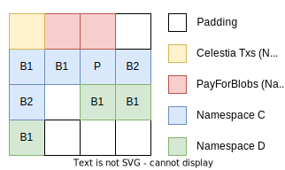

# Data Square Layout

<!-- toc -->

## Preamble

Celestia uses [a data availability scheme](https://arxiv.org/abs/1809.09044) that allows nodes to determine whether a block's data was published without downloading the whole block. The core of this scheme is arranging data in a two-dimensional matrix of [shares](./shares.md), then applying erasure coding to each row and column. This document describes the rationale for how data—transactions, blobs, and other data—[is actually arranged](./data_structures.md#arranging-available-data-into-shares). Familiarity with the [originally proposed data layout format](https://arxiv.org/abs/1809.09044) is assumed.

## Layout Rationale

Block data consists of:

1. Standard cosmos-SDK transactions: (which are often represented internally as the [`sdk.Tx` interface](https://github.com/celestiaorg/cosmos-sdk/blob/v1.14.0-sdk-v0.46.11/types/tx_msg.go#L42-L50)) as described in [cosmos-sdk ADR020](https://github.com/celestiaorg/cosmos-sdk/blob/v1.14.0-sdk-v0.46.11/docs/architecture/adr-020-protobuf-transaction-encoding.md)
    1. These transactions contain protobuf encoded [`sdk.Msg`](https://github.com/celestiaorg/cosmos-sdk/blob/v1.14.0-sdk-v0.46.11/types/tx_msg.go#L14-L26)s, which get executed atomically (if one fails they all fail) to update the Celestia state. The complete list of modules, which define the `sdk.Msg`s that the state machine is capable of handling, can be found in the [state machine modules spec](../specs/state_machine_modules.md). Examples include standard cosmos-sdk module messages such as [MsgSend](https://github.com/cosmos/cosmos-sdk/blob/f71df80e93bffbf7ce5fbd519c6154a2ee9f991b/proto/cosmos/bank/v1beta1/tx.proto#L21-L32)), and celestia specific module messages such as [`MsgPayForBlobs`](https://github.com/celestiaorg/celestia-app/blob/v1.0.0-rc2/proto/celestia/blob/v1/tx.proto#L16-L31)
1. Blobs: binary large objects which do not modify the Celestia state, but which are intended for a Celestia application identified with a provided namespace.

We want to arrange this data into a `k * k` matrix of fixed-sized [shares](../specs/shares.md), which will later be committed to in [Namespace Merkle Trees (NMTs)](https://github.com/celestiaorg/nmt/blob/v0.16.0/docs/spec/nmt.md) so that individual shares in this matrix can be proven to belong to a single data root. `k` must always be a power of 2 (e.g. 1, 2, 4, 8, 16, 32, etc.) as this is optimal for the erasure coding algorithm.

The simplest way we can imagine arranging block data is to simply serialize it all in no particular order, split it into fixed-sized shares, then arrange those shares into the `k * k` matrix in row-major order. However, this naive scheme can be improved in a number of ways, described below.

First, we impose some ground rules:

1. Data must be ordered by namespace. This makes queries into a NMT commitment of that data more efficient.
1. Since non-blob data are not naturally intended for particular namespaces, we assign [reserved namespaces](./namespace.md#Reserved-Namespaces) for them. A range of namespaces is reserved for this purpose, starting from the lowest possible namespace.
1. By construction, the above two rules mean that non-blob data always precedes blob data in the row-major matrix, even when considering single rows or columns.
1. Data with different namespaces must not be in the same share. This might cause a small amount of wasted block space, but makes the NMT easier to reason about in general since leaves are guaranteed to belong to a single namespace.

Given these rules, a square may look as follows:

Padding is addressed in the [padding section](#padding). Namespace C contains two blobs of two shares each while Namespace D contains one blob of three shares.

### Ordering

The order of blobs in a namespace is dictated by the priority of the PFBs that paid for the blob. A PFB with greater priority will have all blobs in that namespace strictly before a PFB with less priority. Priority is determined by the `gas-price` of the transaction (`fee`/`gas`).

## Blob Share Commitment Rules

Transactions can pay fees for a blob to be included in the same block as the transaction itself. It may seem natural to bundle the `MsgPayForBlobs` transaction that pays for a number of blobs with these blobs (which is the case in other blockchains with native execution, e.g. calldata in Ethereum transactions or OP_RETURN data in Bitcoin transactions), however this would mean that processes validating the state of the Celestia network would need to download all blob data. PayForBlob transactions must therefore only include a commitment to (i.e. some hash of) the blob they pay fees for. If implemented naively (e.g. with a simple hash of the blob, or a simple binary Merkle tree root of the blob), this can lead to a data availability problem, as there are no guarantees that the data behind these commitments is actually part of the block data.

To that end, we impose some additional rules onto _blobs only_: blobs must be placed is a way such that both the transaction sender and the block producer can be held accountable—a necessary property for e.g. fee burning. Accountable in this context means that

1. The transaction sender must pay sufficient fees for blob inclusion.
1. The block proposer cannot claim that a blob was included when it was not (which implies that a transaction and the blob it pays for must be included in the same block). In addition all blobs must be accompanied by a PayForBlob transaction.

Specifically, a `MsgPayForBlobs` must include a `ShareCommitment` over the contents of each blob it is paying for. If the transaction sender knows 1) `k`, the size of the matrix, 2) the starting location of their blob in a row, and 3) the length of the blob (they know this since they are sending the blob), then they can actually compute a sequence of roots to _subtrees in the row NMTs_. Taking _the simple Merkle root of these subtree roots_ provides us with the `ShareCommitment` that gets included in `MsgPayForBlobs`. Using subtree roots instead of all the leafs makes blob inclusion proofs smaller.

Understanding 1) and 2) would usually require interaction with the block proposer. To make the possible starting locations of blobs sufficiently predictable and to make `ShareCommitment` independent of `k`, we impose an additional rule. The blob must start at a multiple of the `SubtreeWidth`.

The `SubtreeWidth` is calculated as the length of the blob in shares, divided by the [`SubtreeRootThreshold`](https://github.com/celestiaorg/celestia-app/blob/v1.0.0-rc2/pkg/appconsts/v1/app_consts.go#L6) and rounded up to the nearest power of 2 ([implementation here](https://github.com/celestiaorg/celestia-app/blob/v1.0.0-rc2/pkg/shares/non_interactive_defaults.go#L94-L116)). If the output is greater than the minimum square size that the blob can fit in (i.e. a blob of 15 shares has a minimum square size of 4) then we take that minimum value. This `SubtreeWidth` is used as the width of the first mountain in the [Merkle Mountain Range](https://docs.grin.mw/wiki/chain-state/merkle-mountain-range/) that would all together represent the `ShareCommitment` over the blob.

The `SubtreeRootThreshold` is an arbitrary versioned protocol constant that aims to put a soft limit on the number of subtree roots included in a blob inclusion proof, as described in [ADR013](../../../docs/architecture/adr-013-non-interactive-default-rules-for-zero-padding.md). A higher `SubtreeRootThreshold` means less padding and more tightly packed squares but also means greater blob inclusion proof sizes.
With the above constraint, we can compute subtree roots deterministically. For example, a blob of 172 shares and `SubtreeRootThreshold` (SRT) = 64, must start on a share index that is a multiple of 4 because 172/64 = 3. 3 rounded up to the nearest power of 2 is 4. In this case, there will be a maximum of 3 shares of padding between blobs (more on padding below). The maximum subtree width in shares for the first mountain in the Merkle range will be 4 (The actual mountain range would be 43 subtree roots of 4 shares each). The `ShareCommitment` is then the Merkle tree over the peaks of the mountain range.

## Padding

Given these rules whereby blobs in their share format can't be directly appended one after the other, we use padding shares to fill the gaps. These are shares with a particular format (see [padding](./shares.md#padding)). Padding always comes after all the blobs in the namespace. The padding at the end of the reserved namespace and at the end of the square are special in that they belong to unique namespaces. All other padding shares use the namespace of the blob before it in the data square.
