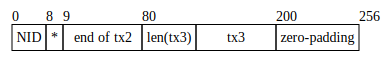
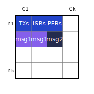

# Data Structures

- [Data Structures Overview](#data-structures-overview)
- [Type Aliases](#type-aliases)
- [Blockchain Data Structures](#blockchain-data-structures)
  - [Block](#block)
  - [Header](#header)
  - [AvailableDataHeader](#availabledataheader)
  - [AvailableData](#availabledata)
  - [Commit](#commit)
  - [Timestamp](#timestamp)
  - [HashDigest](#hashdigest)
  - [TransactionFee](#transactionfee)
  - [Address](#address)
  - [CommitSig](#commitsig)
  - [Signature](#signature)
- [ConsensusVersion](#consensusversion)
- [Serialization](#serialization)
- [Hashing](#hashing)
- [Public-Key Cryptography](#public-key-cryptography)
- [Merkle Trees](#merkle-trees)
  - [Binary Merkle Tree](#binary-merkle-tree)
    - [BinaryMerkleTreeInclusionProof](#binarymerkletreeinclusionproof)
  - [Namespace Merkle Tree](#namespace-merkle-tree)
    - [NamespaceMerkleTreeInclusionProof](#namespacemerkletreeinclusionproof)
  - [Sparse Merkle Tree](#sparse-merkle-tree)
    - [SparseMerkleTreeInclusionProof](#sparsemerkletreeinclusionproof)
- [Erasure Coding](#erasure-coding)
  - [Reed-Solomon Erasure Coding](#reed-solomon-erasure-coding)
  - [2D Reed-Solomon Encoding Scheme](#2d-reed-solomon-encoding-scheme)
  - [Share](#share)
  - [Arranging Available Data Into Shares](#arranging-available-data-into-shares)
- [Available Data](#available-data)
  - [TransactionData](#transactiondata)
    - [WrappedTransaction](#wrappedtransaction)
    - [Transaction](#transaction)
    - [SignedTransactionData](#signedtransactiondata)
      - [SignedTransactionDataTransfer](#signedtransactiondatatransfer)
      - [SignedTransactionDataMsgPayForData](#signedtransactiondatamsgpayfordata)
      - [SignedTransactionDataCreateValidator](#signedtransactiondatacreatevalidator)
      - [SignedTransactionDataBeginUnbondingValidator](#signedtransactiondatabeginunbondingvalidator)
      - [SignedTransactionDataUnbondValidator](#signedtransactiondataunbondvalidator)
      - [SignedTransactionDataCreateDelegation](#signedtransactiondatacreatedelegation)
      - [SignedTransactionDataBeginUnbondingDelegation](#signedtransactiondatabeginunbondingdelegation)
      - [SignedTransactionDataUnbondDelegation](#signedtransactiondataunbonddelegation)
      - [SignedTransactionDataBurn](#signedtransactiondataburn)
      - [SignedTransactionRedelegateCommission](#signedtransactionredelegatecommission)
      - [SignedTransactionRedelegateReward](#signedtransactionredelegatereward)
  - [IntermediateStateRootData](#intermediatestaterootdata)
    - [WrappedIntermediateStateRoot](#wrappedintermediatestateroot)
    - [IntermediateStateRoot](#intermediatestateroot)
  - [EvidenceData](#evidencedata)
    - [Evidence](#evidence)
    - [PublicKey](#publickey)
    - [Vote](#vote)
  - [MessageData](#messagedata)
    - [Message](#message)
- [State](#state)
  - [StateElement](#stateelement)
  - [Account](#account)
  - [Delegation](#delegation)
  - [Validator](#validator)
  - [ActiveValidatorCount](#activevalidatorcount)
  - [ActiveVotingPower](#activevotingpower)
  - [ProposerBlockReward](#proposerblockreward)
  - [ProposerInitialVotingPower](#proposerinitialvotingpower)
  - [ValidatorQueueHead](#validatorqueuehead)
  - [PeriodEntry](#periodentry)
  - [Decimal](#decimal)
  - [MessagePaid](#messagepaid)
  - [MessagePaidHead](#messagepaidhead)
- [Consensus Parameters](#consensus-parameters)

## Data Structures Overview


## Type Aliases

| name                        | type                        |
|-----------------------------|-----------------------------|
| [`Address`](#address)       | `byte[32]`                  |
| `Amount`                    | `uint64`                    |
| `Graffiti`                  | `byte[MAX_GRAFFITI_BYTES]`  |
| [`HashDigest`](#hashdigest) | `byte[32]`                  |
| `Height`                    | `int64`                     |
| `NamespaceID`               | `byte[NAMESPACE_ID_BYTES]`  |
| `Nonce`                     | `uint64`                    |
| `Round`                     | `int32`                     |
| `StateSubtreeID`            | `byte`                      |
| [`Timestamp`](#timestamp)   | `google.protobuf.Timestamp` |
| `VotingPower`               | `uint64`                    |

## Blockchain Data Structures

### Block

Blocks are the top-level data structure of the Celestia blockchain.

| name                  | type                                        | description                                                           |
|-----------------------|---------------------------------------------|-----------------------------------------------------------------------|
| `header`              | [Header](#header)                           | Block header. Contains primarily identification info and commitments. |
| `availableDataHeader` | [AvailableDataHeader](#availabledataheader) | Header of available data. Contains commitments to erasure-coded data. |
| `availableData`       | [AvailableData](#availabledata)             | Data that is erasure-coded for availability.                          |
| `lastCommit`          | [Commit](#commit)                           | Previous block's Tendermint commit.                                   |

### Header

Block header, which is fully downloaded by both full clients and light clients.

| name                              | type                                  | description                                                                                                                                                        |
|-----------------------------------|---------------------------------------|--------------------------------------------------------------------------------------------------------------------------------------------------------------------|
| `version`                         | [ConsensusVersion](#consensusversion) | The consensus version struct.                                                                                                                                      |
| `chainID`                         | `string`                              | The `CHAIN_ID`.                                                                                                                                                    |
| `height`                          | [Height](#type-aliases)               | Block height. The genesis block is at height `1`.                                                                                                                  |
| `timestamp`                       | [Timestamp](#timestamp)               | Timestamp of this block.                                                                                                                                           |
| `lastHeaderHash`                  | [HashDigest](#hashdigest)             | Previous block's header hash.                                                                                                                                      |
| `lastCommitHash`                  | [HashDigest](#hashdigest)             | Previous block's Tendermint commit hash.                                                                                                                           |
| `consensusHash`                   | [HashDigest](#hashdigest)             | Hash of [consensus parameters](#consensus-parameters) for this block.                                                                                              |
| `stateCommitment`                 | [HashDigest](#hashdigest)             | The [state root](#state) after this block's transactions are applied.                                                                                              |
| `availableDataOriginalSharesUsed` | `uint64`                              | The number of shares used in the [original data square](#arranging-available-data-into-shares) that are not [tail padding](./consensus.md#reserved-namespace-ids). |
| `availableDataRoot`               | [HashDigest](#hashdigest)             | Root of [commitments to erasure-coded data](#availabledataheader).                                                                                                 |
| `proposerAddress`                 | [Address](#address)                   | Address of this block's proposer.                                                                                                                                  |

The size of the [original data square](#arranging-available-data-into-shares), `availableDataOriginalSquareSize`, isn't explicitly declared in the block header. Instead, it is implicitly computed as the smallest power of 2 whose square is at least `availableDataOriginalSharesUsed` (in other words, the smallest power of 4 that is at least `availableDataOriginalSharesUsed`).

The header hash is the [hash](#hashing) of the [serialized](#serialization) header.

### AvailableDataHeader

| name       | type                          | description                            |
|------------|-------------------------------|----------------------------------------|
| `rowRoots` | [HashDigest](#hashdigest)`[]` | Commitments to all erasure-coded data. |
| `colRoots` | [HashDigest](#hashdigest)`[]` | Commitments to all erasure-coded data. |

The number of row/column roots of the original data [shares](data_structures.md#share) in [square layout](#arranging-available-data-into-shares) for this block. The `availableDataRoot` of the [header](#header) is computed using the compact row and column roots as described [here](#2d-reed-solomon-encoding-scheme).

The number of row and column roots is each `availableDataOriginalSquareSize * 2`, and must be a power of 2. Note that the minimum `availableDataOriginalSquareSize` is 1 (not 0), therefore the number of row and column roots are each at least 2.

Implementations can prune rows containing only [tail padding](./consensus.md#reserved-namespace-ids) as they are implicitly available.

### AvailableData

Data that is [erasure-coded](#erasure-coding) for [data availability checks](https://arxiv.org/abs/1809.09044).

| name                        | type                                                    | description                                                                                                     |
|-----------------------------|---------------------------------------------------------|-----------------------------------------------------------------------------------------------------------------|
| `transactionData`           | [TransactionData](#transactiondata)                     | Transaction data. Transactions modify the validator set and balances, and pay fees for messages to be included. |
| `intermediateStateRootData` | [IntermediateStateRootData](#intermediatestaterootdata) | Intermediate state roots used for fraud proofs.                                                                 |
| `evidenceData`              | [EvidenceData](#evidencedata)                           | Evidence used for slashing conditions (e.g. equivocation).                                                      |
| `messageData`               | [MessageData](#messagedata)                             | Message data. Messages are app data.                                                                            |

### Commit

| name         | type                        | description                        |
|--------------|-----------------------------|------------------------------------|
| `height`     | [Height](#type-aliases)     | Block height.                      |
| `round`      | [Round](#type-aliases)      | Round. Incremented on view change. |
| `headerHash` | [HashDigest](#hashdigest)   | Header hash of the previous block. |
| `signatures` | [CommitSig](#commitsig)`[]` | List of signatures.                |

### Timestamp

Timestamp is a [type alias](#type-aliases).

Celestia uses [`google.protobuf.Timestamp`](https://developers.google.com/protocol-buffers/docs/reference/google.protobuf#google.protobuf.Timestamp) to represent time.

### HashDigest

HashDigest is a [type alias](#type-aliases).

Output of the [hashing](#hashing) function. Exactly 256 bits (32 bytes) long.

### TransactionFee

| name      | type     | description                        |
|-----------|----------|------------------------------------|
| `tipRate` | `uint64` | The tip rate for this transaction. |

Abstraction over transaction fees.

### Address

Address is a [type alias](#type-aliases).

Addresses are the [hash](#hashing) [digest](#hashdigest) of the [public key](#publickey).

Addresses have a length of 32 bytes.

### CommitSig

```C++
enum CommitFlag : uint8_t {
    CommitFlagAbsent = 1,
    CommitFlagCommit = 2,
    CommitFlagNil = 3,
};
```

| name               | type                    | description |
|--------------------|-------------------------|-------------|
| `commitFlag`       | `CommitFlag`            |             |
| `validatorAddress` | [Address](#address)     |             |
| `timestamp`        | [Timestamp](#timestamp) |             |
| `signature`        | [Signature](#signature) |             |

### Signature

| name | type       | description                                                          |
|------|------------|----------------------------------------------------------------------|
| `r`  | `byte[32]` | `r` value of the signature.                                          |
| `vs` | `byte[32]` | 1-bit `v` value followed by last 255 bits of `s` value of signature. |

Output of the [signing](#public-key-cryptography) process.

## ConsensusVersion

| name    | type     | description          |
|---------|----------|----------------------|
| `block` | `uint64` | The `VERSION_BLOCK`. |
| `app`   | `uint64` | The `VERSION_APP`.   |

## Serialization

Objects that are committed to or signed over require a canonical serialization. This is done using a deterministic (and thus, bijective) variant of protobuf defined [here](https://github.com/cosmos/cosmos-sdk/blob/master/docs/architecture/adr-027-deterministic-protobuf-serialization.md).

Note: there are two requirements for a serialization scheme, should this need to be changed:

1. Must be bijective.
1. Serialization must include the length of dynamic structures (e.g. arrays with variable length).

## Hashing

All protocol-level hashing is done using SHA-2-256 as defined in [FIPS 180-4](https://doi.org/10.6028/NIST.FIPS.180-4). SHA-2-256 outputs a digest that is 256 bits (i.e. 32 bytes) long.

Libraries implementing SHA-2-256 are available in Go (<https://pkg.go.dev/crypto/sha256>) and Rust (<https://docs.rs/sha2>).

Unless otherwise indicated explicitly, objects are first [serialized](#serialization) before being hashed.

## Public-Key Cryptography

Consensus-critical data is authenticated using [ECDSA](https://www.secg.org/sec1-v2.pdf), with the curve [secp256k1](https://en.bitcoin.it/wiki/Secp256k1). A highly-optimized library is available in C (<https://github.com/bitcoin-core/secp256k1>), with wrappers in Go (<https://pkg.go.dev/github.com/ethereum/go-ethereum/crypto/secp256k1>) and Rust (<https://docs.rs/crate/secp256k1>).

[Public keys](#publickey) are encoded in uncompressed form, as the concatenation of the `x` and `y` values. No prefix is needed to distinguish between encoding schemes as this is the only encoding supported.

Deterministic signatures ([RFC-6979](https://tools.ietf.org/rfc/rfc6979.txt)) should be used when signing, but this is not enforced at the protocol level as it cannot be.

[Signatures](#signature) are represented as the `r` and `s` (each 32 bytes), and `v` (1-bit) values of the signature. `r` and `s` take on their usual meaning (see: [SEC 1, 4.1.3 Signing Operation](https://www.secg.org/sec1-v2.pdf)), while `v` is used for recovering the public key from a signature more quickly (see: [SEC 1, 4.1.6 Public Key Recovery Operation](https://www.secg.org/sec1-v2.pdf)). Only low-`s` values in signatures are valid (i.e. `s <= secp256k1.n//2`); `s` can be replaced with `-s mod secp256k1.n` during the signing process if it is high. Given this, the first bit of `s` will always be `0`, and can be used to store the 1-bit `v` value.

`v` represents the parity of the `Y` component of the point, `0` for even and `1` for odd. The `X` component of the point is assumed to always be low, since [the possibility of it being high is negligible](https://bitcoin.stackexchange.com/a/38909).

Putting it all together, the encoding for signatures is:

<!-- markdownlint-disable-next-line MD040 -->
```
|    32 bytes   ||           32 bytes           |
[256-bit r value][1-bit v value][255-bit s value]
```

This encoding scheme is derived from [EIP 2098: Compact Signature Representation](https://eips.ethereum.org/EIPS/eip-2098).

## Merkle Trees

Merkle trees are used to authenticate various pieces of data across the Celestia stack, including transactions, messages, the validator set, etc. This section provides an overview of the different tree types used, and specifies how to construct them.

### Binary Merkle Tree

Binary Merkle trees are constructed in the same fashion as described in [Certificate Transparency (RFC-6962)](https://tools.ietf.org/html/rfc6962), except for using [a different hashing function](#hashing). Leaves are hashed once to get leaf node values and internal node values are the hash of the concatenation of their children (either leaf nodes or other internal nodes).

Nodes contain a single field:

| name | type                      | description |
|------|---------------------------|-------------|
| `v`  | [HashDigest](#hashdigest) | Node value. |

The base case (an empty tree) is defined as the [hash](#hashing) of the empty string:

```C++
node.v = 0xe3b0c44298fc1c149afbf4c8996fb92427ae41e4649b934ca495991b7852b855
```

For leaf node `node` of leaf data `d`:

```C++
node.v = h(0x00, serialize(d))
```

For internal node `node` with children `l` and `r`:

```C++
node.v = h(0x01, l.v, r.v)
```

Note that rather than duplicating the last node if there are an odd number of nodes (the [Bitcoin design](https://github.com/bitcoin/bitcoin/blob/5961b23898ee7c0af2626c46d5d70e80136578d3/src/consensus/merkle.cpp#L9-L43)), trees are allowed to be imbalanced. In other words, the height of each leaf may be different. For an example, see Section 2.1.3 of [Certificate Transparency (RFC-6962)](https://tools.ietf.org/html/rfc6962#section-2.1.3).

Leaves and internal nodes are hashed differently: the one-byte `0x00` is prepended for leaf nodes while `0x01` is prepended for internal nodes. This avoids a second-preimage attack [where internal nodes are presented as leaves](https://en.wikipedia.org/wiki/Merkle_tree#Second_preimage_attack) trees with leaves at different heights.

#### BinaryMerkleTreeInclusionProof

| name       | type                          | description                                                     |
|------------|-------------------------------|-----------------------------------------------------------------|
| `siblings` | [HashDigest](#hashdigest)`[]` | Sibling hash values, ordered starting from the leaf's neighbor. |

A proof for a leaf in a [binary Merkle tree](#binary-merkle-tree), as per Section 2.1.1 of [Certificate Transparency (RFC-6962)](https://tools.ietf.org/html/rfc6962#section-2.1.1).

### Namespace Merkle Tree

[Shares](#share) in Celestia are associated with a provided _namespace ID_. The Namespace Merkle Tree (NMT) is a variation of the [Merkle Interval Tree](https://eprint.iacr.org/2018/642), which is itself an extension of the [Merkle Sum Tree](https://bitcointalk.org/index.php?topic=845978.0). It allows for compact proofs around the inclusion or exclusion of shares with particular namespace IDs.

Nodes contain three fields:

| name    | type                         | description                                      |
|---------|------------------------------|--------------------------------------------------|
| `n_min` | [NamespaceID](#type-aliases) | Min namespace ID in subtree rooted at this node. |
| `n_max` | [NamespaceID](#type-aliases) | Max namespace ID in subtree rooted at this node. |
| `v`     | [HashDigest](#hashdigest)    | Node value.                                      |

The base case (an empty tree) is defined as:

```C++
node.n_min = 0x0000000000000000
node.n_max = 0x0000000000000000
node.v = 0xe3b0c44298fc1c149afbf4c8996fb92427ae41e4649b934ca495991b7852b855
```

For leaf node `node` of [share](#share) data `d`:

```C++
node.n_min = d.namespaceID
node.n_max = d.namespaceID
node.v = h(0x00, d.namespaceID, d.rawData)
```

The `namespaceID` message field here is the namespace ID of the leaf, which is a [`NAMESPACE_ID_BYTES`](consensus.md#system-parameters)-long byte array.

Leaves in an NMT **must** be lexicographically sorted by namespace ID in ascending order.

For internal node `node` with children `l` and `r`:

```C++
node.n_min = min(l.n_min, r.n_min)
if l.n_min == PARITY_SHARE_NAMESPACE_ID
  node.n_max = PARITY_SHARE_NAMESPACE_ID
else if r.n_min == PARITY_SHARE_NAMESPACE_ID
  node.n_max = l.n_max
else
  node.n_max = max(l.n_max, r.n_max)
node.v = h(0x01, l.n_min, l.n_max, l.v, r.n_min, r.n_max, r.v)
```

Note that the above snippet leverages the property that leaves are sorted by namespace ID: if `l.n_min` is [`PARITY_SHARE_NAMESPACE_ID`](consensus.md#reserved-state-subtree-ids), so must `{l,r}.n_max`. By construction, either both the min and max namespace IDs of a node will be [`PARITY_SHARE_NAMESPACE_ID`](consensus.md#reserved-state-subtree-ids), or neither will: if `r.n_min` is [`PARITY_SHARE_NAMESPACE_ID`](consensus.md#reserved-state-subtree-ids), so must `r.n_max`.

For some intuition: the min and max namespace IDs for subtree roots with at least one non-parity leaf (which includes the root of an NMT, as [the right half of an NMT as used in Celestia will be parity shares](#2d-reed-solomon-encoding-scheme)) _ignore_ the namespace ID for the parity leaves. Subtree roots with _only parity leaves_ have their min and max namespace ID set to [`PARITY_SHARE_NAMESPACE_ID`](consensus.md#reserved-state-subtree-ids). This allows for shorter proofs into the tree than if the namespace ID of parity shares was not ignored (which would cause the max namespace ID of the root to always be [`PARITY_SHARE_NAMESPACE_ID`](consensus.md#reserved-state-subtree-ids)).

A compact commitment can be computed by taking the [hash](#hashing) of the [serialized](#serialization) root node.

#### NamespaceMerkleTreeInclusionProof

| name            | type                             | description                                                     |
|-----------------|----------------------------------|-----------------------------------------------------------------|
| `siblingValues` | [HashDigest](#hashdigest)`[]`    | Sibling hash values, ordered starting from the leaf's neighbor. |
| `siblingMins`   | [NamespaceID](#type-aliases)`[]` | Sibling min namespace IDs.                                      |
| `siblingMaxes`  | [NamespaceID](#type-aliases)`[]` | Sibling max namespace IDs.                                      |

When verifying an NMT proof, the root hash is checked by reconstructing the root node `root_node` with the computed `root_node.v` (computed as with a [plain Merkle proof](#binarymerkletreeinclusionproof)) and the provided `rootNamespaceIDMin` and `rootNamespaceIDMax` as the `root_node.n_min` and `root_node.n_max`, respectively.

### Sparse Merkle Tree

Sparse Merkle Trees (SMTs) are _sparse_, i.e. they contain mostly empty leaves. They can be used as key-value stores for arbitrary data, as each leaf is keyed by its index in the tree. Storage efficiency is achieved through clever use of implicit defaults, avoiding the need to store empty leaves.

Additional rules are added on top of plain [binary Merkle trees](#binary-merkle-tree):

1. Default values are given to leaf nodes with empty leaves.
1. While the above rule is sufficient to pre-compute the values of intermediate nodes that are roots of empty subtrees, a further simplification is to extend this default value to all nodes that are roots of empty subtrees. The 32-byte zero, i.e. `0x0000000000000000000000000000000000000000000000000000000000000000`, is used as the default value. This rule takes precedence over the above one.
1. The number of hashing operations can be reduced to be logarithmic in the number of non-empty leaves on average, assuming a uniform distribution of non-empty leaf keys. An internal node that is the root of a subtree that contains exactly one non-empty leaf is replaced by that leaf's leaf node.

Nodes contain a single field:

| name | type                      | description |
|------|---------------------------|-------------|
| `v`  | [HashDigest](#hashdigest) | Node value. |

In the base case, where a sparse Merkle tree has `height = 0`, the root of a tree is defined as the [hash](#hashing) of the empty string:

```C++
node.v = 0xe3b0c44298fc1c149afbf4c8996fb92427ae41e4649b934ca495991b7852b855
```

When a sparse Merkle tree has a height of 0, it can have no leaves, and, therefore, no default value children. The root is then calculated as the hash of the empty string, similar to that of an empty binary Merkle tree.

For a tree with `height > 0`, the root of an empty tree is defined as the default value:

```C++
node.v = 0x0000000000000000000000000000000000000000000000000000000000000000
```

Note that this is in contrast to the base case of the sparse and binary Merkle trees, where the root is the hash of the empty string. When a sparse Merkle tree has a height greater than 0, a new tree instance is composed of default value leaves. Nodes containing only default value children have the default value as well. Applying these rules recursively percolates the default value up to the tree's root.

For leaf node `node` of leaf data `d` with key `k`:

```C++
node.v = h(0x00, k, h(serialize(d)))
```

The key of leaf nodes must be prepended, since the index of a leaf node that is not at maximum depth cannot be determined without this information. Leaf values are hashed so that they do not need to be included in full in non-membership proofs.

For internal node `node` with children `l` and `r`:

```C++
node.v = h(0x01, l.v, r.v)
```

#### SparseMerkleTreeInclusionProof

SMTs can further be extended with _compact_ proofs. Merkle proofs are composed, among other things, of a list of sibling node values. We note that, since nodes that are roots of empty subtrees have known values (the default value), these values do not need to be provided explicitly; it is sufficient to simply identify which siblings in the Merkle branch are roots of empty subtrees, which can be done with one bit per sibling.

For a Merkle branch of height `h`, an `h`-bit value is appended to the proof. The lowest bit corresponds to the sibling of the leaf node, and each higher bit corresponds to the next parent. A value of `1` indicates that the next value in the list of values provided explicitly in the proof should be used, and a value of `0` indicates that the default value should be used.

A proof into an SMT is structured as:

| name               | type                          | description                                                              |
|--------------------|-------------------------------|--------------------------------------------------------------------------|
| `depth`            | `uint16`                      | Depth of the leaf node. The root node is at depth `0`. Must be `<= 256`. |
| `siblings`         | [HashDigest](#hashdigest)`[]` | Sibling hash values, ordered starting from the leaf's neighbor.          |
| `includedSiblings` | `byte[32]`                    | Bitfield of explicitly included sibling hashes.                          |

The `includedSiblings` is ordered by most-significant-byte first, with each byte ordered by most-significant-bit first. The lowest bit corresponds to the leaf node level.

## Erasure Coding

In order to enable trust-minimized light clients (i.e. light clients that do not rely on an honest majority of validating state assumption), it is critical that light clients can determine whether the data in each block is _available_ or not, without downloading the whole block itself. The technique used here was formally described in the paper [Fraud and Data Availability Proofs: Maximising Light Client Security and Scaling Blockchains with Dishonest Majorities](https://arxiv.org/abs/1809.09044).

The remainder of the subsections below specify the [2D Reed-Solomon erasure coding scheme](#2d-reed-solomon-encoding-scheme) used, along with the format of [shares](#share) and how [available data](#available-data) is arranged into shares.

### Reed-Solomon Erasure Coding

Note that while data is laid out in a two-dimensional square, rows and columns are erasure coded using a standard one-dimensional encoding.

Reed-Solomon erasure coding is used as the underlying coding scheme. The parameters are:

- 16-bit Galois field
- [`availableDataOriginalSquareSize`](#header) original pieces (maximum of [`AVAILABLE_DATA_ORIGINAL_SQUARE_MAX`](./consensus.md#constants))
- [`availableDataOriginalSquareSize`](#header) parity pieces (maximum of [`AVAILABLE_DATA_ORIGINAL_SQUARE_MAX`](./consensus.md#constants)) (i.e `availableDataOriginalSquareSize * 2` total pieces), for an erasure efficiency of 50%. In other words, any 50% of the pieces from the `availableDataOriginalSquareSize * 2` total pieces are enough to recover the original data.
- [`SHARE_SIZE`](./consensus.md#constants) bytes per piece

Note that [`availableDataOriginalSquareSize`](#header) may vary each block, and [is decided by the block proposer of that block](./block_proposer.md#deciding-on-a-block-size). [Leopard-RS](https://github.com/catid/leopard) is a C library that implements the above scheme with quasilinear runtime.

### 2D Reed-Solomon Encoding Scheme

The 2-dimensional data layout is described in this section. The roots of [NMTs](#namespace-merkle-tree) for each row and column across four quadrants of data in a `2k * 2k` matrix of shares, `Q0` to `Q3` (shown below), must be computed. In other words, `2k` row roots and `2k` column roots must be computed. The row and column roots are stored in the `availableDataCommitments` of the [AvailableDataHeader](#availabledataheader).


The data of `Q0` is the original data, and the remaining quadrants are parity data. Setting `k = availableDataOriginalSquareSize`, the original data first must be [split into shares](#share) and [arranged into a `k * k` matrix](#arranging-available-data-into-shares). Then the parity data can be computed.

Where `A -> B` indicates that `B` is computed using [erasure coding](#reed-solomon-erasure-coding) from `A`:

- `Q0 -> Q1` for each row in `Q0` and `Q1`
- `Q0 -> Q2` for each column in `Q0` and `Q2`
- `Q2 -> Q3` for each row in `Q2` and `Q3`


As an example, the parity data in the second column of `Q2` (in striped purple) is computed by [extending](#reed-solomon-erasure-coding) the original data in the second column of `Q0` (in solid blue).


Now that all four quadrants of the `2k * 2k` matrix are filled, the row and column roots can be computed. To do so, each row/column is used as the leaves of a [NMT](#namespace-merkle-tree), for which the compact root is computed (i.e. an extra hash operation over the NMT root is used to produce a single [HashDigest](#hashdigest)). In this example, the fourth row root value is computed as the NMT root of the fourth row of `Q0` and the fourth row of `Q1` as leaves.


Finally, the `availableDataRoot` of the block [Header](#header) is computed as the Merkle root of the [binary Merkle tree](#binary-merkle-tree) with the row and column roots as leaves, in that order.


### Share

| name          | type                         | description                |
|---------------|------------------------------|----------------------------|
| `namespaceID` | [NamespaceID](#type-aliases) | Namespace ID of the share. |
| `rawData`     | `byte[SHARE_SIZE]`           | Raw share data.            |

A share is a fixed-size data chunk associated with a namespace ID, whose data will be erasure-coded and committed to in [Namespace Merkle trees](#namespace-merkle-tree).

A share's raw data `rawData` is interpreted differently depending on the namespace ID.

For shares **with a reserved namespace ID through [`NAMESPACE_ID_MAX_RESERVED`](./consensus.md#constants)**:

- The first [`NAMESPACE_ID_BYTES`](./consensus.md#constants) of a share's raw data `rawData` is the namespace ID of that share, `namespaceID`.
- The next [`SHARE_RESERVED_BYTES`](./consensus.md#constants) bytes (the `*` in the example layout figure below) is the starting byte of the length of the [canonically serialized](#serialization) first request that starts in the share, or `0` if there is none, as a one-byte big-endian unsigned integer (i.e. canonical serialization is not used). In this example, with a share size of `256` the first byte would be `80` (or `0x50` in hex).
- The remaining [`SHARE_SIZE`](./consensus.md#constants)`-`[`NAMESPACE_ID_BYTES`](./consensus.md#constants)`-`[`SHARE_RESERVED_BYTES`](./consensus.md#constants) bytes are request data.



For shares **with a namespace ID above [`NAMESPACE_ID_MAX_RESERVED`](./consensus.md#constants) but below [`PARITY_SHARE_NAMESPACE_ID`](./consensus.md#constants)**:

- The first [`NAMESPACE_ID_BYTES`](./consensus.md#constants) of a share's raw data `rawData` is the namespace ID of that share, `namespaceID`.
- The remaining [`SHARE_SIZE`](./consensus.md#constants)`-`[`NAMESPACE_ID_BYTES`](./consensus.md#constants) bytes are request data. In other words, the remaining bytes have no special meaning and are simply used to store data.

For shares **with a namespace ID equal to [`PARITY_SHARE_NAMESPACE_ID`](./consensus.md#constants)** (i.e. parity shares):

- Bytes carry no special meaning.

For non-parity shares, if there is insufficient request data to fill the share, the remaining bytes are filled with `0`.

### Arranging Available Data Into Shares

The previous sections described how some original data, arranged into a `k * k` matrix, can be extended into a `2k * 2k` matrix and committed to with NMT roots. This section specifies how [available data](#available-data) (which includes [transactions](#transactiondata), [intermediate state roots](#intermediatestaterootdata), [evidence](#evidencedata), and [messages](#messagedata)) is arranged into the matrix in the first place.

Then,

1. For each of `transactionData`, `intermediateStateRootData`, and `evidenceData`, [serialize](#serialization):
    1. For each request in the list:
        1. [Serialize](#serialization) the request (individually).
        1. Compute the length of each serialized request, [serialize the length](#serialization), and pre-pend the serialized request with its serialized length.
    1. Split up the length/request pairs into [`SHARE_SIZE`](./consensus.md#constants)`-`[`NAMESPACE_ID_BYTES`](./consensus.md#constants)`-`[`SHARE_RESERVED_BYTES`](./consensus.md#constants)-byte chunks.
    1. Create a [share](#share) out of each chunk. This data has a _reserved_ namespace ID, so the first [`NAMESPACE_ID_BYTES`](./consensus.md#constants)`+`[`SHARE_RESERVED_BYTES`](./consensus.md#constants) bytes for these shares must be [set specially](#share).
1. Concatenate the lists of shares in the order: transactions, intermediate state roots, evidence.

Note that by construction, each share only has a single namespace, and that the list of concatenated shares is [lexicographically ordered by namespace ID](consensus.md#reserved-namespace-ids).

These shares are arranged in the [first quadrant](#2d-reed-solomon-encoding-scheme) (`Q0`) of the `availableDataOriginalSquareSize*2 * availableDataOriginalSquareSize*2` available data matrix in _row-major_ order. In the example below, each reserved data element takes up exactly one share.


Each message in the list `messageData`:

1. [Serialize](#serialization) the message (individually).
1. Compute the length of each serialized message, [serialize the length](#serialization), and pre-pend the serialized message with its serialized length.
1. Split up the length/message pairs into [`SHARE_SIZE`](./consensus.md#constants)`-`[`NAMESPACE_ID_BYTES`](./consensus.md#constants)-byte chunks.
1. Create a [share](#share) out of each chunk. The first [`NAMESPACE_ID_BYTES`](./consensus.md#constants) bytes for these shares is [set to the namespace ID](#share).

For each message, it is placed in the available data matrix, with row-major order, as follows:

1. Place the first share of the message at the next unused location in the matrix, then place the remaining shares in the following locations.

Transactions [must commit to a Merkle root of a list of hashes](#transaction) that are each guaranteed (assuming the block is valid) to be subtree roots in one or more of the row NMTs. For additional info, see [the rationale document](../rationale/message_block_layout.md) for this section.

However, with only the rule above, interaction between the block producer and transaction sender may be required to compute a commitment to the message the transaction sender can sign over. To remove interaction, messages can optionally be laid out using a non-interactive default:

1. Place the first share of the message at the next unused location in the matrix whose column is aligned with the largest power of 2 that is not larger than the message length or [`availableDataOriginalSquareSize`](#header), then place the remaining shares in the following locations **unless** there are insufficient unused locations in the row.
1. If there are insufficient unused locations in the row, place the first share of the message at the first column of the next row. Then place the remaining shares in the following locations. By construction, any message whose length is greater than [`availableDataOriginalSquareSize`](#header) will be placed in this way.

In the example below, two messages (of lengths 2 and 1, respectively) are placed using the aforementioned default non-interactive rules.



The non-interactive default rules may introduce empty shares that do not belong to any message (in the example above, the top-right share is empty). These are zeroes with namespace ID equal to the either [`TAIL_TRANSACTION_PADDING_NAMESPACE_ID`](./consensus.md#constants) if between a request with a reserved namespace ID and a message, or the namespace ID of the previous message if succeeded by a message. See the [rationale doc](../rationale/message_block_layout.md) for more info.

## Available Data

### TransactionData

| name                  | type                                          | description                   |
|-----------------------|-----------------------------------------------|-------------------------------|
| `wrappedTransactions` | [WrappedTransaction](#wrappedtransaction)`[]` | List of wrapped transactions. |

#### WrappedTransaction

Wrapped transactions include additional metadata by the block proposer that is committed to in the [available data matrix](#arranging-available-data-into-shares).

| name                | type                        | description                                                                                                                                                                                                                                                                                                |
|---------------------|-----------------------------|------------------------------------------------------------------------------------------------------------------------------------------------------------------------------------------------------------------------------------------------------------------------------------------------------------|
| `index`             | `uint64`                    | Index of this transaction in the list of wrapped transactions. This information is lost when splitting transactions into [fixed-sized shares](#share), and needs to be re-added here for fraud proof support. Allows linking a transaction to an [intermediate state root](#wrappedintermediatestateroot). |
| `transaction`       | [Transaction](#transaction) | Actual transaction.                                                                                                                                                                                                                                                                                        |
| `messageStartIndex` | `uint64`                    | _Optional, only used if transaction pays for a message or padding_. Share index (in row-major order) of first share of message this transaction pays for. Needed for light verification of proper message inclusion.                                                                                       |

#### Transaction

| name                    | type                                            | description                       |
|-------------------------|-------------------------------------------------|-----------------------------------|
| `signedTransactionData` | [SignedTransactionData](#signedtransactiondata) | Data payload that is signed over. |
| `signature`             | [Signature](#signature)                         | Signature.                        |

#### SignedTransactionData

```C++
enum TransactionType : uint8_t {
    Transfer = 1,
    MsgPayForData = 2,
    CreateValidator = 3,
    BeginUnbondingValidator = 4,
    UnbondValidator = 5,
    CreateDelegation = 6,
    BeginUnbondingDelegation = 7,
    UnbondDelegation = 8,
    Burn = 9,
    RedelegateCommission = 10,
    RedelegateReward = 11,
};
```

Signed transaction data comes in a number of types:

1. [Transfer](#signedtransactiondatatransfer)
1. [MsgPayForData](#signedtransactiondatamsgpayfordata)
1. [CreateValidator](#signedtransactiondatacreatevalidator)
1. [BeginUnbondingValidator](#signedtransactiondatabeginunbondingvalidator)
1. [UnbondValidator](#signedtransactiondataunbondvalidator)
1. [CreateDelegation](#signedtransactiondatacreatedelegation)
1. [BeginUnbondingDelegation](#signedtransactiondatabeginunbondingdelegation)
1. [UnbondDelegation](#signedtransactiondataunbonddelegation)
1. [Burn](#signedtransactiondataburn)
1. [RedelegateCommission](#signedtransactionredelegatecommission)
1. [RedelegateReward](#signedtransactionredelegatereward)

Common fields are denoted here to avoid repeating descriptions:

| name     | type                              | description                                                                |
|----------|-----------------------------------|----------------------------------------------------------------------------|
| `type`   | `TransactionType`                 | Type of the transaction. Each type indicates a different state transition. |
| `amount` | [Amount](#type-aliases)           | Amount of coins to send, in `1u`.                                          |
| `to`     | [Address](#address)               | Recipient's address.                                                       |
| `fee`    | [TransactionFee](#transactionfee) | The fee information for this transaction.                                  |
| `nonce`  | [Nonce](#type-aliases)            | Nonce of sender.                                                           |

##### SignedTransactionDataTransfer

| name     | type                              | description                         |
|----------|-----------------------------------|-------------------------------------|
| `type`   | `TransactionType`                 | Must be `TransactionType.Transfer`. |
| `amount` | [Amount](#type-aliases)           |                                     |
| `to`     | [Address](#address)               |                                     |
| `fee`    | [TransactionFee](#transactionfee) |                                     |
| `nonce`  | [Nonce](#type-aliases)            |                                     |

Transfers `amount` coins to `to`.

##### SignedTransactionDataMsgPayForData

| name                     | type                              | description                                                  |
|--------------------------|-----------------------------------|--------------------------------------------------------------|
| `type`                   | `TransactionType`                 | Must be `TransactionType.MsgPayForData`.                     |
| `fee`                    | [TransactionFee](#transactionfee) |                                                              |
| `nonce`                  | [Nonce](#type-aliases)            |                                                              |
| `messageNamespaceID`     | [`NamespaceID`](#type-aliases)    | Namespace ID of message this transaction pays a fee for.     |
| `messageSize`            | `uint64`                          | Size of message this transaction pays a fee for, in `byte`s. |
| `messageShareCommitment` | [HashDigest](#hashdigest)         | Commitment to message shares (details below).                |

Pays for the inclusion of a [message](#message) in the same block.

The commitment to message shares `messageShareCommitment` is a [Merkle root](#binary-merkle-tree) of message share roots. Each message share root is [a subtree root in a row NMT](#arranging-available-data-into-shares). For rationale, see [rationale doc](../rationale/message_block_layout.md).

##### SignedTransactionDataCreateValidator

| name             | type                              | description                                |
|------------------|-----------------------------------|--------------------------------------------|
| `type`           | `TransactionType`                 | Must be `TransactionType.CreateValidator`. |
| `fee`            | [TransactionFee](#transactionfee) |                                            |
| `nonce`          | [Nonce](#type-aliases)            |                                            |
| `commissionRate` | [Decimal](#decimal)               |                                            |

Create a new [Validator](#validator) at this address.

##### SignedTransactionDataBeginUnbondingValidator

| name    | type                              | description                                        |
|---------|-----------------------------------|----------------------------------------------------|
| `type`  | `TransactionType`                 | Must be `TransactionType.BeginUnbondingValidator`. |
| `fee`   | [TransactionFee](#transactionfee) |                                                    |
| `nonce` | [Nonce](#type-aliases)            |                                                    |

Begin unbonding the [Validator](#validator) at this address.

##### SignedTransactionDataUnbondValidator

| name    | type                              | description                                |
|---------|-----------------------------------|--------------------------------------------|
| `type`  | `TransactionType`                 | Must be `TransactionType.UnbondValidator`. |
| `fee`   | [TransactionFee](#transactionfee) |                                            |
| `nonce` | [Nonce](#type-aliases)            |                                            |

Finish unbonding the [Validator](#validator) at this address.

##### SignedTransactionDataCreateDelegation

| name     | type                              | description                                 |
|----------|-----------------------------------|---------------------------------------------|
| `type`   | `TransactionType`                 | Must be `TransactionType.CreateDelegation`. |
| `amount` | [Amount](#type-aliases)           |                                             |
| `to`     | [Address](#address)               |                                             |
| `fee`    | [TransactionFee](#transactionfee) |                                             |
| `nonce`  | [Nonce](#type-aliases)            |                                             |

Create a new [Delegation](#delegation) of `amount` coins worth of voting power for validator with address `to`.

##### SignedTransactionDataBeginUnbondingDelegation

| name    | type                              | description                                         |
|---------|-----------------------------------|-----------------------------------------------------|
| `type`  | `TransactionType`                 | Must be `TransactionType.BeginUnbondingDelegation`. |
| `fee`   | [TransactionFee](#transactionfee) |                                                     |
| `nonce` | [Nonce](#type-aliases)            |                                                     |

Begin unbonding the [Delegation](#delegation) at this address.

##### SignedTransactionDataUnbondDelegation

| name    | type                              | description                                 |
|---------|-----------------------------------|---------------------------------------------|
| `type`  | `TransactionType`                 | Must be `TransactionType.UnbondDelegation`. |
| `fee`   | [TransactionFee](#transactionfee) |                                             |
| `nonce` | [Nonce](#type-aliases)            |                                             |

Finish unbonding the [Delegation](#delegation) at this address.

##### SignedTransactionDataBurn

| name       | type                              | description                                  |
|------------|-----------------------------------|----------------------------------------------|
| `type`     | `TransactionType`                 | Must be `TransactionType.Burn`.              |
| `amount`   | [Amount](#type-aliases)           |                                              |
| `fee`      | [TransactionFee](#transactionfee) |                                              |
| `nonce`    | [Nonce](#type-aliases)            |                                              |
| `graffiti` | [Graffiti](#type-aliases)         | Graffiti to indicate the reason for burning. |

##### SignedTransactionRedelegateCommission

| name    | type                              | description                                     |
|---------|-----------------------------------|-------------------------------------------------|
| `type`  | `TransactionType`                 | Must be `TransactionType.RedelegateCommission`. |
| `to`    | [Address](#address)               |                                                 |
| `fee`   | [TransactionFee](#transactionfee) |                                                 |
| `nonce` | [Nonce](#type-aliases)            |                                                 |

Assigns validator's pending commission to a delegation.

##### SignedTransactionRedelegateReward

| name    | type                              | description                                 |
|---------|-----------------------------------|---------------------------------------------|
| `type`  | `TransactionType`                 | Must be `TransactionType.RedelegateReward`. |
| `fee`   | [TransactionFee](#transactionfee) |                                             |
| `nonce` | [Nonce](#type-aliases)            |                                             |

Adds delegation's pending rewards to voting power.

### IntermediateStateRootData

| name                            | type                                                              | description                               |
|---------------------------------|-------------------------------------------------------------------|-------------------------------------------|
| `wrappedIntermediateStateRoots` | [WrappedIntermediateStateRoot](#wrappedintermediatestateroot)`[]` | List of wrapped intermediate state roots. |

#### WrappedIntermediateStateRoot

| name                    | type                                            | description                                                                                                                                                                                                                                                                                                                  |
|-------------------------|-------------------------------------------------|------------------------------------------------------------------------------------------------------------------------------------------------------------------------------------------------------------------------------------------------------------------------------------------------------------------------------|
| `index`                 | `uint64`                                        | Index of this intermediate state root in the list of intermediate state roots. This information is lost when splitting intermediate state roots into [fixed-sized shares](#share), and needs to be re-added here for fraud proof support. Allows linking an intermediate state root to a [transaction](#wrappedtransaction). |
| `intermediateStateRoot` | [IntermediateStateRoot](#intermediatestateroot) | Intermediate state root. Used for fraud proofs.                                                                                                                                                                                                                                                                              |

#### IntermediateStateRoot

| name   | type                      | description                                                                              |
|--------|---------------------------|------------------------------------------------------------------------------------------|
| `root` | [HashDigest](#hashdigest) | Root of intermediate state, which is composed of the global state and the validator set. |

### EvidenceData

Wrapper for evidence data.

| name        | type                      | description                                    |
|-------------|---------------------------|------------------------------------------------|
| `evidences` | [Evidence](#evidence)`[]` | List of evidence used for slashing conditions. |

#### Evidence

| name     | type                    | description |
|----------|-------------------------|-------------|
| `pubKey` | [PublicKey](#publickey) |             |
| `voteA`  | [Vote](#vote)           |             |
| `voteB`  | [Vote](#vote)           |             |

#### PublicKey

| name | type       | description              |
|------|------------|--------------------------|
| `x`  | `byte[32]` | `x` value of public key. |
| `y`  | `byte[32]` | `y` value of public key. |

#### Vote

```C++
enum VoteType : uint8_t {
    Prevote = 1,
    Precommit = 2,
};
```

| name         | type                      | description |
|--------------|---------------------------|-------------|
| `type`       | `VoteType`                |             |
| `height`     | [Height](#type-aliases)   |             |
| `round`      | [Round](#type-aliases)    |             |
| `headerHash` | [HashDigest](#hashdigest) |             |
| `timestamp`  | [Timestamp](#timestamp)   |             |
| `signature`  | [Signature](#signature)   |             |

### MessageData

| name       | type                    | description       |
|------------|-------------------------|-------------------|
| `messages` | [Message](#message)`[]` | List of messages. |

#### Message

| name          | type                         | description                   |
|---------------|------------------------------|-------------------------------|
| `namespaceID` | [NamespaceID](#type-aliases) | Namespace ID of this message. |
| `rawData`     | `byte[]`                     | Raw message bytes.            |

## State

The state of the Celestia chain is intentionally restricted to containing only account balances and the validator set metadata. One unified [Sparse Merkle Tree](#sparse-merkle-tree) is maintained for the entire chain state, the _state tree_. The root of this tree is committed to in the [block header](#header).

The state tree is separated into `2**(8*STATE_SUBTREE_RESERVED_BYTES)` subtrees, each of which can be used to store a different component of the state. This is done by slicing off the highest `STATE_SUBTREE_RESERVED_BYTES` bytes from the key and replacing them with the appropriate [reserved state subtree ID](consensus.md#reserved-state-subtree-ids). Reducing the key size within subtrees also reduces the collision resistance of keys by `8*STATE_SUBTREE_RESERVED_BYTES` bits, but this is not an issue due the number of bits removed being small.

A number of subtrees are maintained:

1. [Accounts](#account)
1. [Active validator set](#validator)
1. [Inactive validator set](#validator)
1. [Delegation set](#delegation)
1. [Message shares paid for](#messagepaid)

### StateElement

Data structure for state elements is given below:

| name        | type                                                                                                                                                                                                                                                                                                                                                                  | description                                                                                                                                  |
|-------------|----------------------------------------------------------------------------------------------------------------------------------------------------------------------------------------------------------------------------------------------------------------------------------------------------------------------------------------------------------------------|----------------------------------------------------------------------------------------------------------------------------------------------|
| `key`       | `byte[32]`                                                                                                                                                                                                                                                                                                                                                            | Keys are byte arrays with size 32.                                                                                                           |
| `value`     | [Account](#account), [Delegation](#delegation), [Validator](#validator), [ActiveValidatorCount](#activevalidatorcount), [ActiveVotingPower](#activevotingpower), [ProposerBlockReward](#proposerblockreward), [ProposerInitialVotingPower](#proposerinitialvotingpower), [ValidatorQueueHead](#validatorqueuehead), [MessagePaidHead](#messagepaidhead) | `value` can be of different types depending on the state elements listed below. There exists a unique protobuf for different state elements. |

### Account

```C++
enum AccountStatus : uint8_t {
    None = 1,
    DelegationBonded = 2,
    DelegationUnbonding = 3,
    ValidatorQueued = 4,
    ValidatorBonded = 5,
    ValidatorUnbonding = 6,
    ValidatorUnbonded = 7,
};
```

| name      | type                    | description                                                                       |
|-----------|-------------------------|-----------------------------------------------------------------------------------|
| `balance` | [Amount](#type-aliases) | Coin balance.                                                                     |
| `nonce`   | [Nonce](#type-aliases)  | Account nonce. Every outgoing transaction from this account increments the nonce. |
| `status`  | `AccountStatus`         | Validator or delegation status of this account.                                   |

The `status` of an account indicates weather it is a validator (`AccountStatus.Validator*`), delegating to a validator (`AccountStatus.Delegation*`), or neither (`AccountStatus.None`). Being a validator and delegating are mutually exclusive, and only a single validator can be delegated to.

Delegations have two statuses:

1. `DelegationBonded`: This delegation is enabled for a `Queued` _or_ `Bonded` validator. Delegations to a `Queued` validator can be withdrawn immediately, while delegations for a `Bonded` validator must be unbonded first.
1. `DelegationUnbonding`: This delegation is unbonding. It will remain in this status for at least `UNBONDING_DURATION` blocks, and while unbonding may still be slashed. Once the unbonding duration has expired, the delegation can be withdrawn.

Validators have four statuses:

1. `ValidatorQueued`: This validator has entered the queue to become an active validator. Once the next validator set transition occurs, if this validator has sufficient voting power (including its own stake and stake delegated to it) to be in the top `MAX_VALIDATORS` validators by voting power, it will become an active, i.e. `ValidatorBonded` validator. Until bonded, this validator can immediately exit the queue.
1. `ValidatorBonded`: This validator is active and bonded. It can propose new blocks and vote on proposed blocks. Once bonded, an active validator must go through an unbonding process until its stake can be freed.
1. `ValidatorUnbonding`: This validator is in the process of unbonding, which can be voluntary (the validator decided to stop being an active validator) or forced (the validator committed a slashable offence and was kicked from the active validator set). Validators will remain in this status for at least `UNBONDING_DURATION` blocks, and while unbonding may still be slashed.
1. `ValidatorUnbonded`: This validator has completed its unbonding and has withdrawn its stake. The validator object will remain in this status until `delegatedCount` reaches zero, at which point it is destroyed.

In the accounts subtree, accounts (i.e. leaves) are keyed by the [hash](#hashdigest) of their [address](#address). The first byte is then replaced with [`ACCOUNTS_SUBTREE_ID`](./consensus.md#reserved-state-subtree-ids).

### Delegation

| name              | type                         | description                                         |
|-------------------|------------------------------|-----------------------------------------------------|
| `validator`       | [Address](#address)          | The validator being delegating to.                  |
| `stakedBalance`   | [VotingPower](#type-aliases) | Delegated stake, in `4u`.                           |
| `beginEntry`      | [PeriodEntry](#periodentry)  | Entry when delegation began.                        |
| `endEntry`        | [PeriodEntry](#periodentry)  | Entry when delegation ended (i.e. began unbonding). |
| `unbondingHeight` | [Height](#type-aliases)      | Block height delegation began unbonding.            |

Delegation objects represent a delegation.

In the delegation subtree, delegations are keyed by the [hash](#hashdigest) of their [address](#address). The first byte is then replaced with [`DELEGATIONS_SUBTREE_ID`](./consensus.md#reserved-state-subtree-ids).

### Validator

| name                | type                         | description                                                                            |
|---------------------|------------------------------|----------------------------------------------------------------------------------------|
| `commissionRewards` | `uint64`                     | Validator's commission rewards, in `1u`.                                               |
| `commissionRate`    | [Decimal](#decimal)          | Commission rate.                                                                       |
| `delegatedCount`    | `uint32`                     | Number of accounts delegating to this validator.                                       |
| `votingPower`       | [VotingPower](#type-aliases) | Total voting power as staked balance + delegated stake, in `4u`.                       |
| `pendingRewards`    | [Amount](#type-aliases)      | Rewards collected so far this period, in `1u`.                                         |
| `latestEntry`       | [PeriodEntry](#periodentry)  | Latest entry, used for calculating reward distribution.                                |
| `unbondingHeight`   | [Height](#type-aliases)      | Block height validator began unbonding.                                                |
| `isSlashed`         | `bool`                       | If this validator has been slashed or not.                                             |
| `slashRate`         | [Decimal](#decimal)          | _Optional_, only if `isSlashed` is set. Rate at which this validator has been slashed. |
| `next`              | [Address](#type-aliases)     | Next validator in the queue. Zero if this validator is not in the queue.               |

Validator objects represent all the information needed to be keep track of a validator.

In the validators subtrees, validators are keyed by the [hash](#hashdigest) of their [address](#address). The first byte is then replaced with [`ACTIVE_VALIDATORS_SUBTREE_ID`](./consensus.md#reserved-state-subtree-ids) for the active validator set or [`INACTIVE_VALIDATORS_SUBTREE_ID`](./consensus.md#reserved-state-subtree-ids) for the inactive validator set. Active validators are bonded, (i.e. `ValidatorBonded`), while inactive validators are not bonded (i.e. `ValidatorUnbonded`). By construction, the validators subtrees will be a subset of a mirror of the [accounts subtree](#account).

The validator queue (i.e. validators with status `ValidatorQueued`) is a subset of the inactive validator set. This queue is represented as a linked list, with each validator pointing to the `next` validator in the queue, and the head of the linked list stored in [ValidatorQueueHead](#validatorqueuehead).

### ActiveValidatorCount

| name            | type     | description                  |
|-----------------|----------|------------------------------|
| `numValidators` | `uint32` | Number of active validators. |

Since the [active validator set](#validator) is stored in a [Sparse Merkle Tree](#sparse-merkle-tree), there is no compact way of proving that the number of active validators exceeds `MAX_VALIDATORS` without keeping track of the number of active validators. The active validator count is stored in the active validators subtree, and is keyed with `0` (i.e. `0x0000000000000000000000000000000000000000000000000000000000000000`), with the first byte replaced with `ACTIVE_VALIDATORS_SUBTREE_ID`.

### ActiveVotingPower

| name          | type     | description          |
|---------------|----------|----------------------|
| `votingPower` | `uint64` | Active voting power. |

Since the [active validator set](#validator) is stored in a [Sparse Merkle Tree](#sparse-merkle-tree), there is no compact way of proving the active voting power. The active voting power is stored in the active validators subtree, and is keyed with `1` (i.e. `0x0000000000000000000000000000000000000000000000000000000000000001`), with the first byte replaced with `ACTIVE_VALIDATORS_SUBTREE_ID`.

### ProposerBlockReward

| name     | type     | description                                                                    |
|----------|----------|--------------------------------------------------------------------------------|
| `reward` | `uint64` | Total block reward (subsidy + fees) in current block so far. Reset each block. |

The current block reward for the proposer is kept track of here. This is keyed with `2` (i.e. `0x0000000000000000000000000000000000000000000000000000000000000002`), with the first byte replaced with `ACTIVE_VALIDATORS_SUBTREE_ID`.

### ProposerInitialVotingPower

| name          | type     | description                                                              |
|---------------|----------|--------------------------------------------------------------------------|
| `votingPower` | `uint64` | Voting power of the proposer at the start of each block. Set each block. |

The proposer's voting power at the beginning of the block is kept track of here. This is keyed with `3` (i.e. `0x0000000000000000000000000000000000000000000000000000000000000003`), with the first byte replaced with `ACTIVE_VALIDATORS_SUBTREE_ID`.

### ValidatorQueueHead

| name   | type                | description                                                       |
|--------|---------------------|-------------------------------------------------------------------|
| `head` | [Address](#address) | Address of inactive validator at the head of the validator queue. |

The head of the queue for validators that are waiting to become active validators is stored in the inactive validators subtree, and is keyed with `0` (i.e. `0x0000000000000000000000000000000000000000000000000000000000000000`), with the first byte replaced with `INACTIVE_VALIDATORS_SUBTREE_ID`.

If the queue is empty, `head` is set to the default value (i.e. the hash of the leaf is [the default value for a Sparse Merkle Tree](#sparse-merkle-tree)).

### PeriodEntry

| name         | type                    | description                                                   |
|--------------|-------------------------|---------------------------------------------------------------|
| `rewardRate` | [Amount](#type-aliases) | Rewards per unit of voting power accumulated so far, in `1u`. |

For explanation on entries, see the [reward distribution rationale document](../rationale/distributing_rewards.md).

### Decimal

| name          | type   | description           |
|---------------|--------|-----------------------|
| `numerator`   | uint64 | Rational numerator.   |
| `denominator` | uint64 | Rational denominator. |

Represents a (potentially) non-integer number.

### MessagePaid

| name     | type                      | description                                                           |
|----------|---------------------------|-----------------------------------------------------------------------|
| `start`  | `uint64`                  | Share index (in row-major order) of first share paid for (inclusive). |
| `finish` | `uint64`                  | Share index (in row-major order) of last share paid for (inclusive).  |
| `next`   | [HashDigest](#hashdigest) | Next transaction ID in the list.                                      |

### MessagePaidHead

| name   | type                      | description                                                              |
|--------|---------------------------|--------------------------------------------------------------------------|
| `head` | [HashDigest](#hashdigest) | Transaction hash at the head of the list (has the smallest start index). |

The head of the list of paid message shares is stored in the message share paid subtree, and is keyed with `0` (i.e. `0x0000000000000000000000000000000000000000000000000000000000000000`), with the first byte replaced with `MESSAGE_PAID_SUBTREE_ID`.

If the paid list is empty, `head` is set to the default value (i.e. the hash of the leaf is [the default value for a Sparse Merkle Tree](#sparse-merkle-tree)).

## Consensus Parameters

Various [consensus parameters](consensus.md#system-parameters) are committed to in the block header, such as limits and constants.

| name                             | type                                  | description                               |
|----------------------------------|---------------------------------------|-------------------------------------------|
| `version`                        | [ConsensusVersion](#consensusversion) | The consensus version struct.             |
| `chainID`                        | `string`                              | The `CHAIN_ID`.                           |
| `shareSize`                      | `uint64`                              | The `SHARE_SIZE`.                         |
| `shareReservedBytes`             | `uint64`                              | The `SHARE_RESERVED_BYTES`.               |
| `availableDataOriginalSquareMax` | `uint64`                              | The `AVAILABLE_DATA_ORIGINAL_SQUARE_MAX`. |

In order to compute the `consensusHash` field in the [block header](#header), the above list of parameters is [hashed](#hashing).
