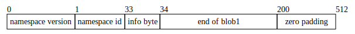
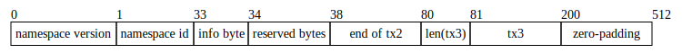

# Shares

<!-- toc -->

## Abstract

All available data in a Celestia [block](./data_structures.md#block) is split into fixed-size data chunks known as "shares". Shares are the atomic unit of the Celestia data square. The shares in a Celestia block are eventually [erasure-coded](./data_structures.md#erasure-coding) and committed to in [Namespace Merkle trees](./data_structures.md#namespace-merkle-tree) (also see [NMT spec](https://github.com/celestiaorg/nmt/blob/master/docs/spec/nmt.md)).

## Terms

- **Blob**: User specified data (e.g. a roll-up block) that is associated with exactly one namespace. Blob data are opaque bytes of data that are included in the block but do not impact Celestia's state.
- **Share**: A fixed-size data chunk that is associated with exactly one namespace.
- **Share sequence**: A share sequence is a contiguous set of shares that contain semantically relevant data. A share sequence MUST contain one or more shares. When a [blob](../../../x/blob/README.md) is split into shares, it is written to one share sequence. As a result, all shares in a share sequence are typically parsed together because the original blob data may have been split across share boundaries. All transactions in the [`TRANSACTION_NAMESPACE`](./namespace.md#reserved-namespaces) are contained in one share sequence. All transactions in the [`PAY_FOR_BLOB_NAMESPACE`](./namespace.md#reserved-namespaces) are contained in one share sequence.

## Overview

User submitted transactions are split into shares (see [share splitting](#share-splitting)) and arranged in a `k * k` matrix (see [arranging available data into shares](./data_structures.md#arranging-available-data-into-shares)) prior to the erasure coding step. Shares in the `k * k` matrix are ordered by namespace and have a common [share format](#share-format).

[Padding](#padding) shares are added to the `k * k` matrix to ensure:

1. Blob sequences start on an index that conforms to [blob share commitment rules](./data_square_layout.md#blob-share-commitment-rules) (see [namespace padding share](#namespace-padding-share) and [reserved padding share](#primary-reserved-padding-share))
1. The number of shares in the matrix is a perfect square (see [tail padding share](#tail-padding-share))

## Share Format

Every share has a fixed size [`SHARE_SIZE`](./consensus.md#constants). The share format below is consistent for all shares:

- The first [`NAMESPACE_VERSION_SIZE`](./consensus.md#constants) bytes of a share's raw data is the namespace version of that share (denoted by "namespace version" in the figure below).
- The next [`NAMESPACE_ID_SIZE`](./consensus.md#constants) bytes of a share's raw data is the namespace ID of that share (denoted by "namespace id" in the figure below).
- The next [`SHARE_INFO_BYTES`](./consensus.md#constants) bytes are for share information (denoted by "info byte" in the figure below) with the following structure:
  - The first 7 bits represent the [share version](#share-version) in big endian form (initially, this will be `0000000` for version `0`);
  - The last bit is a sequence start indicator. The indicator is `1` if this share is the first share in a sequence or `0` if this share is a continuation share in a sequence.
- If this share is the first share in a sequence, it will include the length of the sequence in bytes. The next [`SEQUENCE_BYTES`](./consensus.md#constants) represent a big-endian uint32 value (denoted by "sequence length" in the figure below). This length is placed immediately after the `SHARE_INFO_BYTES` field. It's important to note that shares that are not the first share in a sequence do not contain this field.
- The remaining [`SHARE_SIZE`](./consensus.md#constants)`-`[`NAMESPACE_SIZE`](./consensus.md#constants)`-`[`SHARE_INFO_BYTES`](./consensus.md#constants)`-`[`SEQUENCE_BYTES`](./consensus.md#constants) bytes (if first share) or [`SHARE_SIZE`](./consensus.md#constants)`-`[`NAMESPACE_SIZE`](./consensus.md#constants)`-`[`SHARE_INFO_BYTES`](./consensus.md#constants) bytes (if continuation share) are raw data (denoted by "blob1" in the figure below). Typically raw data is the blob payload that user's submit in a [BlobTx](../../../x/blob/README.md). However, raw data can also be transaction data (see [transaction shares](#transaction-shares) below).
- If there is insufficient raw data to fill the share, the remaining bytes are filled with `0`.

First share in a sequence:

Continuation share in a sequence:

Since raw data that exceeds [`SHARE_SIZE`](./consensus.md#constants)`-`[`NAMESPACE_SIZE`](./consensus.md#constants)`-`[`SHARE_INFO_BYTES`](./consensus.md#constants) `-` [`SEQUENCE_BYTES`](./consensus.md#constants) bytes will span more than one share, developers MAY choose to encode additional metadata in their raw blob data prior to inclusion in a Celestia block. For example, Celestia transaction shares encode additional metadata in the form of "reserved bytes".

### Share Version

The share version is a 7-bit big-endian unsigned integer that is used to indicate the version of the [share format](#share-format). The only supported share version is `0`. A new share version MUST be introduced if the share format changes in a way that is not backwards compatible.

## Transaction Shares

In order for clients to parse shares in the middle of a sequence without downloading antecedent shares, Celestia encodes additional metadata in the shares associated with reserved namespaces. At the time of writing this only applies to the [`TRANSACTION_NAMESPACE`](./namespace.md#reserved-namespaces) and [`PAY_FOR_BLOB_NAMESPACE`](./namespace.md#reserved-namespaces). This share structure is often referred to as "compact shares" to differentiate from the share structure defined above for all shares. It conforms to the common [share format](#share-format) with one additional field, the "reserved bytes" field, which is described below:

- Every transaction share includes [`SHARE_RESERVED_BYTES`](./consensus.md#constants) bytes that contain the index of the starting byte of the length of the [canonically serialized](./consensus.md#serialization) first transaction that starts in the share, or `0` if there is none, as a binary big endian `uint32`. Denoted by "reserved bytes" in the figure below. The [`SHARE_RESERVED_BYTES`](./consensus.md#constants) are placed immediately after the `SEQUENCE_BYTES` if this is the first share in a sequence or immediately after the `SHARE_INFO_BYTES` if this is a continuation share in a sequence.
- The remaining [`SHARE_SIZE`](./consensus.md#constants)`-`[`NAMESPACE_SIZE`](./consensus.md#constants)`-`[`SHARE_INFO_BYTES`](./consensus.md#constants)`-`[`SEQUENCE_BYTES`](./consensus.md#constants)`-`[`SHARE_RESERVED_BYTES`](./consensus.md#constants) bytes (if first share) or [`SHARE_SIZE`](./consensus.md#constants)`-`[`NAMESPACE_SIZE`](./consensus.md#constants)`-`[`SHARE_INFO_BYTES`](./consensus.md#constants)`-`[`SHARE_RESERVED_BYTES`](./consensus.md#constants) bytes (if continuation share) are transaction or PayForBlob transaction data (denoted by "tx1" and "tx2" in the figure below). Each transaction or PayForBlob transaction is prefixed with a [varint](https://developers.google.com/protocol-buffers/docs/encoding) of the length of that unit (denoted by "len(tx1)" and "len(tx2)" in the figure below).
- If there is insufficient transaction or PayForBlob transaction data to fill the share, the remaining bytes are filled with `0`.

First share in a sequence:

where reserved bytes would be `38` as a binary big endian `uint32` (`[0b00000000, 0b00000000, 0b00000000, 0b00100110]`).

Continuation share in a sequence:

where reserved bytes would be `80` as a binary big endian `uint32` (`[0b00000000, 0b00000000, 0b00000000, 0b01010000]`).

## Padding

Padding shares vary based on namespace but they conform to the [share format](#share-format) described above.

- The first [`NAMESPACE_VERSION_SIZE`](./consensus.md#constants) bytes of a share's raw data is the namespace version of that share (initially, this will be `0`).
- The next [`NAMESPACE_ID_SIZE`](./consensus.md#constants) bytes of a share's raw data is the namespace ID of that share. This varies based on the type of padding share.
- The next [`SHARE_INFO_BYTES`](./consensus.md#constants) bytes are for share information.
  - The first 7 bits represent the [share version](#share-version) in big endian form (initially, this will be `0000000` for version `0`);
  - The last bit is a sequence start indicator. The indicator is always `1`.
- The next [`SEQUENCE_BYTES`](./consensus.md#constants) contain a big endian `uint32` of value `0`.
- The remaining [`SHARE_SIZE`](./consensus.md#constants)`-`[`NAMESPACE_SIZE`](./consensus.md#constants)`-`[`SHARE_INFO_BYTES`](./consensus.md#constants)`-`[`SEQUENCE_BYTES`](./consensus.md#constants) bytes are filled with `0`.

### Namespace Padding Share

A namespace padding share uses the namespace of the blob that precedes it in the data square so that the data square can retain the property that all shares are ordered by namespace.
A namespace padding share acts as padding between blobs so that the subsequent blob begins at an index that conforms to the [blob share commitment rules](./data_square_layout.md#blob-share-commitment-rules). Clients MAY ignore the contents of these shares because they don't contain any significant data.

### Primary Reserved Padding Share

Primary reserved padding shares use the [`PRIMARY_RESERVED_PADDING_NAMESPACE`](./namespace.md#reserved-namespaces). Primary reserved padding shares are placed after shares in the primary reserved namespace range so that the first blob can start at an index that conforms to blob share commitment rules. Clients MAY ignore the contents of these shares because they don't contain any significant data.

### Tail Padding Share

Tail padding shares use the [`TAIL_PADDING_NAMESPACE`](./namespace.md#reserved-namespaces). Tail padding shares are placed after the last blob in the data square so that the number of shares in the data square is a perfect square. Clients MAY ignore the contents of these shares because they don't contain any significant data.

## Parity Share

Parity shares use the [`PARITY_SHARE_NAMESPACE`](./namespace.md#reserved-namespaces). Parity shares are the output of the erasure coding step of the data square construction process. They occupy quadrants Q1, Q2, and Q3 of the extended data square and are used to reconstruct the original data square (Q0). Bytes carry no special meaning.

## Share Splitting

Share splitting is the process of converting a blob into a share sequence. The process is as follows:

1. Create a new share and populate the prefix of the share with the blob's namespace and [share version](#share-version). Set the sequence start indicator to `1`. Write the blob length as the sequence length. Write the blob's data into the share until the share is full.
1. If there is more data to write, create a new share (a.k.a continuation share) and populate the prefix of the share with the blob's namespace and [share version](#share-version). Set the sequence start indicator to `0`. Write the remaining blob data into the share until the share is full.
1. Repeat the previous step until all blob data has been written.
1. If the last share is not full, fill the remainder of the share with `0`.

## Assumptions and Considerations

- Shares are assumed to be byte slices of length 512. Parsing shares of a different length WILL result in an error.

## Implementation

See [go-square/shares](https://github.com/celestiaorg/go-square/tree/c8242f96a844956f8d1c60e5511104deed8bc361/shares).

## References

1. [ADR-012](../../../docs/architecture/adr-012-sequence-length-encoding.md)
1. [ADR-014](../../../docs/architecture/adr-014-versioned-namespaces.md)
1. [ADR-015](../../../docs/architecture/adr-015-namespace-id-size.md)
