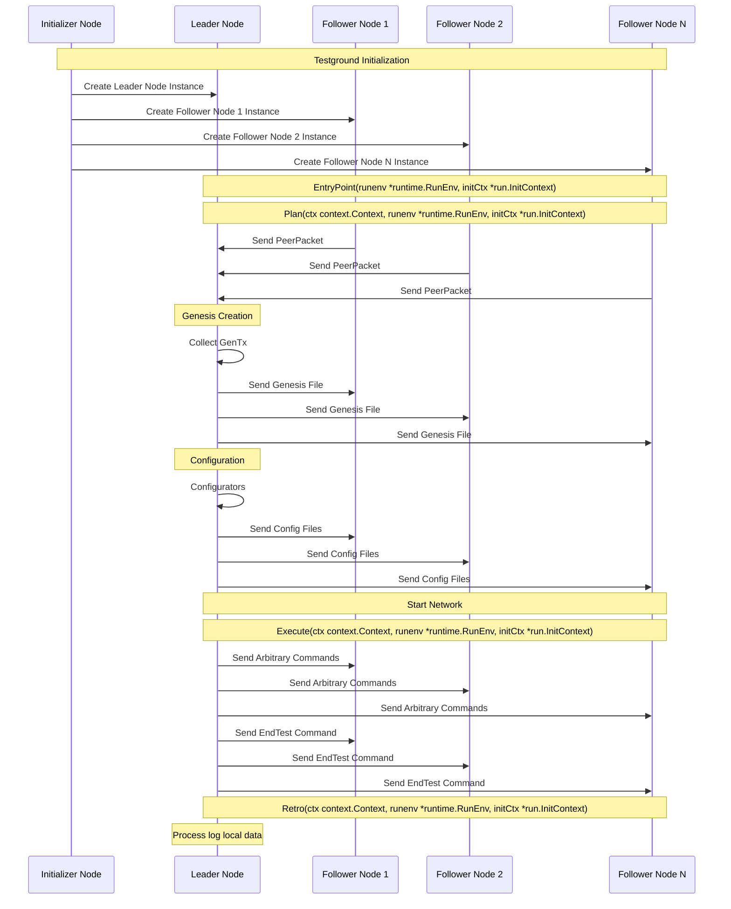

# Testground Experiment Tooling

## Test Instance Communication and Experiment Flow

[Context](https://github.com/celestiaorg/celestia-app/blob/d698845db9b28cbacef2e5bde57ef9dc443fc21a/test/testground/network/role.go#L18-L36)



## Configuring an Experiment

### Defining Topologies and Configs

Per the diagram above, the leader node initializes and modifies the configs used
by each node. This allows for arbitrary network topologies to be created.

## Implemented Experiments

### Standard

The `standard` test runs an experiment that is as close to mainnet as possible.
This is used as a base for other experiments.

## Running the Experiment

Testground must be installed, and testground cluster must be setup in a
kubernetes cluster that you have access to via a kubeconfig file. More details
can be found in the [testground](https://github.com/testground/testground) repo.

```sh
cd ./test/testground
testground plan import --from . --name core-app

# This command should be executed in the 1st terminal
testground daemon

# This command should be executed in the 2nd terminal
testground run composition -f compositions/standard/plan.toml --wait

# After the test has been completed, run this command to cleanup remaining instance resources
testground terminate --runner cluster:k8s
```

## Collecting Data

### Grafana

All metrics data is logged to a separate testground specific grafana/influx
node. To access that node, forward the ports using kubectl.

```sh
export POD_NAME=$(kubectl get pods --namespace default -l "app.kubernetes.io/name=grafana,app.kubernetes.io/instance=tg-monitoring" -o jsonpath="{.items[0].metadata.name}")

kubectl --namespace default port-forward $POD_NAME 3000

contact members of the devops team or testground admins to get the creds for accessing this node.
```

### Tracing

The tracing infrastructure in celestia-core can be used by using `tracing_nodes`
plan parameter greater than 0, along with specifying the tracing URL and tracing
token as plan parameters in the `plan.toml`.
