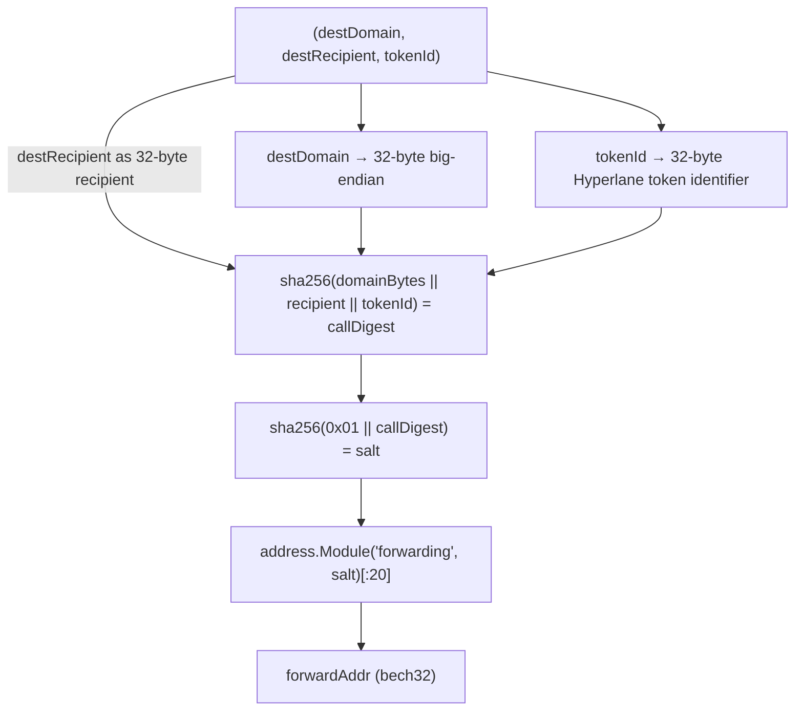
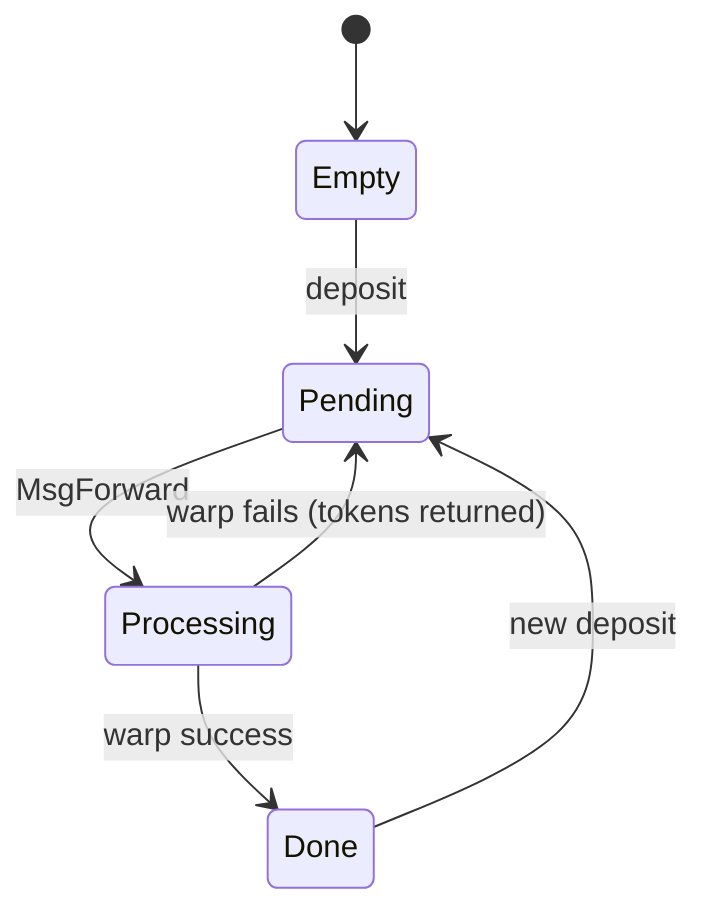

# CLAUDE.md - Forwarding Module

Agent context for `celestia-app/x/forwarding/`.

## Quick Reference

- **Full specification**: See [README.md](./README.md)
- **Relayer guide**: See [forwarding-relayer docs](https://github.com/celestiaorg/forwarding-relayer/blob/master/RELAYER.md)

## Key Concepts

- **Purpose**: Single-signature cross-chain transfers via Hyperlane warp routes
- **Core invariant**: `derive(destDomain, destRecipient, tokenId[, hookId]) == forwardAddr` - this IS the authorization
- **Permissionless**: Anyone can trigger forwarding with correct params
- **Hook is committed**: `custom_hook_id` is part of the derivation (version byte `0x02`), so the depositor picks the hook, not the submitter. A mismatch is `ErrAddressMismatch`.

## Address Derivation


```mermaid
flowchart TD
    A["(destDomain, destRecipient, tokenId)"] --> B["destDomain → 32-byte big-endian"]
    A --> C["tokenId → 32-byte Hyperlane token identifier"]
    A -->|destRecipient as 32-byte recipient| D["sha256(domainBytes || recipient || tokenId) = callDigest"]
    B --> D["sha256(domainBytes || recipient || tokenId) = callDigest"]
    C --> D
    D --> E["sha256(0x01 || callDigest) = salt"]
    E --> F["address.Module('forwarding', salt)[:20]"]
    F --> G["forwardAddr (bech32)"]
```

## Token Lifecycle


```mermaid
stateDiagram-v2
    [*] --> Empty
    Empty --> Pending: deposit
    Pending --> Processing: MsgForward
    Processing --> Done: warp success
    Processing --> Pending: warp fails (tokens returned)
    Done --> Pending: new deposit
```

## Review Checklist

- [ ] Address derivation matches exactly
- [ ] destRecipient validated as 32 bytes
- [ ] Pre-checks happen BEFORE SendCoins
- [ ] Failed warp transfers return tokens to forwardAddr
- [ ] MsgForward is atomic: a bound token either fully forwards or the tx fails

## Build & Test

```bash
go test ./x/forwarding/... -v
go build ./cmd/celestia-appd
```
