# CLAUDE.md - Forwarding Module

Agent context for `celestia-app/x/forwarding/`.

## Quick Reference

- **Full specification**: See [SPEC.md](./SPEC.md)
- **Relayer guide**: See [forwarding-relayer docs](https://github.com/celestiaorg/forwarding-relayer/blob/master/RELAYER.md)

## Key Concepts

- **Purpose**: Single-signature cross-chain transfers via Hyperlane warp routes
- **Core invariant**: `derive(destDomain, destRecipient) == forwardAddr` - this IS the authorization
- **Permissionless**: Anyone can trigger forwarding with correct params

## Address Derivation

```mermaid
flowchart TD
    A["(destDomain, destRecipient)"] --> B["destDomain → 32-byte big-endian"]
    B --> C["sha256(domainBytes || recipient) = callDigest"]
    C --> D["sha256(0x01 || callDigest) = salt"]
    D --> E["address.Module('forwarding', salt)[:20]"]
    E --> F["forwardAddr (bech32)"]
```



## Token Lifecycle


## Review Checklist

- [ ] Address derivation matches exactly
- [ ] destRecipient validated as 32 bytes
- [ ] Pre-checks happen BEFORE SendCoins
- [ ] Failed warp transfers return tokens to forwardAddr
- [ ] Partial success handled (some tokens fail, others succeed)

## Build & Test

```bash
go test ./x/forwarding/... -v
go build ./cmd/celestia-appd
```
