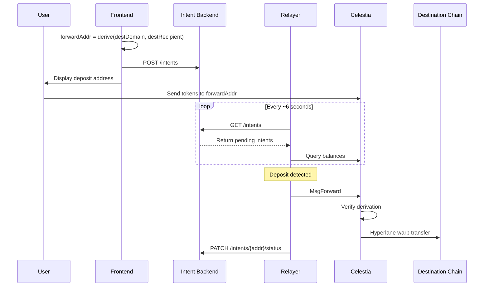

# Forwarding Module Relayer Specification

The relayer is an off-chain service that watches for deposits to forwarding addresses and triggers permissionless execution of cross-chain transfers.

## Key Properties

| Property | Description |
|----------|-------------|
| **Permissionless** | Anyone can run a relayer or manually trigger forwarding |
| **Non-custodial** | Relayer never holds user funds |
| **Fault-tolerant** | If relayer is down, funds remain safe at `forwardAddr` until forwarded |
| **Stateless-capable** | Can re-sync all state from Backend API |

### Backend and Frontend

The "Backend" (Intent Backend) is a server coupled with a bridge frontend page. It stores forwarding intents so relayers know which addresses to monitor.

- **Anyone can run** their own frontend, backend, and relayer
- **A relayer monitors** the backend corresponding to the frontend it serves
- **No single point of failure**: If one operator goes down, users can use another frontend or trigger forwarding manually

## Architecture

### Sequence Diagram



## Relayer Responsibilities

1. **Poll Backend** for pending intents (~every 6 seconds / 1 block)
2. **Monitor balances** at known `forwardAddr`s on Celestia
3. **Submit transactions** when deposits detected
4. **Handle results** including partial failures
5. **Retry** failed forwardings (tokens remain at address)

## Technical Specification

### Message Format

The relayer submits `MsgForward` to trigger transfers:

```protobuf
message MsgForward {
  string signer = 1;           // Relayer address (pays gas + IGP fees)
  string forward_addr = 2;     // bech32 forwarding address
  uint32 dest_domain = 3;      // Hyperlane destination domain ID
  string dest_recipient = 4;   // 32-byte recipient (hex-encoded, 0x-prefixed)
  Coin max_igp_fee = 5;        // Max IGP fee relayer will pay per token
}
```

**Important**: This message forwards ALL tokens at `forward_addr`. There is no token-specific parameter.

### IGP Fee Handling

The relayer pays Hyperlane IGP fees for cross-chain message delivery:

1. **Query fee estimate** before submitting: `QuoteForwardingFee` returns the current IGP fee
2. **Set max_igp_fee** with a buffer (e.g., +10%) to handle price fluctuations
3. **Per-token charging**: Each token forwarded charges its own IGP fee (up to max_igp_fee)
4. **Only actual fee charged**: If quoted fee < max_igp_fee, only the quoted amount is taken
5. **Fee on failure**: IGP fee is NOT returned if warp transfer fails (incentivizes checking routes)

### IGP Fee Edge Cases

| Scenario | Fee Status | Tokens Status | Relayer Action |
|----------|------------|---------------|----------------|
| Warp succeeds | Consumed | Forwarded | None |
| Warp fails (e.g., route removed mid-tx) | **Consumed** | Returned to `forwardAddr` | Retry after fixing route |
| IGP fee denom mismatch | Not collected | Unchanged | Fix `max_igp_fee` denom |
| Insufficient max_igp_fee | Not collected | Unchanged | Increase `max_igp_fee` |
| Relayer has insufficient balance | Not collected | Unchanged | Fund relayer account |
| Recovery fails (CRITICAL) | Consumed | **Stuck in module** | Contact governance |

**Important**: When warp transfer fails AFTER IGP fee collection:

- Tokens are returned to `forwardAddr` (safe for retry)
- IGP fee is NOT returned to relayer
- This is intentional: incentivizes relayers to verify routes before submitting

**Mitigation strategies:**

1. Always call `QuoteForwardingFee` before submitting
2. Use `DeriveForwardingAddress` query to verify route exists (returns error if no route)
3. Monitor `EventTokenForwarded` events for `success=false` cases
4. Track IGP fee expenses separately from gas costs

### Response Format

```protobuf
message MsgForwardResponse {
  repeated ForwardingResult results = 1;
}

message ForwardingResult {
  string denom = 1;
  string amount = 2;
  string message_id = 3;  // Hyperlane message ID (empty if failed)
  bool success = 4;
  string error = 5;       // Error message (empty if success)
}
```

### Address Derivation

See the canonical derivation algorithm in [SPEC.md](./SPEC.md#address-derivation).

**Key points for relayers:**

- `destDomain`: uint32 encoded as 32-byte big-endian (right-aligned)
- `destRecipient`: exactly 32 bytes
- Output: bech32 address with `celestia` prefix

### Recipient Address Formatting

| Chain Type | Native Size | Format for destRecipient |
|------------|-------------|--------------------------|
| EVM (Arbitrum, Optimism, Base) | 20 bytes | Left-pad with 12 zero bytes |
| Solana | 32 bytes | Use directly |
| Cosmos (via Hyperlane) | 20 bytes | Left-pad with 12 zero bytes |

**All 20-byte addresses** (EVM and Cosmos) must be left-padded to 32 bytes. Hyperlane uses `bytes32` as the canonical recipient format across all chains.

Example EVM address `0x742d35Cc6634C0532925a3b844Bc9e7595f00000`:

```text
destRecipient = 0x000000000000000000000000742d35Cc6634C0532925a3b844Bc9e7595f00000
```

## Operational Flow

```text
STARTUP:
  intents = GET /intents from Backend
  balanceCache = {}

MAIN LOOP (every ~6 seconds):
  newIntents = GET /intents from Backend
  intents = merge(intents, newIntents)

  for each intent in intents:
    balance = query Celestia balance at intent.forward_addr

    if balance > 0 AND balance != balanceCache[intent.forward_addr]:
      # Query current IGP fee and add buffer
      quoted_fee = query QuoteForwardingFee(intent.dest_domain)
      max_fee = quoted_fee * 1.1  # 10% buffer for price changes

      result = submit MsgForward(
        forward_addr = intent.forward_addr,
        dest_domain = intent.dest_domain,
        dest_recipient = intent.dest_recipient,
        max_igp_fee = max_fee
      )

      if all tokens forwarded:
        PATCH /intents/{forward_addr}/status = "completed"
      else:
        log partial failure, will retry next cycle

      balanceCache[intent.forward_addr] = query new balance

  sleep(6 seconds)
```

## Error Handling

| Scenario | Funds Status | Relayer Action |
|----------|--------------|----------------|
| Relayer crashes | Safe at `forwardAddr` | Restart, re-sync from Backend |
| Backend unavailable | Safe | Retry with backoff, use cached intents |
| Tx fails (out of gas) | Unchanged | Retry with higher gas |
| Partial forwarding | Remaining at `forwardAddr` | Auto-retry on next cycle |
| No warp route for token | Stays at `forwardAddr` | Skip token, retry when route added |
| Below minimum threshold | Stays at `forwardAddr` | Skip, wait for more deposits |
| Insufficient IGP fee | Unchanged | Re-query `QuoteForwardingFee`, retry with higher fee |
| IGP fee denom mismatch | Unchanged | Ensure max_igp_fee uses correct denom (usually utia) |

**Key insight**: Since forwarding is permissionless, funds are never at risk. Anyone with the correct `(destDomain, destRecipient)` can trigger forwarding.

**IGP fee note**: If warp transfer fails after IGP fee collection, the fee is consumed (not returned). This incentivizes relayers to verify routes exist before submitting.

### Relayer Incentives

Currently, relaying is **unincentivized** - relayers pay gas out of pocket, similar to IBC relayers. The `MsgForward` is permissionless so anyone can trigger it.

**Future enhancement**: A flat fee deducted from the forwarded amount could be added to incentivize relayers. For v1, keeping it simple like IBC relaying is sufficient.

## Backend API Specification

The Intent Backend stores the mapping from `forwardAddr` to forwarding parameters.

### Endpoints

#### List Intents

```text
GET /intents
GET /intents?status=pending

Response 200:
[
  {
    "forward_addr": "celestia1abc...",
    "dest_domain": 42161,
    "dest_recipient": "0x000000000000000000000000742d35cc6634c0532925a3b844bc9e7595f00000",
    "status": "pending",
    "created_at": "2024-01-15T10:30:00Z"
  }
]
```

#### Get Single Intent

```text
GET /intents/{forward_addr}

Response 200:
{
  "forward_addr": "celestia1abc...",
  "dest_domain": 42161,
  "dest_recipient": "0x000000000000000000000000742d35cc6634c0532925a3b844bc9e7595f00000",
  "status": "pending",
  "created_at": "2024-01-15T10:30:00Z"
}

Response 404:
{ "error": "intent not found" }
```

#### Create Intent (called by Frontend)

```text
POST /intents
Content-Type: application/json

{
  "forward_addr": "celestia1abc...",
  "dest_domain": 42161,
  "dest_recipient": "0x000000000000000000000000742d35cc6634c0532925a3b844bc9e7595f00000"
}

Response 201:
{
  "forward_addr": "celestia1abc...",
  "created_at": "2024-01-15T10:30:00Z"
}

Response 400:
{ "error": "invalid dest_recipient format" }
```

#### Update Intent Status (called by Relayer)

```text
PATCH /intents/{forward_addr}/status
Content-Type: application/json

{
  "status": "completed"
}

Response 200:
{ "forward_addr": "celestia1abc...", "status": "completed" }
```

### Intent Statuses

| Status | Meaning |
|--------|---------|
| `pending` | Awaiting deposit or forwarding |
| `completed` | All tokens successfully forwarded |

## CLI Commands for Testing

```bash
# Query derived address
celestia-appd query forwarding derive-address 42161 \
  0x000000000000000000000000742d35cc6634c0532925a3b844bc9e7595f00000

# Query IGP fee estimate for destination
celestia-appd query forwarding quote-fee 42161

# Check balance at forwarding address
celestia-appd query bank balances celestia1<forward_addr>

# Execute forwarding manually (anyone can do this)
# Note: --max-igp-fee is required, query quote-fee first
celestia-appd tx forwarding forward \
  celestia1<forward_addr> \
  42161 \
  0x000000000000000000000000742d35cc6634c0532925a3b844bc9e7595f00000 \
  --max-igp-fee 1000utia \
  --from mykey --chain-id celestia -y

# Check transaction result
celestia-appd query tx <txhash> --output json | jq '.events'
```

## Implementation Checklist

- [ ] Address derivation matching on-chain algorithm
- [ ] Backend API client
- [ ] Celestia gRPC/RPC client (balance queries, tx submission)
- [ ] Transaction signing and broadcasting
- [ ] Balance change detection (avoid duplicate submissions)
- [ ] IGP fee quoting via `QuoteForwardingFee` query
- [ ] Fee buffer calculation (e.g., quoted_fee * 1.1)
- [ ] Retry logic with exponential backoff
- [ ] Partial failure handling
- [ ] Graceful shutdown with in-flight tx completion
- [ ] Logging for debugging and auditing

## Security Considerations

1. **No key management for user funds** - Relayer only needs its own signing key for gas
2. **Derivation verification** - On-chain module verifies `derive(destDomain, destRecipient) == forwardAddr`
3. **Idempotent execution** - Submitting same forwarding twice is safe (second will have no balance)
4. **Backend trust** - Relayer trusts Backend for intent data, but on-chain verification prevents misdirection
