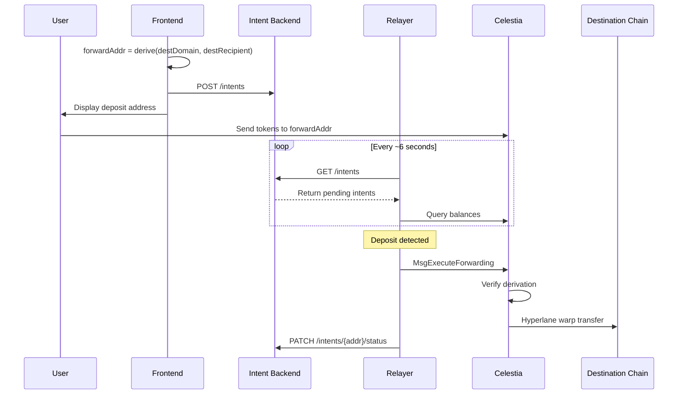

# Forwarding Module Relayer Specification

The relayer is an off-chain service that watches for deposits to forwarding addresses and triggers permissionless execution of cross-chain transfers.

## Key Properties

| Property | Description |
|----------|-------------|
| **Permissionless** | Anyone can run a relayer or manually trigger forwarding |
| **Non-custodial** | Relayer never holds user funds |
| **Fault-tolerant** | If relayer is down, funds remain safe at `forwardAddr` until forwarded |
| **Stateless-capable** | Can re-sync all state from Backend API |

## Architecture

### System Flow

```
┌──────────┐    ┌─────────┐    ┌─────────┐    ┌──────────┐    ┌─────────────┐
│ Frontend │───>│ Backend │<───│ Relayer │───>│ Celestia │───>│ Destination │
└──────────┘    └─────────┘    └─────────┘    └──────────┘    └─────────────┘
     │                              │              │
     │ 1. Compute forwardAddr       │              │
     │ 2. POST intent               │              │
     │ 3. Show address to user      │              │
     │                              │              │
     │         User sends tokens ──────────────────>│
     │                              │              │
     │              4. Poll intents │              │
     │              5. Check balance│──────────────>│
     │              6. Submit tx    │──────────────>│
     │                              │              │ 7. Warp transfer
     │                              │              │──────────────────>
```

### Sequence Diagram



## Relayer Responsibilities

1. **Poll Backend** for pending intents (~every 6 seconds / 1 block)
2. **Monitor balances** at known `forwardAddr`s on Celestia
3. **Submit transactions** when deposits detected
4. **Handle results** including partial failures
5. **Retry** failed forwardings (tokens remain at address)

## Technical Specification

### Message Format

The relayer submits `MsgExecuteForwarding` to trigger transfers:

```protobuf
message MsgExecuteForwarding {
  string signer = 1;           // Relayer address (pays gas)
  string forward_addr = 2;     // bech32 forwarding address
  uint32 dest_domain = 3;      // Hyperlane destination domain ID
  string dest_recipient = 4;   // 32-byte recipient (hex-encoded, 0x-prefixed)
}
```

**Important**: This message forwards ALL tokens at `forward_addr`. There is no token-specific parameter.

### Response Format

```protobuf
message MsgExecuteForwardingResponse {
  repeated ForwardingResult results = 1;
}

message ForwardingResult {
  string denom = 1;
  string amount = 2;
  string message_id = 3;  // Hyperlane message ID (empty if failed)
  bool success = 4;
  string error = 5;       // Error message (empty if success)
}
```

### Address Derivation

The relayer must compute `forwardAddr` identically to the on-chain module:

```
INPUT:
  destDomain: uint32 (e.g., 42161 for Arbitrum)
  destRecipient: 32 bytes (left-pad with zeros for 20-byte EVM addresses)

ALGORITHM:
  1. destDomainBytes = destDomain as 32-byte big-endian (right-aligned)
  2. callDigest = sha256(destDomainBytes || destRecipient)
  3. salt = sha256("CELESTIA_FORWARD_V1" || callDigest)
  4. hash = sha256("forwarding" || salt)
  5. forwardAddr = hash[:20]  // First 20 bytes

OUTPUT:
  forwardAddr as bech32 with "celestia" prefix
```

### Recipient Address Formatting

| Chain Type | Native Size | Format for destRecipient |
|------------|-------------|--------------------------|
| EVM (Arbitrum, Optimism, Base) | 20 bytes | Left-pad with 12 zero bytes |
| Solana | 32 bytes | Use directly |

Example EVM address `0x742d35Cc6634C0532925a3b844Bc9e7595f00000`:
```
destRecipient = 0x000000000000000000000000742d35Cc6634C0532925a3b844Bc9e7595f00000
```

## Operational Flow

```
STARTUP:
  intents = GET /intents from Backend
  balanceCache = {}

MAIN LOOP (every ~6 seconds):
  newIntents = GET /intents from Backend
  intents = merge(intents, newIntents)

  for each intent in intents:
    balance = query Celestia balance at intent.forward_addr

    if balance > 0 AND balance != balanceCache[intent.forward_addr]:
      result = submit MsgExecuteForwarding(
        forward_addr = intent.forward_addr,
        dest_domain = intent.dest_domain,
        dest_recipient = intent.dest_recipient
      )

      if all tokens forwarded:
        PATCH /intents/{forward_addr}/status = "completed"
      else:
        log partial failure, will retry next cycle

      balanceCache[intent.forward_addr] = query new balance

  sleep(6 seconds)
```

## Error Handling

| Scenario | Funds Status | Relayer Action |
|----------|--------------|----------------|
| Relayer crashes | Safe at `forwardAddr` | Restart, re-sync from Backend |
| Backend unavailable | Safe | Retry with backoff, use cached intents |
| Tx fails (out of gas) | Unchanged | Retry with higher gas |
| Partial forwarding | Remaining at `forwardAddr` | Auto-retry on next cycle |
| No warp route for token | Stays at `forwardAddr` | Skip token, retry when route added |
| Below minimum threshold | Stays at `forwardAddr` | Skip, wait for more deposits |

**Key insight**: Since forwarding is permissionless, funds are never at risk. Anyone with the correct `(destDomain, destRecipient)` can trigger forwarding.

## Backend API Specification

The Intent Backend stores the mapping from `forwardAddr` to forwarding parameters.

### Endpoints

#### List Intents
```
GET /intents
GET /intents?status=pending

Response 200:
[
  {
    "forward_addr": "celestia1abc...",
    "dest_domain": 42161,
    "dest_recipient": "0x000000000000000000000000742d35cc6634c0532925a3b844bc9e7595f00000",
    "status": "pending",
    "created_at": "2024-01-15T10:30:00Z"
  }
]
```

#### Get Single Intent
```
GET /intents/{forward_addr}

Response 200:
{
  "forward_addr": "celestia1abc...",
  "dest_domain": 42161,
  "dest_recipient": "0x000000000000000000000000742d35cc6634c0532925a3b844bc9e7595f00000",
  "status": "pending",
  "created_at": "2024-01-15T10:30:00Z"
}

Response 404:
{ "error": "intent not found" }
```

#### Create Intent (called by Frontend)
```
POST /intents
Content-Type: application/json

{
  "forward_addr": "celestia1abc...",
  "dest_domain": 42161,
  "dest_recipient": "0x000000000000000000000000742d35cc6634c0532925a3b844bc9e7595f00000"
}

Response 201:
{
  "forward_addr": "celestia1abc...",
  "created_at": "2024-01-15T10:30:00Z"
}

Response 400:
{ "error": "invalid dest_recipient format" }
```

#### Update Intent Status (called by Relayer)
```
PATCH /intents/{forward_addr}/status
Content-Type: application/json

{
  "status": "completed"
}

Response 200:
{ "forward_addr": "celestia1abc...", "status": "completed" }
```

### Intent Statuses

| Status | Meaning |
|--------|---------|
| `pending` | Awaiting deposit or forwarding |
| `completed` | All tokens successfully forwarded |

## CLI Commands for Testing

```bash
# Query derived address
celestia-appd query forwarding derive-address 42161 \
  0x000000000000000000000000742d35cc6634c0532925a3b844bc9e7595f00000

# Check balance at forwarding address
celestia-appd query bank balances celestia1<forward_addr>

# Execute forwarding manually (anyone can do this)
celestia-appd tx forwarding execute \
  celestia1<forward_addr> \
  42161 \
  0x000000000000000000000000742d35cc6634c0532925a3b844bc9e7595f00000 \
  --from mykey --chain-id celestia -y

# Check transaction result
celestia-appd query tx <txhash> --output json | jq '.events'
```

## Implementation Checklist

- [ ] Address derivation matching on-chain algorithm
- [ ] Backend API client
- [ ] Celestia gRPC/RPC client (balance queries, tx submission)
- [ ] Transaction signing and broadcasting
- [ ] Balance change detection (avoid duplicate submissions)
- [ ] Retry logic with exponential backoff
- [ ] Partial failure handling
- [ ] Graceful shutdown with in-flight tx completion
- [ ] Logging for debugging and auditing

## Security Considerations

1. **No key management for user funds** - Relayer only needs its own signing key for gas
2. **Derivation verification** - On-chain module verifies `derive(destDomain, destRecipient) == forwardAddr`
3. **Idempotent execution** - Submitting same forwarding twice is safe (second will have no balance)
4. **Backend trust** - Relayer trusts Backend for intent data, but on-chain verification prevents misdirection
